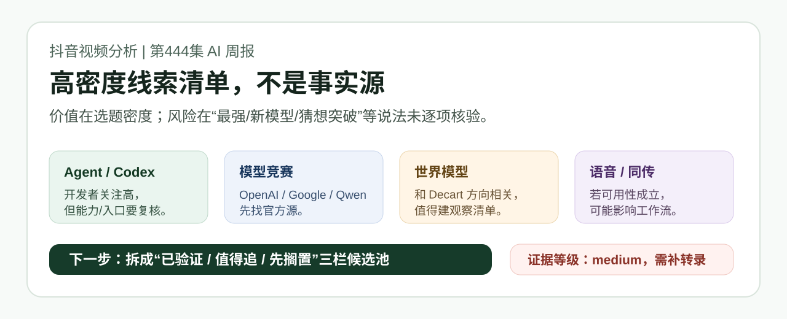

# 视频分析：产品君《盘点一周AI大事(5月24日)》

## 一句话结论

这条视频值得入库，但它的价值不是“已验证新闻”，而是一个高密度 AI 情报候选池：适合帮我们发现 Agent/Codex、世界模型、数字人/语音、AI 同传这些值得追踪的方向；不适合作为事实源直接引用。

## 证据等级

- 证据等级：`medium`
- 置信度：`medium`
- 已拿到：展开后的抖音页面、页面标题/简介、作者信息、发布时间、视频时长、章节要点、可见画面截图、部分评论。
- 未拿到：完整视频文件、完整字幕、完整口播转录、逐项外部来源。
- 关键边界：页面声明“内容由 AI 生成”，且视频标题/简介包含大量“最强”“新模型”“猜想”等强表述。当前材料只能证明“视频这样列了这些线索”，不能证明每条线索已经真实发布、性能领先或可用。

本地证据：

- 页面证据：[page_evidence.md](page_evidence.md)
- 页面截图：[page_screenshot.png](page_screenshot.png)

## 元信息

- 原始短链：`https://v.douyin.com/crO2I-q0lSQ/`
- 展开链接：`https://www.douyin.com/video/7643493803533323570`
- 作者：产品君
- 作者方向：AI 生产力
- 作者数据：粉丝 44.3 万，获赞 221.4 万
- 发布时间：2026-05-25 00:19
- 时长：03:02
- 可见互动数据：点赞 6255，评论 117，收藏 2702，分享 1796

## 内容结构

基于页面可见章节和标题/简介，这条视频按“AI 周报快讯”组织：

| 时间 | 章节 | 页面可见主题 |
| --- | --- | --- |
| 00:03 | OpenAI | Codex 再进化、电脑息屏远程派活、OpenAI 新模型与数学猜想 |
| 00:35 | Google | AI Co-Scientist、Gemini Omni、Stitch |
| 01:14 | Qwen 3.7 | Qwen3.7-Max、FashionChameleon |
| 01:35 | 世界模型 | Lance Odyssey、Starchild-1、Agora-1、PanoWorld |
| 01:56 | 最强数字人 | LongCat-Video-Avatar 1.5 |
| 02:23 | 最强配音 | WavFlow、Mega-ASR |
| 02:40 | AI同传 | Qwen3.5 LiveTranslate |

## 核心观点

基于当前页面证据，我认为视频想传达的不是单一观点，而是“AI 进展正在同时从模型、Agent、世界模型、语音和生成视频多点爆发”。它用大量项目名堆叠出速度感，重点刺激观众产生“本周又发生了很多事，必须跟上”的感受。

对你有用的不是这种焦虑感，而是其中的线索分桶：

- Agent/Codex：评论区真实反馈集中在 Codex 能力、Goal 模式入口、Plus/Pro 成本，这比单纯转述功能更有价值。
- 世界模型：Lance Odyssey、Starchild-1、Agora-1、PanoWorld 这一组和你最近追的 Decart/world model 方向同频，适合做专题候选池。
- 语音/同传：Qwen3.5 LiveTranslate、WavFlow、Mega-ASR 若有官方源和 demo，可能影响视频生产、跨语种沟通和知识采集工作流。
- 多模态生成：Gemini Omni、Stitch、FashionChameleon、LongCat-Video-Avatar 这些更偏应用层，需要先判断是否只是 demo、论文或真实可用产品。

## 事实 / 观点 / 推断

### 已看到的事实

- 抖音页面可访问，视频 ID 为 `7643493803533323570`。
- 页面标题列出了 Codex、AI Co-Scientist、Gemini Omni、Stitch、Qwen3.7-Max、FashionChameleon、Lance Odyssey、Starchild-1、Agora-1、PanoWorld、LongCat-Video-Avatar 1.5、WavFlow、Mega-ASR、Qwen3.5 LiveTranslate 等线索。
- 页面发布时间为 2026-05-25 00:19，视频时长 03:02。
- 页面明确标注“作者声明：内容由 AI 生成”。
- 评论区可见多条围绕 Codex 的反馈，包括“建模跑仿真”“Plus 不够用、Pro 挺贵”“没有 goal 模式”等。

### 作者观点

- 作者把这些项目包装成“一周 AI 大事”，并多次使用“最强”“再进化”“开源”“发布”等强判断。
- 作者的表达方式更接近快讯汇总和趋势刺激，不是逐项深度论证。

### 我的推断

- 这类视频适合进入 `AI news` 的候选池环节，作为“发现线索”的输入。
- 不适合直接进入最终情报结果，因为当前缺少官方公告、论文、GitHub repo、演示或第三方复核。
- 评论区对 Codex 的反馈比标题里的部分“最强模型”更接近真实市场信号，因为它反映了用户正在尝试、遇到入口差异和成本摩擦。

## 高价值要点

1. Codex 方向值得继续跟踪，但重点不只是功能发布，而是“远程派活、锁屏继续跑、Goal 模式、成本限制、真实开发者使用反馈”这条工作流成熟度链路。
2. 世界模型应单独建观察池。视频里一次性出现多个 world model 线索，这和 Decart 方向重合，适合后续用 `ai news world model` 或 `ai news decart world model` 做交叉验证。
3. AI 同传/语音方向可能对知识库输入效率有直接影响。如果 Qwen3.5 LiveTranslate、Mega-ASR、WavFlow 有真实可用版本，应优先评估“能否用于视频/会议/外语资料采集”。
4. “内容由 AI 生成”是重要风险信号。它不意味着内容一定错，但意味着要把这条视频默认当作线索聚合，而不是新闻事实。
5. 评论区是额外信号源：Codex 的用户感知已经从“好玩”走向“能干活”，但付费层级、功能灰度和入口差异正在形成采用门槛。

## 噪音与风险

- 强词过多：`最强`、`新模型`、`数学界80年猜想` 这类词需要逐项核验。
- 项目名密集：3 分钟内塞入大量项目，容易造成“都很重要”的错觉。
- 缺少来源链：页面没有直接给出官方公告、论文、GitHub 或 demo 链接。
- AI 生成声明：存在自动拼接、误写项目名、时间错位或夸大能力的风险。
- 版本号风险：例如 `Qwen3.7-Max`、`Qwen3.5 LiveTranslate`、`GPT 5.6`、`Claude 4.8` 等名称必须先找一手来源，不能从视频标题直接采信。

## 对现有知识库的关系

- Codex 相关内容和 `40_outputs/daily_ai/2026-05-22.md` 的 Codex Appshots / Goal mode / locked-computer-use 方向有关，可以作为后续补充评论区反馈的材料。
- 世界模型方向和近期 `AI news decart` 的关注点有关，建议进入观察池，不要与 Decart 直接等同。
- AI 同传、数字人、配音、ASR 这些点目前在知识库里更像候选线索，需要一手来源补齐后再升级为正式情报。

## 我的判断

值得沉淀，等级是“候选池材料”，不是“结论材料”。

如果把它当新闻看，会被标题密度和强词带偏；如果把它当线索池看，它有用。下一步最值得做的是把标题里列出的项目拆成三栏：

- 已验证：有官方公告 / repo / paper / demo / 可访问产品。
- 值得追：有多个信号，但还缺关键证据。
- 先搁置：只有短视频标题或营销包装，暂时不占用注意力。

## 可行动作

1. 用 `ai news qwen live translate` 或 `ai news AI同传` 单独核验实时同传方向。
2. 建一个世界模型观察清单：Decart、Lance Odyssey、Starchild-1、Agora-1、PanoWorld。
3. 对 Codex 做一次“真实可用性复盘”：Goal 模式入口、远程派活、锁屏继续跑、成本限制、适合你的任务类型。
4. 对视频标题里的每个“最强/发布/开源”项目，必须先找到官方源或 GitHub，再允许进入每日 AI 情报最终 3 条。

## 补证路径

要把这份分析从 `medium` 升到 `high`，最少需要补齐其中一种材料：

- 获取完整视频文件并抽取音频转录。
- 获取平台字幕或作者原文稿。
- 对每个项目补官方公告、论文、GitHub repo、demo 或可信第三方复核。
- 对视频关键帧做 OCR，确认口播/画面中的模型名、能力描述和时间点。

在补证前，本文所有模型/产品条目都应按“待核验线索”处理。
