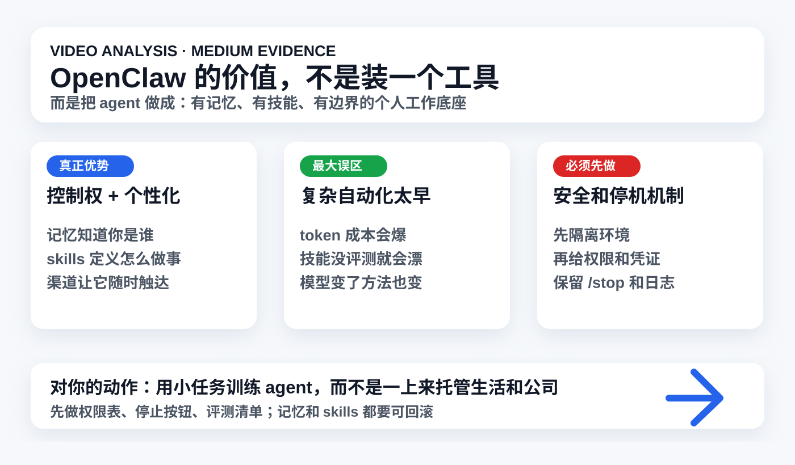

# 视频分析：OpenClaw 核心开发者访谈

## 一句话结论

这条视频最有价值的不是“OpenClaw 到底火不火”，而是核心维护者把它看成一种可控的个人 agent 底座：记忆负责理解你，skills 负责定义做法，渠道负责随时触达；但安全、成本、评测和停止机制必须先于复杂自动化。

## 元信息

- 原始短链：<https://v.douyin.com/TA0_6_-2rzg/>
- 展开链接：<https://www.douyin.com/video/7640457019010338082>
- 用户提供标题片段：`【抖音独家】我们和OpenClaw的核心开发者聊了...`
- 作者：差评硬件部
- 采集时间：2026-06-04 14:07 CST
- 证据等级：`medium`
- 置信度：`medium`

## 证据边界

### 已拿到的证据

- 短链经 `curl -I -L` 展开到 Douyin canonical video id：`7640457019010338082`。
- `yt-dlp` 对 canonical URL 返回：`Fresh cookies (not necessarily logged in) are needed`；短链在沙箱内 DNS 解析失败。
- 搜索结果中，抖音精选页面可见同题内容：`〖抖音独家〗我们和OpenClaw的核心开发者聊了聊！最后给他送了本《毛选》。。。`，作者为差评硬件部，时长约 `04:00`。
- 找到同题文字版来源：[新浪转载 / 网易科技：OpenClaw 凉了吗？我们和它的核心开发者聊了聊](https://finance.sina.cn/stock/jdts/2026-05-18/detail-inhyfsvf8528675.d.html?vt=4)。该文明确说是在抖音精选、抖音科技和 mushanghai 邀请下，于上海与 OpenClaw 代码维护者 Josh Palmer、ClawCon 发起人 Michael Galpert 对谈，文字版经删减和调整但未改变原意。
- 找到 OpenClaw 官方 release 背景：[GitHub Releases: openclaw/openclaw](https://github.com/openclaw/openclaw/releases/)，可核验项目近期仍在围绕插件安装策略、通道安全、Codex/provider/model/memory 等路径快速迭代。

### 没拿到的证据

- 没拿到原始视频文件、完整口播转录、关键帧截图、评论区、点赞/收藏等原始页面数据。
- 没法核验 4 分钟抖音短视频的剪辑顺序、删减内容、字幕和画面语境。
- 文字版是长访谈整理，不等于 4 分钟视频逐字稿；因此本报告不能声称“已完整看完视频”。

### 补证路径

- 最小补证材料：原视频文件、视频字幕/转录、或 6-10 张关键帧截图。
- 如果需要升到 `high` evidence，可在你明确授权后复用浏览器登录态尝试 `yt-dlp --cookies-from-browser chrome`，或你直接提供视频文件/截图。

## 内容结构

1. **OpenClaw 和网页聊天 AI 的差异**：维护者把 OpenClaw 的优势放在历史记忆、个人偏好、自定义 skills、多渠道接入和用户掌控权上，而不是单轮回答质量。
2. **成本和个性化难题**：访谈提到 token 开销、个性化配置、系统提示、Agent 文件和记忆都很难一次做好；简单任务也可能因为上下文和工具链设计消耗巨大。
3. **记忆进化 vs skill 进化**：维护者没有把两者对立起来，而是认为记忆描述“你是谁/做过什么”，skills 描述“和某个东西怎么交互”；当前最大缺口是缺少评测系统。
4. **模型选择影响方法论**：Josh 的观点是，不同模型对结构化指导、性格、服从度的需求不同；随着模型变化，过去有效的 workflow/skill 可能会失效。
5. **中国社区和本地化通道**：访谈提到中文文档、飞书 channel、中文社交软件生态，以及中国用户把 OpenClaw 接入工作流的速度很快。
6. **失控案例和停止机制**：访谈提到 agent 幻觉电话号码并通过 iMessage 错发消息，以及 `/stop` 这类停止命令的重要性。
7. **最终建议**：不要一开始就做复杂自动化；先从自己熟悉的小任务开始，逐步理解、配置和扩展。

## 核心观点

### 1. OpenClaw 的核心价值是“个人可控 agent 底座”

基于访谈文字版，OpenClaw 的差异不只是“能接工具”，而是用户可以把自己的历史、偏好、渠道、技能和常用软件接进去，形成一个长期跟随自己的 agent。这和大厂网页 AI 的差异在于：大厂产品通常按厂商设计方式工作，OpenClaw 则更接近可自定义的个人基础设施。

### 2. 记忆和 skills 不是二选一，而是两种不同上下文

对你最有启发的是这一点：记忆描述身份、偏好、历史、目标；skills 描述做事方式、工具协议、边界和流程。此前你在 AnySearch、AI news、视频分析 skill 上的判断是对的：真正高价值的本地 agent，不是多装 skill，而是要知道何时用记忆、何时用 skill、何时查知识库、何时联网补证。

### 3. 没有评测体系，skill 自进化很容易变成玄学

访谈里 Michael 提到一个关键缺口：还没有有效评估系统来判断技能是否真的变好、技能怎么组织、怎么创建、大小该多大。这个对你尤其重要：如果以后让 agent 自动生成或改写 skill，必须先有固定任务集和验收规则，否则“自进化”很容易只是把提示词越堆越厚。

### 4. 模型变化会重写方法论

Josh 的观点是，某些模型需要更强结构化指导，某些模型更能按要求执行；而且今天有效的 MCP/CLI/skill 方法，模型换代后可能失效。这提醒我们：知识库里的 skill 不应写成永久真理，而应有版本、适用模型、失效条件和复测节奏。

### 5. agent 的第一安全能力不是聪明，而是能停下来

错发短信、误删邮件、敏感信息写入记忆，都是 agent 真正接触真实世界之后的风险。视频/文字版里 `/stop` 的价值非常明确：一旦 agent 拿到工具权限，停止按钮、权限边界、日志和回滚就不再是“高级功能”，而是基础设施。

## 事实 / 观点 / 推断

### 可核验事实

- 短链展开到 Douyin video id `7640457019010338082`。
- 公开视频页面在无登录态下未能完整访问，`yt-dlp` 要求 fresh cookies。
- 新浪/网易文字版称受访者包括 OpenClaw 代码维护者 Josh Palmer、ClawCon 发起人 Michael Galpert。
- OpenClaw 官方 GitHub release 页面显示项目仍在高频迭代，近期 release 涉及插件安装策略、通道安全、Codex/provider/model/memory 路径等。

### 作者/受访者观点

- OpenClaw 相比网页 AI 的优势在于记忆、偏好、skills、自定义工具和掌控感。
- 个性化很难，token 成本和上下文设计是实际问题。
- memory 和 skill 可以互补，但现在缺少好的技能评测体系。
- 用户刚开始应保持简单，从熟悉任务开始，不要一上来做复杂自动化。
- 敏感信息更适合本地模型和本机运行，但使用者仍要权衡价值与长期风险。

### 我的推断

- OpenClaw 对你的价值，不在于“要不要马上安装”，而在于验证了你当前知识库建设方向：长期记忆、skill、权限、候选池、证据边界和可视化输出要作为一个系统设计。
- 未来个人 AI 工作流会分成三层：`memory` 记住你，`skills` 固化做法，`runtime/governance` 限制它能做什么。
- AnySearch 的方向应该加入 OpenClaw 这类思路：不是简单检索，而是根据任务在 memory、skill、知识库、在线来源、浏览器和本地工具之间路由。

## 论据质量

- **强证据**：短链展开、官方 release、公开文字版访谈的受访者和主要段落。
- **中等证据**：抖音精选搜索结果显示的同题标题、作者、时长；可证明该视频/同题内容存在，但不能证明完整视频内容。
- **弱证据**：中文二手百科、社区帖子、OpenClaw 热度/星标叙事；只能作为背景，不用于关键结论。
- **不能下的结论**：不能说视频原片逐字表达了本文全部观点；不能把受访者个人经验等同于 OpenClaw 官方路线图；不能根据访谈直接判断 OpenClaw 当前安全性足够。

## 高价值点

### 对你的 AI 成长

这条内容把“高频使用 AI”从 prompt 技巧拉回到系统工程：长期记忆、工具协议、技能组织、模型选择、成本、停止机制和安全边界。你现在最应该提升的不是多背 prompt，而是把自己的 AI 工作流做成可复盘、可迭代、可控的系统。

### 对知识库

当前知识库已经有 shared memory、AI news、视频分析、skill、视觉摘要、git 发布。OpenClaw 访谈说明这些能力应该继续向 `个人 agent runtime` 演进：每个 skill 都有输入边界、权限、输出模板、评测任务和失败处理。

### 对工作流

如果要试 OpenClaw 或类似 agent，不建议从“接邮箱、接病历、接公司资料”开始。最合理路径是：

1. 先用隔离环境跑一个熟悉的小任务。
2. 加入 `/stop`、日志、权限表和回滚。
3. 再接低风险工具。
4. 最后才考虑私密记忆、真实账号和自动化执行。

### 对产品/职业判断

OpenClaw 这类工具真正打开的是“非程序员也能用 agent 组织项目”的门槛。访谈里房地产投资人三天拿到付费客户的例子未能独立核验，但方向值得看：未来价值不只在 coding agent，而在“用户用 agent 把自己熟悉领域的工作流产品化”。

## 噪音与风险

- 标题“凉了吗”有争议/流量包装成分，不能让标题决定判断。
- 访谈嘉宾是项目相关方，天然会强调 OpenClaw 的自由、控制感和赋能价值。
- OpenClaw 热度叙事里混有大量二手文章、SEO 页面和夸张表达，需要优先看官方 release、代码、issue、真实使用案例和安全报告。
- 把敏感信息放入长期记忆很有价值，但风险也真实存在：模型提供商、插件、skill、日志、截图、浏览器 cookie 都可能扩大泄露面。
- 开源不自动等于安全。越能控制本地系统，越需要隔离、权限、审计和停止机制。

## 我的判断

值得沉淀，但应归为 `medium evidence / medium confidence`。它不是一份已完整核验的视频逐字分析，而是一份基于同题访谈文字版和公开取证的 agent 系统设计笔记。

对你最有价值的结论是：不要把 OpenClaw/AnySearch/Codex skills 当成单点工具看，而要把它们看成同一个个人 agent 系统里的不同层。真正的升级路线是：

- 记忆：知道你的偏好、目标、历史。
- skills：固定可复用的做事方式。
- 路由：判断何时查本地、何时联网、何时调用工具。
- 评测：证明 skill/记忆/模型变化真的变好。
- 治理：限制权限、保留日志、能立刻停机。

## 可行动作

1. 建 `agent_skill_eval_matrix.md`：用 5-10 个真实知识库任务测试每个 skill 是否真的提升结果，而不是只看感觉。
2. 给所有高权限 agent 增加 `stop / rollback / log` 三件套：能停、能撤、能查。
3. 试 OpenClaw / Hermes / AnySearch 前，先做隔离清单：不接真实邮箱、浏览器 cookie、支付、病历和公司资料。
4. 把 `memory vs skills` 作为后续专题：哪些信息该进长期记忆，哪些应写成 skill，哪些只应作为一次性上下文。
5. 继续跟踪 OpenClaw 官方 release 的 `plugin install policy`、`Codex/provider/model/memory`、`channel safety` 变化，不跟二手热度走。

## 关联笔记

- `40_outputs/daily_ai/2026-06-04.md`：agent 生产化需要上下文供给、系统级观测和浏览器防污染。
- `40_outputs/daily_ai/2026-06-03.md`：OpenAI role-based plugins 与 agent 可运营系统。
- `20_wiki/skills/agent_skill_candidate_list.md`：Top5 skill 资产与 AnySearch 隔离试用判断。
- `90_system/skills/ai-news/SKILL.md`：AI 情报员 skill。
- `90_system/skills/douyin-video-analysis/SKILL.md`：视频链接分析 skill。

## 补证路径

要把本报告升级到 `high` evidence，需要至少补齐其中一种：

- 原抖音视频文件或可播放页面截图。
- 完整字幕/口播转录。
- 关键帧截图 + OCR。
- 用户授权使用浏览器登录态抓取 metadata/video/subtitles。

在没有这些材料前，本报告应作为“同题访谈文字版 + 公开视频元信息”的分析，不应当作为完整视频逐帧分析。
