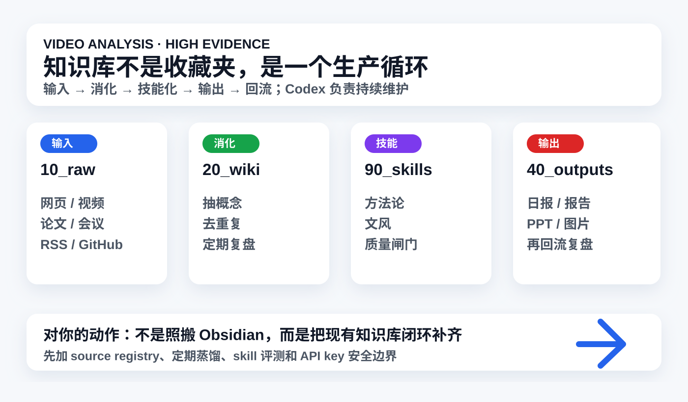

# 视频分析：Codex 联动 Obsidian 搭建自生长知识库

## 一句话结论

这条视频真正值钱的不是“Codex + Obsidian 怎么装”，而是把知识库从收藏夹升级为一个闭环系统：原始资料进入、AI 定期消化、沉淀成 reusable skills / 方法论，再输出文档、PPT、图片、视频，最后让输出继续回流复盘。

## 元信息

- 原始短链：<https://v.douyin.com/qpLNOId0ITc/>
- 展开链接：<https://www.douyin.com/video/7645192281837948196>
- 标题：`Codex联动Obsidian，搭建超强知识库，手把手教程`
- 作者：Xuan酱
- 公开视频线索：B站搜索页显示 Xuan_酱同题视频为 2026-05-29，时长约 `13:23`；Douyin 页面显示同题视频时长 `13:22`。
- 采集时间：2026-06-04 14:46 CST
- 证据等级：`high`
- 置信度：`medium_high`

## 证据边界

### 已拿到的证据

- 短链经 `curl -I -L` 展开到 Douyin canonical video id：`7645192281837948196`。
- `yt-dlp` 对 canonical URL 返回：`Fresh cookies (not necessarily logged in) are needed`；短链在沙箱内 DNS 解析失败。
- 搜索结果打开的 Douyin 页面中，能看到同题视频、作者 Xuan酱、时长 `13:22`，并出现较完整的 `AI文稿`。
- B站搜索页也显示 Xuan_酱同题视频：`Codex联动Obsidian，搭建卡帕西同款知识库，手把手教程`，发布时间 `05-29`，时长约 `13:23`。

### 没拿到的证据

- 没有拿到原始视频文件、关键帧截图、评论区、作者附带文档、安装包、提示词原文或插件配置文件。
- Douyin `AI文稿` 存在明显 ASR 错字，例如把 Obsidian 转成近似音；所以能用于结构分析，但不能作为逐字稿引用。
- 无法核验作者说的 GitHub 项目、插件、API key 注册路径、文档包是否真实可用或安全。

### 补证路径

- 最小补证材料：作者附带文档/架构图、原视频文件或完整字幕、示例 GitHub 项目链接、Obsidian 插件名和配置截图。
- 如需复现教程，应先隔离测试，不要直接把 API key、飞书文档、浏览器 cookie 或私人素材交给未知插件/脚本。

## 内容结构

1. **理念层**：不要把知识库当收藏夹，而是让 AI 持续维护一个“自生长系统”。
2. **目录层**：原始资料 A、处理后概念 B、方法论 / skill 库 C、输出 D；输出再回流到知识库。
3. **工具层**：用 Obsidian 承载本地 Markdown，用 Codex 读取、整理、生成文件；通过插件或项目文件夹让两者联动。
4. **收集层**：从 Twitter / GitHub / Reddit / RSS / 网页 / 小红书 / 视频字幕 / 飞书 / Notion / Word 等入口收集资料。
5. **迭代层**：让 Codex 定期蒸馏、复盘、去重、发现过时内容，并生成结构化总结。
6. **skill 化层**：把重复 3 次以上的工作流沉淀为 skill，例如选题判断、文风、去 AI 味、配图、PPT、视频摘要。
7. **输出层**：基于知识库批量生成文章、报告、PPT、图片、视频，再把产出反哺系统。

## 核心观点

### 1. 自生长知识库的关键是“循环”，不是工具组合

视频把核心循环讲清楚了：资料不是存进去就结束，而是要经过 AI 消化、概念化、方法论化、输出、回流。对你来说，Obsidian 只是一个可选 UI；真正重要的是这条生命周期。

### 2. 目录分层非常接近你现在的知识库

视频里的 A/B/C/D 四层，和你当前体系高度对应：

- A 原始资料：`10_raw/`
- B 处理后的概念 / wiki：`20_wiki/`
- C 方法论 / skill：`90_system/skills/`
- D 输出：`40_outputs/`

这说明我们现在的方向是对的，差的不是换工具，而是补齐自动蒸馏、source registry、skill 评测和输出回流规则。

### 3. “重复三次以上的方法”应该沉淀成 skill

视频里最有价值的一句话可以概括为：反复用的工作流不要一直靠临时 prompt，而要沉淀成 skill。你现在的 `AI情报员.skill`、`视频链接分析员.skill`、顶部图规范、候选池淘汰理由，就是这套逻辑的真实落地。

### 4. 输出不是终点，输出也是知识库养料

视频强调文档、PPT、图片、视频这些产物要回流。这个点对你特别关键：你现在的 AI news 和视频分析已经会生成报告，但后续还应定期把高价值结论蒸馏成 wiki、skill、watchlist、eval task，而不是只停留在日报。

### 5. 最大风险是“小白友好”包装下的权限和密钥风险

视频提到把 GitHub 项目、API key、飞书资料、外部平台链接交给 AI 配置。这个方向有生产力，但也有高风险：API key、公司文档、私密素材和浏览器登录态一旦进入不透明脚本或插件，知识库就从“效率工具”变成“泄露面”。

## 事实 / 观点 / 推断

### 可核验事实

- 短链展开到 Douyin video id `7645192281837948196`。
- 无登录态 `yt-dlp` 无法下载该抖音视频，提示需要 fresh cookies。
- Douyin 页面公开可见该同题视频的 AI 文稿，内容覆盖 Codex + Obsidian 搭建自生长知识库的理念和步骤。
- B站搜索页能看到 Xuan_酱同题视频，显示 05-29 发布、约 13 分钟。

### 作者观点

- Codex + Obsidian 能让知识库自动收集热点、整理信息、定期复盘、沉淀方法论，并输出文档/PPT/视频。
- Obsidian 适合作为本地 Markdown 知识库，因为 Codex 能直接读取和写入本地文件。
- 任何分散、持续更新、需要反复调用的信息，都适合统一进入知识库。
- 重复三次以上的工作流应该转成 skill，帮助后续自动判断、写作、配图、做 PPT 和视频摘要。

### 我的推断

- 这条视频的高价值不是教程细节，而是它验证了你当前知识库的系统路线：raw -> wiki -> skill -> output -> memory。
- 你不一定需要切到 Obsidian；当前知识库后台 + Markdown 文件 + Codex 已经覆盖核心能力。Obsidian 可以作为编辑和图谱 UI，而不是系统核心。
- 真正值得新增的是自动蒸馏和评测闭环，不是盲目安装更多插件。

## 论据质量

- **强证据**：Douyin AI 文稿、短链展开、B站同题视频元信息。
- **中等证据**：视频中提到的自动化流程、GitHub 项目、插件和提示词包，尚未拿到原始链接和配置文件，不能确认安全性与可复现性。
- **弱证据**：`小白无痛复刻`、`最全面系统`、`一键抄作业` 等营销表达，只能视为传播话术。
- **不能下的结论**：不能说所有非技术用户都能安全复刻；不能说作者的插件链路适合你的生产知识库；不能确认视频附带资料没有权限/密钥风险。

## 高价值点

### 对你的当前系统

这条视频几乎是在描述你正在做的事，但它把闭环讲得更产品化。你现在已经有：

- `10_raw/`：视频、链接、原始材料
- `20_wiki/`：技能候选、知识沉淀
- `40_outputs/`：AI news、专题、报告
- `90_system/skills/`：AI news、视频分析、工程护栏
- `90_system/shared_memory/`：跨任务记忆和索引

下一步不是重做，而是把每个环节之间的“定期回流规则”补上。

### 对 AI news

视频里“每天抓热点、去重、评分、生成日报”的思路，和你对 `AI news` 的要求完全一致。但你已经进一步要求候选池、淘汰理由、早期信号和证据边界，这是比视频更高质量的标准。可以吸收它的自动化方向，但不降低求真标准。

### 对视频分析

视频提到网页、视频字幕、案例都能进 Obsidian。你当前视频分析 skill 已经更严谨：没有证据就降级，不硬分析。未来可以加一个 `video_to_wiki_digest`：把高价值视频分析二次蒸馏成 wiki 或 skill，而不只是保留 raw 分析。

### 对个人复利

这条视频背后的核心是“把个人经验资产化”。你的 AI 使用频率已经很高，真正的复利来自：

- 把判断标准写成 skill。
- 把输出回流成知识。
- 把失败案例沉淀成 guardrail。
- 把高价值内容变成可复用模板。

## 噪音与风险

- `把 API key 发给 AI 配置` 这类说法对小白很危险；正确做法是用 `.env`、最小权限、隔离账号和不提交凭证。
- 自动抓 Twitter/GitHub/Reddit/RSS 需要 source policy，否则会引入重复、营销、错误和低质量内容。
- 自生长知识库如果没有评测，会自我污染：错误总结、过期结论、低质量输出会反复回流。
- Obsidian 插件生态很强，但插件权限、同步、文件改写、第三方服务都需要审计。
- 定时自动化不等于无人监督；尤其涉及联网、下载、登录态、发送消息和写文件时，必须有日志和人工检查点。

## 我的判断

非常值得沉淀。它对你最有价值的不是“学会一个 Obsidian 教程”，而是确认我们现在建设知识库的方向：个人 AI 系统应该有输入、消化、方法论、输出和回流。

但不能照搬。更适合你的版本是：

- Obsidian：可选前端，不是核心。
- Codex：执行和维护引擎。
- 知识库目录：继续沿用现有 `10_raw / 20_wiki / 40_outputs / 90_system`。
- 自动化：先做低风险定期蒸馏，再做高权限自动化。
- skill：必须有评测和版本，不靠感觉自增。
- 安全：API key、飞书、浏览器、私人资料必须先有权限边界。

## 可行动作

1. 建 `90_system/source_registry.md`：记录所有信息源、用途、可信度、是否需要登录、是否可自动抓取。
2. 建 `20_wiki/knowledge_lifecycle.md`：把 `10_raw -> 20_wiki -> 90_system/skills -> 40_outputs -> shared_memory` 的回流规则写清楚。
3. 建 `90_system/skills/skill_eval_matrix.md`：每个 skill 至少绑定 3 个真实任务和验收标准。
4. 给 `AI news` 加自动蒸馏任务：每周把日报中反复出现的主题沉淀为 wiki/watchlist，而不是只堆日报。
5. 给视频分析加二次蒸馏：高价值视频生成 `wiki digest` 或 `skill candidate`，低证据视频只保留 raw。

## 关联笔记

- `40_outputs/daily_ai/2026-06-04.md`：agent 生产化需要上下文供给、系统级观测和浏览器防污染。
- `10_raw/videos/2026-06-04_douyin_7640457019010338082/analysis.md`：OpenClaw 核心开发者访谈，强调个人 agent 底座、skills、记忆和停止机制。
- `20_wiki/skills/agent_skill_candidate_list.md`：Top5 skill 资产和 AnySearch 试用边界。
- `90_system/skills/ai-news/SKILL.md`：AI 情报员 skill。
- `90_system/skills/douyin-video-analysis/SKILL.md`：视频链接分析 skill。

## 补证路径

如要进一步复现教程，需要补齐：

- 作者附带的两张架构图、安装文档、skill 包和提示词。
- 视频里提到的 GitHub 项目地址、Obsidian 插件名、Codex CLI 路径配置截图。
- 任意 API key / 飞书 / Notion / 小红书导入部分的安全审计。
- 一个隔离测试仓库，用假数据跑通全流程，再决定是否接入生产知识库。
