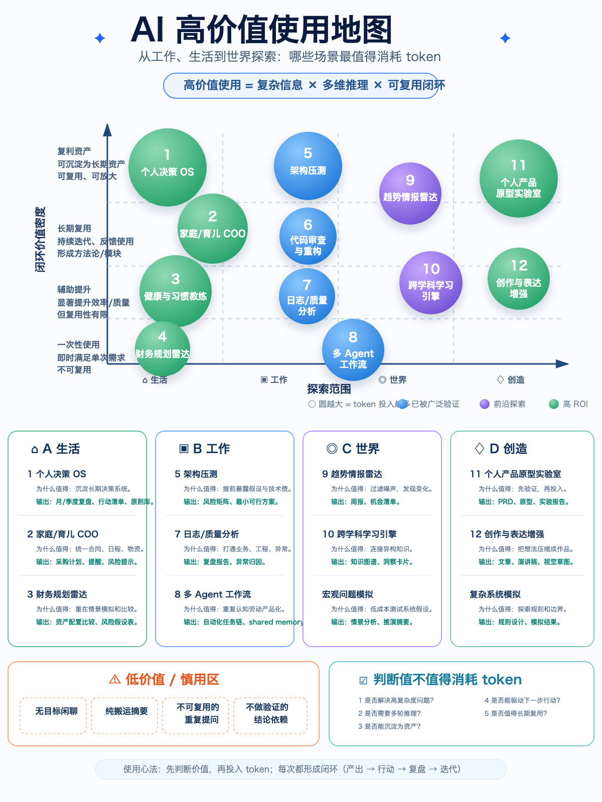

# AI 高价值使用地图：哪些场景最值得消耗 token

## 1. 背景 / 为什么写这篇

使用 AI 的目标不是把 AI 用得很花，而是识别哪些场景值得高质量消耗 token：哪些问题值得多轮对话、长上下文、深推理和结构化输出，哪些问题只需要轻量处理甚至不值得问。

高价值使用和低价值滥用的差别，不在于一次对话看起来多复杂，而在于它是否能解决复杂问题、形成行动，并沉淀为可复用资产。

AI 也不应该只被限制在工作效率工具里。它同样适用于生活决策、家庭管理、健康习惯、世界认知、趋势判断、创作表达和复杂系统探索。真正值得投入的场景，往往横跨工作、生活、世界探索和创造四个维度。

## 2. 核心判断公式

`高价值使用 = 复杂信息 × 多维推理 × 可复用闭环`

这个公式可以作为判断是否值得消耗高质量 token 的第一原则。

- 复杂信息：问题不是一句话能回答完的，通常涉及多变量、多约束、多来源信息。例如家庭采购、架构迁移、财务决策、趋势判断。
- 多维推理：需要比较、推演、拆解、情景模拟，而不是简单摘抄。例如方案取舍、风险识别、异常归因、跨学科关联。
- 可复用闭环：结果最好能沉淀为资产，推动行动，并支持后续复盘迭代。例如 SOP、模板、决策框架、复盘报告、知识卡片。

如果一个问题同时满足这三点，它通常值得投入更多 token、上下文和反复打磨。反过来，如果只是一次性闲聊、单点答案或无法验证的结论，就不应该投入过高成本。

## 3. 一套判断“值不值得消耗 token”的标准

### 1. 是否解决高复杂度问题？

如果问题涉及多个变量、多个角色、多个约束或多种不确定性，AI 的价值会明显提高。复杂度越高，越需要 AI 帮助梳理结构、拆分层次、暴露遗漏。

低复杂度问题可以用搜索、计算器、固定清单或短 prompt 解决，不必使用长上下文和多轮推理。

### 2. 是否需要多轮推理？

高价值问题通常不能靠第一版回答解决。它需要追问、比较、反驳、重构和验证。

如果一个问题需要经历“提出假设 → 拆解变量 → 生成方案 → 压测风险 → 修正方案”，它就值得投入高质量对话。

### 3. 是否能沉淀为资产？

高价值输出应该能变成某种可复用资产，例如模板、SOP、原则库、知识卡片、复盘报告、代码脚本或决策框架。

如果对话结束后没有任何可留存结果，只是获得短暂情绪反馈或一次性答案，就不适合高成本投入。

### 4. 是否能驱动下一步行动？

好的 AI 使用应该让人更容易行动，而不是只获得更多信息。输出应该能回答：下一步做什么、先做什么、怎么判断做得好不好。

如果输出不能转化为任务、清单、实验、决策或复盘，就需要继续压缩成可行动结果。

### 5. 是否值得长期复用？

越能长期复用的场景，越值得认真设计 prompt、上下文、模板和知识库回写机制。

例如代码审查、资料消化、周复盘、趋势情报、家庭预算、健康习惯追踪，都是高复用场景；一次性的低风险小问题则不需要复杂化。

## 4. 四大高价值场景地图

### A. 生活

生活场景的高价值使用，不是让 AI 替你做零碎建议，而是把长期反复出现的问题变成个人和家庭的操作系统。

#### 1. 个人决策 OS

定义：把碎片问题沉淀为长期决策系统，让 AI 帮助你记录背景、澄清目标、比较方案、复盘结果，并逐步形成个人原则库。

典型场景：

- 职业选择、学习方向、长期项目取舍
- 周/月/季度复盘
- 重要消费、搬家、旅行、关系沟通等复杂决策

为什么高价值：

- 个人决策通常包含价值观、时间、金钱、机会成本和情绪因素。
- AI 可以帮助拆解隐含假设，避免只凭当下情绪做判断。
- 多次复盘后，能形成稳定的个人判断框架。

典型输出：

- 周/月/季度复盘
- 行动清单
- 决策记录
- 个人原则库

#### 2. 家庭 / 育儿 COO

定义：把家庭中的合同、日程、物资、预算、风险和责任分工结构化，让 AI 成为家庭运营的辅助中枢。

典型场景：

- 育儿日程、疫苗、保险、教育材料整理
- 家庭采购、维修、服务合同管理
- 旅行准备、老人照护、家庭风险排查

为什么高价值：

- 家庭事务信息分散，且遗漏成本较高。
- AI 适合把零散信息转为清单、时间线和风险表。
- 长期沉淀后，可以形成家庭运营 SOP。

典型输出：

- 采购计划
- 提醒机制
- 风险清单
- 家庭 SOP

#### 3. 健康与习惯教练

定义：用 AI 做习惯设计、追踪、反馈和调整，而不是只要一次性建议。

典型场景：

- 睡眠、运动、饮食、用眼、情绪管理
- 习惯打卡和行为回顾
- 低风险健康信息整理和就医前问题清单

为什么高价值：

- 习惯改变不是知识问题，而是反馈系统问题。
- AI 可以帮助把目标拆小、降低执行阻力，并根据记录持续调整。
- 复盘越多，越能贴合个人节奏。

典型输出：

- 打卡体系
- 行为回顾
- 调整建议
- 就医沟通问题清单

#### 4. 财务规划雷达

定义：用 AI 辅助整理财务目标、现金流、风险假设和情景模拟，而不是追求单点投资推荐。

典型场景：

- 大额消费决策
- 家庭预算与现金流规划
- 资产配置方案比较
- 风险承受能力梳理

为什么高价值：

- 财务问题不应依赖单点答案，更需要情景模拟与风险比较。
- AI 可以帮助把假设显性化，例如收入变化、支出上升、利率变化、紧急备用金不足。
- 结果可以沉淀为长期财务决策框架。

典型输出：

- 资产配置对比
- 风险假设表
- 消费决策框架
- 预算复盘表

### B. 工作

工作场景的高价值使用，核心是把复杂认知劳动结构化、可审查、可复用，并尽量产品化为流程、脚本或 agent。

#### 5. 架构压测

定义：让 AI 帮助暴露方案中的隐含假设、技术债、边界问题、迁移风险和组织成本。

典型场景：

- 新系统架构设计
- 老系统重构与迁移
- 技术选型
- 性能、稳定性、扩展性评估

为什么高价值：

- 架构问题变量多，且错误成本高。
- AI 适合做多视角审查：边界、风险、依赖、测试、回滚、成本。
- 压测结果能形成团队可复用的评审模板。

典型输出：

- 风险矩阵
- 最小可行方案
- 迁移策略
- 架构评审清单

#### 6. 代码审查与重构

定义：用 AI 做代码语义理解、风险识别、重构建议和测试补齐，而不是只让它改几行代码。

典型场景：

- PR / MR review
- 复杂模块重构
- 测试缺口识别
- 代码风格和架构边界检查

为什么高价值：

- 好的代码审查需要上下文、意图、边界和风险判断。
- AI 可以快速扫描重复模式、异常路径、兼容性风险和测试遗漏。
- 输出可以沉淀为 review 规则和重构 SOP。

典型输出：

- review 结论
- 重构方案
- 测试建议
- 风险说明

#### 7. 日志 / 质量分析

定义：打通业务现象、工程实现、异常日志和用户影响，形成可行动的质量洞察。

典型场景：

- 线上事故复盘
- 错误日志归因
- 性能指标异常分析
- 业务漏斗和工程变更关联分析

为什么高价值：

- 日志分析通常信息量大、来源多、噪声高。
- AI 适合做模式归纳、时间线整理、假设生成和复盘结构化。
- 结果可沉淀为质量分析模板和监控改进项。

典型输出：

- 复盘报告
- 异常归因
- 质量洞察
- 监控和告警改进建议

#### 8. 多 Agent 工作流

定义：把重复认知劳动产品化，让多个 agent 或自动化步骤承担信息收集、处理、校验、输出和回写。

典型场景：

- 每日 AI 情报筛选
- 视频链接自动分析
- PR 审查与 CI 修复
- 知识库整理与 shared memory 回写

为什么高价值：

- 重复认知劳动适合流程化和自动化。
- 多 agent 工作流能把“临时聊天”升级为“可持续生产系统”。
- 结果能直接进入知识库、脚本和协作协议。

典型输出：

- 自动化任务链
- 脚本
- 工作流说明
- shared memory 回写机制

### C. 世界

世界探索场景的高价值使用，是用 AI 帮助你理解变化、连接知识、模拟复杂系统，而不是被信息流牵着走。

#### 9. 趋势情报雷达

定义：持续追踪科技、政策、产业、资本和社会变化，从噪声中提炼真正值得关注的变化。

典型场景：

- AI 模型、工具、论文、开源项目追踪
- 政策和行业变化监控
- 竞品和产品趋势分析
- 新机会识别

为什么高价值：

- 趋势判断需要跨来源信息、时间序列和影响评估。
- AI 可以帮助过滤重复包装和营销噪声。
- 持续沉淀后能形成个人情报系统。

典型输出：

- 周报
- 机会清单
- 变化摘要
- 趋势判断卡片

#### 10. 跨学科学习引擎

定义：连接技术、商业、心理学、行为科学、组织管理等异构知识，形成更强的解释力和迁移能力。

典型场景：

- 从工程问题连接到组织激励
- 从产品体验连接到心理学和行为科学
- 从商业案例提炼技术决策启发
- 建立个人知识图谱

为什么高价值：

- 跨学科洞察很难靠单一搜索获得。
- AI 适合做类比、迁移、结构化关联和反例分析。
- 输出能进入长期知识库，成为思维模型资产。

典型输出：

- 知识图谱
- 洞察卡片
- 关联分析
- 思维模型笔记

#### 11. 宏观问题模拟

定义：用低成本方式测试复杂系统假设，理解关键变量、反馈回路和不同情景下的可能结果。

典型场景：

- 技术趋势对职业路径的影响
- 政策变化对产业链的影响
- 组织调整对团队效率的影响
- AI 普及对个人能力结构的影响

为什么高价值：

- 宏观问题无法简单验证，但可以通过情景模拟降低盲区。
- AI 可以帮助列变量、建假设、做情景对比和寻找反例。
- 结果不一定是预测，但能提高判断质量。

典型输出：

- 情景分析
- 推演摘要
- 关键变量图
- 待验证假设清单

### D. 创造

创造场景的高价值使用，是把模糊想法快速外化、验证和迭代，让想象力进入可执行系统。

#### 12. 个人产品原型实验室

定义：用 AI 快速验证产品、工具、服务或内容想法，不必先投入大量开发和设计成本。

典型场景：

- 个人知识库产品化
- 小工具、脚本、插件原型
- SaaS / 内容产品想法验证
- 用户流程和需求假设测试

为什么高价值：

- 早期想法最大风险是方向错误，而不是执行不够快。
- AI 可以快速生成 PRD、原型、交互流程、实验设计和反馈指标。
- 多次实验后，能沉淀为个人创新方法论。

典型输出：

- PRD
- 原型
- 实验报告
- 用户访谈提纲

#### 13. 创作与表达增强

定义：把模糊想法压缩成清晰作品，辅助完成结构、叙事、措辞、图示和多版本表达。

典型场景：

- 文章、演讲稿、课程大纲
- 技术方案表达
- 视觉图示和信息架构
- 个人观点体系整理

为什么高价值：

- 表达不是润色问题，而是结构问题。
- AI 可以帮助把混乱素材组织成清晰论证。
- 作品可以反过来成为知识库资产。

典型输出：

- 文章
- 演讲稿
- 图示
- 表达框架
- 发布前审稿清单

#### 14. 复杂系统模拟

定义：用 AI 探索规则、反馈、边界和涌现结果，帮助设计游戏、组织机制、学习系统或多 agent 协作系统。

典型场景：

- 游戏规则和经济系统设计
- 多 agent 协作机制设计
- 学习系统和激励机制设计
- 组织流程模拟

为什么高价值：

- 复杂系统很难靠直觉一次设计正确。
- AI 可以帮助构造规则、模拟路径、找边界条件和失败模式。
- 结果可沉淀为实验记录和规则库。

典型输出：

- 规则设计
- 模拟结果
- 实验记录
- 失败模式清单

## 5. 低价值 / 慎用区

低价值不等于完全不能用，而是：如果不能形成行动或资产沉淀，就不值得高成本投入。

### 无目标闲聊

闲聊可以放松，也可以激发灵感，但如果没有目标、没有问题、没有产出，就不应该占用高质量推理资源。适合轻量模型、短对话或明确限定时间。

### 纯搬运式摘要

把一篇文章压缩成几条摘要有时有用，但如果只是搬运，没有判断、比较、关联和行动建议，价值有限。

更高价值的做法是要求 AI 区分事实、观点、推断、证据强弱、适用边界和可行动点。

### 不可复用的重复提问

如果同类问题反复问，但不沉淀模板、规则或知识库记录，就会持续浪费 token。

重复问题应该升级为 SOP、prompt 模板、检查清单或自动化流程。

### 不做验证的结论依赖

AI 输出不是事实本身。涉及医学、法律、金融、政策、价格、软件版本、安全等高风险或高变化信息时，必须验证来源和时效。

不做验证就直接依赖结论，短期看省事，长期会降低判断质量。

## 6. 实操建议：怎么真正把 token 用出复利

- 每次使用前先判断价值，而不是先开聊。先问：这个问题是否复杂、是否需要推理、是否能沉淀。
- 让每次高质量对话形成闭环：产出 → 行动 → 复盘 → 迭代。没有闭环的输出容易变成一次性消费。
- 优先做能沉淀为资产的事，例如模板、SOP、知识卡片、脚本、决策记录、复盘报告。
- 对工作流、模板、知识库、决策系统优先投入，因为它们会降低未来重复成本。
- 对一次性、不可复用、无行动结果的问题减少投入，必要时用短 prompt 或轻量处理。
- 把高价值对话回写知识库，至少记录：问题背景、关键判断、行动结果、后续复盘点。
- 对结论设置信心等级。能验证的就验证，不能验证的标记为推断或待验证。

## 7. 适合后续扩展的方向

- 结合个人知识库形成“高价值 AI 使用 SOP”，规定什么问题进入深度处理，什么问题轻量处理。
- 与 shared memory / Flux 结合，把高价值对话自动回写为任务、决策、产物和下一步。
- 继续沉淀具体案例库，按工作、生活、世界、创造四类归档。
- 未来扩展成图谱、仪表盘或导航页，让每类高价值场景都有入口、模板和案例。
- 为常见高价值场景建立 prompt 模板，例如架构压测、视频资料消化、趋势雷达、个人复盘。

## 地图总览

