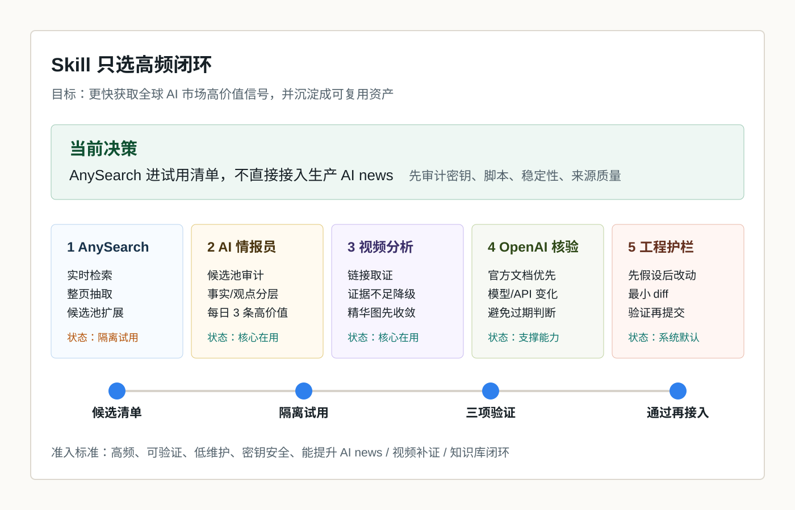

# Agent Skill 候选清单：Top5 与 AnySearch 隔离试用

## 结论先行

当前最值得做的不是继续堆更多 skill，而是围绕一个高频闭环筛选 skill：

`全球 AI 市场信号 -> 候选池审计 -> 视频/网页补证 -> 官方核验 -> 知识库沉淀 -> 下一次复用`

因此，AnySearch 值得进入试用清单，但不应该因为短视频推荐就直接接入生产 `AI news`。现在的正确动作是：先把它作为候选能力隔离验证；如果三项验证通过，再升级 `AI情报员.skill` 的候选池检索和整页抽取步骤。

## 事实依据与边界

### 已核验事实

- AnySearch 官方文档显示，它提供 `/v1/search` 统一搜索 API、MCP 安装方式和 SKILL 安装说明；API key 可选但推荐，无 key 可匿名使用但限额更低。来源：[AnySearch Docs](https://www.anysearch.com/docs)
- AnySearch GitHub 仓库将自己描述为面向 AI agents 的统一实时搜索 skill；截至 2026-05-25 页面可见约 `1.1k stars`、`97 forks`，且暂无正式 release。来源：[anysearch-ai/anysearch-skill](https://github.com/anysearch-ai/anysearch-skill)
- OpenAI skills catalog 将 Agent Skills 定义为由 instructions、scripts、resources 组成的能力包，用于让 Codex 可重复完成特定任务。来源：[openai/skills](https://github.com/openai/skills)
- OpenAI Help 说明 ChatGPT skills 是可复用、可共享的工作流，可包含 instructions、examples 和 code；但 skills 目前不会自动跨产品同步。来源：[Skills in ChatGPT](https://help.openai.com/en/articles/20001066-skills-in-chatgpt)

### 判断边界

- GitHub stars、短视频收藏、评论热度只能说明注意力，不证明工具可靠。
- 当前没有安装 AnySearch，也没有使用真实 API key 跑生产数据；本文结论是准入判断，不是实装验收。
- AnySearch 文档中的匿名访问、限额、价格、支持能力可能变化；正式接入前需要重新核验。

## Top5 推荐

| 排名 | Skill / 能力 | 当前状态 | 对你的核心价值 | 推荐理由 | 风险与准入条件 |
| --- | --- | --- | --- | --- | --- |
| 1 | AnySearch Skill | 候选 / 隔离试用 | 扩大 `AI news` 的候选池，补上实时搜索、批量检索和整页抽取能力 | 直接对应你反复要求的 GitHub 热榜、新星、官方文章、X/KOL、网页全文证据 | 不进生产；先审计 API key、脚本、依赖、license、稳定性和来源质量 |
| 2 | `AI情报员.skill` | 核心 / 在用 | 把外部信息转成每天可决策的 3 条高价值 AI 情报 | 已经具备候选池、淘汰理由、事实/观点/推断分层、顶部精华图和后台链接 | 后续可接入更强检索，但必须保留审计层，不允许黑盒直接生成结论 |
| 3 | `视频链接分析员.skill` | 核心 / 在用 | 把抖音、B站等短视频从“种草”还原成证据链和行动判断 | 已经支持证据不足时降级，能把热门视频转成知识库资产 | 需要继续强化补证路径，避免没有完整转录时过度解读 |
| 4 | OpenAI 官方文档核验能力 | 支撑 / 在用 | 对 Codex、ChatGPT、OpenAI API、skills 等变化做一手核验 | 你会频繁围绕 Codex/Agent 工作流做决策，官方源优先能减少过期判断 | 只解决 OpenAI 生态；外部工具仍需 GitHub、官网、社区实测交叉验证 |
| 5 | `coding-guardrails` / Agent 工程护栏 | 系统 / 默认 | 限制 agent 顺手乱改、过度抽象、未验证就提交 | 你的知识库和自动化越来越像长期系统，工程护栏是复利资产 | 不直接提高信息量，但能显著降低长期维护成本和误改风险 |

## 为什么 AnySearch 排第一，但不能直接生产接入

AnySearch 的价值点和你的缺口高度匹配：

- `AI news` 需要更大的候选池，而不是只依赖成熟官方公告。
- 视频分析需要补证路径，例如从视频提到的工具名反查官网、GitHub、文档、社区反馈。
- 专题情报需要网页全文抽取，避免只看搜索结果摘要。
- 你关心的是全球 AI 市场早期信号，搜索基础设施比单个内容源更重要。

但它也有明确风险：

- 涉及 API key，密钥绝不能进入 Markdown、截图、聊天记录或 git。
- GitHub 仓库当前暂无正式 release，不适合直接当稳定生产依赖。
- 搜索结果质量需要实测，尤其要看是否能覆盖 GitHub、官方文档、X/KOL、论文、社区实测。
- 一旦直接接入 `AI news`，如果没有候选池审计，可能会把搜索噪音包装成高价值判断。

所以准入结论是：`高价值候选，先试用，不进生产`。

## AnySearch 隔离试用计划

### 试用目标

验证它是否能稳定提升三类任务，而不是只验证“能不能搜”：

1. `AI news` 候选池扩展：是否能更快找到 GitHub 新星、官方文章、社区早期反馈和 X/KOL 线索。
2. 网页全文抽取：是否能从官网、GitHub README、文档页中抽出足够完整的事实，而不是只返回摘要。
3. 视频分析补证：是否能围绕视频提到的工具、项目、说法，自动找到一手来源和反证材料。

### 验收标准

| 测试 | 任务 | 通过标准 | 失败信号 |
| --- | --- | --- | --- |
| T1 | `AI news` 候选池 | 6-10 个候选有来源链接、时间、新鲜度、入选/淘汰理由 | 只返回泛新闻、旧内容、营销页，无法解释来源质量 |
| T2 | 网页全文抽取 | 能提取官方文档、GitHub README、release/issue 关键事实 | 抽取缺段、只有标题摘要、频繁超时或无法处理动态页面 |
| T3 | 视频分析补证 | 能把视频里的工具名/观点关联到官网、GitHub、文档、社区实测 | 只能补到二手搬运、无法找到一手材料、噪音明显高 |

### 安全规则

- 不把真实 `ANYSEARCH_API_KEY` 写入 `.md`、截图、git diff、聊天内容。
- 只使用 `.env`、本地环境变量或系统密钥管理；确认 `.env` 被 `.gitignore` 排除。
- 首次试用使用隔离目录，不修改 `90_system/skills/ai-news/SKILL.md`。
- 安装前检查 `SKILL.md`、脚本、依赖、license；必要时 pin commit。
- 试用日志只记录能力、错误、耗时、来源质量和成本，不记录密钥。

## 后续接入条件

只有同时满足以下条件，才升级生产 skill：

- 三项测试至少两项通过，且 `AI news` 候选池任务必须通过。
- 可稳定输出候选池、淘汰理由、来源类型和验证边界。
- 不要求在知识库中保存任何密钥。
- 错误处理清楚：限额、超时、401/403、抽取失败时能降级，不硬写结论。
- 维护成本可接受：不需要每天手工修依赖、调参数或清理噪音。

## 对当前知识库的改动建议

### 现在做

- 保留本候选清单，作为后续 skill 评估入口。
- AnySearch 进入隔离试用，不进入生产 `AI news`。
- 后续每次遇到高价值 skill，先按 `频率 / 价值 / 证据 / 成本 / 风险` 评分，再决定是否沉淀。

### 通过试用后再做

- 升级 `AI情报员.skill`：把“候选池检索”和“整页抽取”列为可审计步骤。
- 升级 `视频链接分析员.skill`：把“自动补证路径”从人工建议变成默认流程。
- 增加 `skill_candidate_registry`：记录每个 skill 的来源、版本、试用结果、是否生产启用。

## 本次执行状态

- 已完成：Top5 技能候选清单。
- 已完成：AnySearch 隔离试用验收表。
- 已完成：API key 与生产接入安全边界。
- 未执行：AnySearch 安装与真实 API 测试。
- 未执行原因：当前阶段不应把未审计外部 skill 直接安装到生产知识库；真实测试需要明确隔离目录、密钥管理方式和可回滚记录。

## 相关笔记

- `10_raw/videos/2026-05-25_douyin_7642361133782160113/analysis.md`：萌萌本萌《codex超好用skills》视频分析。
- `90_system/skills/ai-news/SKILL.md`：当前 AI 情报采集 skill。
- `90_system/skills/douyin-video-analysis/SKILL.md`：当前视频链接分析 skill。
- `40_outputs/daily_ai/2026-05-20_andrej-karpathy-skills.md`：Agent 行为策略层和 skills 复用价值。
