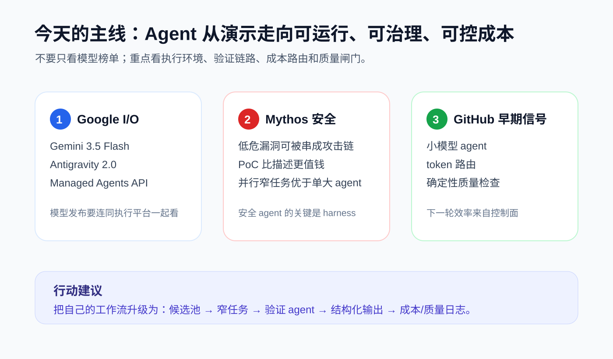

# 每日 AI 高价值信息

## 筛选原则

- 本次模式：广谱 AI 市场情报。
- 搜索时间窗：2026-05-19 至 2026-05-20 12:30 CST；优先 Google I/O 后的正式公告与近 48 小时工程信号。
- 来源范围：Google / Google Cloud / Cloudflare 官方博客、GitHub 仓库与 GitHub API、arXiv、Anthropic 官方页、GitHub Blog / Changelog。
- 排除/降权：已在 2026-05-19 覆盖的 OpenAI + Dell、Anthropic + Stainless、Anthropic + KPMG、Karpathy 去向、Elephant retrieval；纯二手报道、Reddit 争议帖、疑似 SEO/蹭热仓库。
- 只保留 3 条。兼顾成熟事实与早期信号；早期信号必须标注置信度和待验证点。

## 候选池与淘汰理由

| 候选 | 来源类型 | 状态 | 理由 |
| --- | --- | --- | --- |
| Google I/O 2026：Gemini 3.5 Flash + Antigravity 2.0 + Managed Agents API | 官方发布 | 入选 | 一手来源、5/19-5/20 新发布；同时改变模型、开发平台、托管执行环境三层。 |
| Cloudflare：Project Glasswing / Mythos Preview 实测经验 | 官方技术博客 | 入选 | 5/18 发布，信息密度高；把“安全 agent”从模型能力讲到 harness、验证、去重、并行窄任务。 |
| GitHub 早期信号：SmallCode / OpenSquilla / Slopless | GitHub 页面 + GitHub API | 入选 | 新仓/新 release，集中指向 agent 的成本、质量和小模型可用性控制层。 |
| Cloudflare：Claude Managed Agents on Cloudflare | 官方技术博客 | 暂缓 | 很重要，但与 Google Managed Agents 同属执行环境主题；今天作为 1/2 条背景，不单独占坑。 |
| Google：SynthID / C2PA / AI Content Detection API 扩展 | 官方发布 | 暂缓 | 信任与溯源价值高，但对个人 AI 成长的直接行动性低于前三条；后续可做专题。 |
| Gemini Spark / Daily Brief / macOS Gemini | 官方发布 | 淘汰 | 消费者产品信号强，但大量功能仍处 trusted tester / Beta / summer rollout，先观察实测。 |
| Anthropic：Widening the conversation on frontier AI | 官方发布 | 淘汰 | 是治理/价值观信号，不是今天最直接影响工具链和个人成长的高价值信息。 |
| GitHub Copilot 个人计划/用量争议 | 官方页 + 社区反馈 | 淘汰 | 定价和社区情绪重要，但此前已多次覆盖 agent 预算/计费逻辑；今天不重复。 |
| arXiv：Agent-generated code maintenance 研究 | 论文 | 淘汰 | 主题重要，但发布时间较早且行动价值不如今天的官方/工程信号。 |

## 1. Google I/O：Gemini 3.5 不只是模型发布，而是“模型 + Agent harness + 托管环境”的组合拳

### 来源

- [Google：I/O 2026 news and announcements](https://blog.google/innovation-and-ai/technology/developers-tools/google-io-2026-collection/)
- [Google：Gemini 3.5: frontier intelligence with action](https://blog.google/innovation-and-ai/models-and-research/gemini-models/gemini-3-5/)
- [Google：Building the agentic future: Developer highlights from I/O 2026](https://blog.google/innovation-and-ai/technology/developers-tools/google-io-2026-developer-highlights/)
- [Google Cloud：Everything Google Cloud customers need to know coming out of Google I/O](https://cloud.google.com/blog/products/ai-machine-learning/innovations-from-google-io-26-on-google-cloud)

### 信号类型

- S2：官方发布 / 模型与开发者平台更新
- 来源类型：官方博客、Google Cloud 官方博客
- 置信度：高

### 一句话结论

Google 把 Gemini 3.5 Flash、Antigravity 2.0、Managed Agents API 和 Gemini Spark 串成同一条 agent 执行链，重点从“回答问题”转向“在受控环境里持续行动”。

### 事实 / 观点 / 推断

- 事实：Google I/O 2026 官方集合页称本次发布包括 Gemini Omni、Gemini 3.5、Antigravity 进展、Search / Gemini app / Workspace / Cloud 的 agentic experiences。
- 事实：Gemini 3.5 Flash 已面向 Gemini app、AI Mode in Search、Google Antigravity、Gemini API、AI Studio、Android Studio、Gemini Enterprise Agent Platform 等可用。
- 事实：Google 称 3.5 Flash 在 Terminal-Bench 2.1、GDPval-AA、MCP Atlas、CharXiv Reasoning 等 benchmark 上表现突出，并强调速度与 agent/coding 任务。
- 事实：开发者公告提到 Antigravity 2.0 desktop app、Antigravity CLI / SDK，以及 Gemini API 的 Managed Agents：一次 API call 可启动能推理、用工具、执行代码的隔离 Linux 环境。
- 推断：Google 的核心叙事不是单点模型能力，而是把模型、agent harness、隔离执行、企业平台和消费者入口打包成闭环。

### 为什么重要

大模型竞争正在从“哪个模型更聪明”转向“哪个平台能让 agent 可靠执行长任务”。Google 同时把 Gemini 3.5 放进消费端、开发工具、企业平台和托管环境，说明后续竞争重点会变成：执行环境、状态持久化、权限、工具调用、并行 subagents、成本与可观测性。

### 对我的启发

- 以后跟踪模型发布，不能只记参数和榜单；要同步记录它配套的 harness、sandbox、API、价格、上下文、可观测性和权限模型。
- 你的知识库/skill 系统也应该按“模型脑力 + 工具手脚 + 记忆状态 + 验证闸门”拆解，而不是把所有问题都归因于模型强弱。
- `ai news` 可以新增一个固定字段：该信号影响的是 `model`、`runtime`、`tooling`、`distribution` 还是 `governance`。

### 待验证点

- Gemini 3.5 Flash 的 benchmark 由官方给出，需要等第三方实测验证 coding、agent、长任务稳定性。
- Managed Agents API 的真实限制：环境持久化时长、文件状态、网络权限、成本、日志可观测性、企业合规边界。
- Antigravity 2.0 与 Codex / Claude Code / GitHub Copilot CLI 相比，真实体验差异是否足够大。

### 可行动作

- 建一张 `agent_runtime_watchlist`：对比 Codex、Claude Managed Agents、Google Antigravity、GitHub Copilot agent、Cloudflare agent sandbox。
- 用 30 分钟读 Google Managed Agents / Antigravity 文档，记录“隔离环境、持久化、工具调用、审计、定价”五类字段。
- 后续如果拿到 Gemini 3.5 / Antigravity 可用入口，用同一个小任务与 Codex 做 A/B：生成文件、运行命令、修错、写总结。

## 2. Cloudflare + Mythos：安全 agent 的关键不是“一个更强模型”，而是并行、验证、去重和可审计 harness

### 来源

- [Cloudflare：Project Glasswing: what Mythos showed us](https://blog.cloudflare.com/cyber-frontier-models/)
- [Anthropic：Project Glasswing](https://www.anthropic.com/project/glasswing)

### 信号类型

- S2/S3：官方技术复盘 / 受控安全研究
- 来源类型：Cloudflare 官方技术博客、Anthropic 项目页
- 置信度：高；但具体漏洞细节未公开，影响范围以官方描述为准

### 一句话结论

Cloudflare 对 Mythos Preview 的实测说明，AI 安全能力的跃迁点在于能把低严重度原语串成可运行 PoC，但真正可规模化依赖的是围绕模型搭建的漏洞发现 harness。

### 事实 / 观点 / 推断

- 事实：Cloudflare 称其在 Project Glasswing 中把 Mythos Preview 指向 50+ 个自有仓库，用于观察安全模型能发现什么、如何工作。
- 事实：Cloudflare 观察到 Mythos Preview 在 exploit chain construction 和 proof generation 上显著强于把通用 frontier model 直接指向代码库。
- 事实：Cloudflare 明确说单一泛化 coding agent 不适合覆盖真实大型代码库；有效方式是把任务拆成窄范围、并行 hunter、独立 validate、gapfill、dedupe、trace、report。
- 事实：Cloudflare 还指出模型的“自然拒绝”不稳定，不能单独作为安全边界；未来公开高能力 cyber model 需要额外 safeguards。
- 推断：AI 安全将从“人问模型找漏洞”升级为“组织设计一套可审计的漏洞生产/验证流水线”，模型只是其中一个组件。

### 为什么重要

这篇对所有 agent 工作流都有迁移价值：复杂任务不能靠一个大 prompt 解决，而要拆成多个窄任务、角色互相质疑、用 schema 交付、用 trace 判断可达性、用 dedupe 防止噪声爆炸。它也提醒：AI 能降低发现漏洞的成本，防御侧必须更重视架构隔离、验证链路和响应流程。

### 对我的启发

- `ai news`、视频分析、代码审查都可以借鉴这个结构：先 recon，再 hunt，再 validate，再 dedupe，再 report。
- 高置信度不是“模型说得像专家”，而是有独立验证、可运行证据、反向质疑和结构化输出。
- 个人知识库可以把“验证 agent”单独做成 skill：它不产生新观点，只负责反驳、查证、降噪。

### 待验证点

- Mythos Preview 未公开，外部无法复现实测；Cloudflare 描述中的具体漏洞与修复细节受限。
- 这种 harness 的成本很高：并行几十个 agent、编译运行 PoC、独立验证，对个人工作流要做轻量化版本。
- 安全模型能力提升也会压缩攻击窗口，后续要观察公开模型或泄露模型是否复现类似能力。

### 可行动作

- 给视频分析 / ai-news 增加一个轻量验证环节：`生成结论 -> 列反例 -> 标注证据等级 -> 删除低置信内容`。
- 为知识库建立“证据等级”统一字段：`raw / medium / high`，并明确 high 必须有一手材料或可运行证据。
- 把 Cloudflare 的 8 阶段 harness 改写成个人版：`扫源 -> 分题 -> 初判 -> 反证 -> 去重 -> 输出`。

## 3. GitHub 早期信号：agent 的下一轮效率来自成本路由、质量闸门和小模型适配

### 来源

- [GitHub：Doorman11991/smallcode](https://github.com/Doorman11991/smallcode)
- [GitHub：opensquilla/opensquilla](https://github.com/opensquilla/opensquilla)
- [GitHub：agent-quality-controls/slopless](https://github.com/agent-quality-controls/slopless)
- GitHub API 快照：`created:>2026-05-15 (ai OR llm OR agent) stars:>20`、`created:>2026-05-01 mcp stars:>50`，采集时间 2026-05-20 12:18 CST。

### 信号类型

- S0/S1：GitHub 早期工程信号
- 来源类型：GitHub 新仓、新 release、README、GitHub API
- 置信度：中；stars 和 README 只能证明注意力和可检查对象，不能证明长期采用

### 一句话结论

GitHub 上的新信号正在从“再造一个 coding agent”转向“让 agent 更便宜、更可控、更少废话、更适合小模型和本地环境”。

### 事实 / 观点 / 推断

- 事实：`Doorman11991/smallcode` 创建于 2026-05-18，GitHub API 快照显示约 732 stars；README 将其定位为面向 7B-20B 本地小模型的 terminal-native coding agent，强调预算管理、摘要、宽容 tool parser、patch-first editing、TODO-driven planning、local privacy。
- 事实：`opensquilla/opensquilla` GitHub 页面显示 2026-05-19 发布 OpenSquilla 0.2.0，定位为 token-efficient microkernel AI agent，使用本地模型路由器把每轮请求分配到最便宜可胜任模型，并支持 skills、MCP、memory、sandbox、20+ provider。
- 事实：`agent-quality-controls/slopless` 最新 release 为 2026-05-18，提供 50+ deterministic textlint rules 和 CLI，用于在不调用 LLM 的情况下检查 Markdown 中的 AI/human slop，并可安装 Codex / Claude Code skill。
- 推断：开发者正在补 agent 的“控制面”：成本路由、上下文预算、输出质量规则、可追踪执行，而不是只等待更大的模型。

### 为什么重要

当 agent 使用频率上升后，真正的瓶颈会变成 token 成本、长上下文污染、输出废话、工具调用不稳、质量不可测。上述项目虽然早期，但指向同一个方向：把“模型自由发挥”改造成“有预算、有规则、有质量闸门的生产流水线”。

### 对我的启发

- 个人 AI 成长不应该只追新模型，还要建设自己的 agent 控制层：预算、日志、验证、风格检查、复用 skill、失败复盘。
- 当前知识库已经有 `ai-news`、视频分析、shared memory、skills；下一步高价值不是多写 prompt，而是给这些流程加上可观测性和质量检查。
- 中文内容暂时不能直接用 Slopless，但它的思路可迁移：为中文日报/视频分析建立确定性低质量规则。

### 待验证点

- 这些仓库都很新，star 可能受传播影响；需要观察 2-4 周后的 release、issue、真实用户案例和维护频率。
- SmallCode / OpenSquilla 的 benchmark 与架构宣称需要本地实测，尤其是小模型是否真的能稳定完成非玩具任务。
- Slopless 目前 README 明确 English-only，中文知识库需要自建规则或等待多语言支持。

### 可行动作

- 建一个 `agent_control_plane_watchlist`，记录：成本路由、上下文预算、质量检查、日志/trace、验证 agent、sandbox。
- 选 Slopless 的规则家族做参考，为中文知识库写 10 条“低信息密度/营销话术/结论不清”检查规则。
- 暂不安装这些早期项目到主工作流；先观察 2 周，若 release 和 issue 活跃，再选一个做小样本实测。
