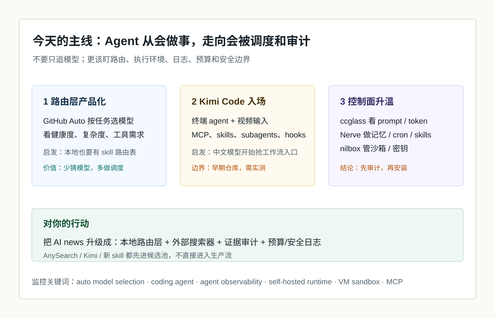

# 每日 AI 高价值信息

## 筛选原则

- 本次模式：泛 AI 情报，优先挑对你未来 1-4 周 AI 工作流、知识库、agent 使用方式有直接影响的信号。
- 搜索时间窗：优先 2026-05-25 至 2026-05-26；若近 24 小时硬事实不足，扩展到近 7 天。采集时间：2026-05-26 15:45 CST。
- 来源范围：GitHub Changelog、Claude / Anthropic 官方博客与文档、MoonshotAI / Kimi Code 官方文档与 GitHub、GitHub 新仓、Hacker News 新帖、npm / GitHub supply-chain 更新。
- 排除/降权：已在 2026-05-20 覆盖的 Google I/O 主线、已覆盖的 Anthropic + Stainless、OpenAI + Dell、Karpathy 去向；纯媒体复述、没有可检查对象的 X 摘要、只谈融资或愿景的内容。
- 只保留 3 条。今天的共同主线是：agent 竞争从“模型能力”转向“路由、执行环境、日志、预算和安全边界”。

## 候选池与淘汰理由

| 候选 | 来源类型 | 状态 | 理由 |
| --- | --- | --- | --- |
| GitHub Copilot Auto model selection | GitHub 官方 Changelog | 入选 | 官方产品信号；把“按任务选择模型”做成默认路由层，和你刚讨论的本地 skill / AnySearch 路由高度相关。 |
| MoonshotAI / Kimi Code CLI | 官方文档 + GitHub 新仓 | 入选 | 2026-05-22 新仓，GitHub 页面可见 600+ stars；视频输入、MCP、skills、subagents、hooks 直接进入 Codex / Claude Code 竞争区。 |
| ccglass / Nerve / nilbox 控制面小集群 | GitHub + HN 早期信号 | 入选 | 三个方向分别对应 agent 可观测性、长期运行时、沙箱与密钥隔离；对你的知识库生产化最有行动价值。 |
| Anthropic Claude Managed Agents：self-hosted sandboxes + MCP tunnels | Claude 官方博客 / 文档 | 暂缓 | 很重要，但 2026-05-20 已覆盖过 Managed Agents / Cloudflare 方向；今天作为背景，不重复占最终名额。 |
| GitHub npm staged publishing + install source flags | GitHub 官方 Changelog | 暂缓 | 对 agent 写包和 supply-chain 安全很重要，但不是今天最直接的 AI 工作流信号；可后续做安全专题。 |
| KPMG + Anthropic 全员 Claude 联盟 | Anthropic 官方新闻 | 淘汰 | 企业采用信号强，但更像渠道/咨询落地，不如今天入选项对个人系统建设直接。 |
| Google I/O 2026：Gemini 3.5 / Search AI Mode / Spark | Google 官方 | 淘汰 | 已在 2026-05-20 日报覆盖主线；今天不重复。 |
| HN：AI agent token cost calculator | HN / 小工具 | 暂缓 | 贴近成本痛点，但目前证据和采用度弱；可并入后续 agent budget 工具清单。 |
| AMD：Agentic AI changes CPU/GPU equation | 厂商博客 | 淘汰 | 硬件叙事有参考价值，但偏厂商视角，缺少可执行工具链变化。 |
| Natively / interview stealth assistant 类项目 | GitHub 热度 | 淘汰 | 伦理和合规风险高，且与你的长期知识库价值不匹配。 |

## 1. GitHub Copilot Auto：模型选择正在变成 agent 路由层，而不是用户手动切模型

### 来源

- [GitHub Changelog：Auto model selection now routes based on your task in VS Code](https://github.blog/changelog/2026-05-20-auto-model-selection-now-routes-based-on-your-task-in-vs-code/)

### 信号类型

- S2：官方产品能力更新
- 来源类型：GitHub 官方 Changelog
- 置信度：高；实际效果仍需使用体验验证

### 一句话结论

GitHub Copilot 的 Auto 模式开始按任务复杂度、模型健康度和工具编排需求自动选模型，说明“路由层”正在从高级用户技巧变成 AI 产品的默认控制面。

### 事实 / 观点 / 推断

- 事实：GitHub 在 2026-05-20 宣布 Copilot Auto model selection 会根据实时模型可用性、可靠性信号，以及推理、代码生成复杂度、bug 诊断难度、工具编排需求等维度选择模型。
- 事实：GitHub 称用户可以看到实际使用的模型，也可以随时切回 Auto 或指定模型；企业管理员设置的模型策略仍会被遵守。
- 事实：Auto 会按实际选中的模型计费；GitHub 同时提到 Auto 会沿自然 cache 边界路由，以降低不必要的缓存相关成本。
- 观点：这不是一个小 UI 改动，而是把“该用哪个模型”从用户心智负担迁移到平台路由层。
- 推断：下一阶段 AI 工具竞争会越来越像“调度系统竞争”：谁更懂任务、成本、延迟、可靠性和企业策略，谁就能让 agent 更稳定。

### 为什么重要

这条正好回应你刚才对 AnySearch / 本地 skill 路由的理解：高价值 AI 系统不能只靠一个搜索器或一个模型，而要先判断任务意图，再决定用本地知识库、skill、外部搜索、官方文档、视频补证还是高推理模型。GitHub 正在把这个判断做成产品默认能力。

### 对我的启发

- 你的知识库下一步应该补一个 `信息路由层`，而不是直接把 AnySearch 接进 `AI news`。
- 路由表的字段应包括：任务类型、优先本地还是联网、需要什么证据等级、可用 skill、成本风险、是否需要人工确认。
- 对 agent 来说，“会选工具 / 会选模型 / 会降级”会比“单次回答更聪明”更有长期价值。

### 待验证点

- GitHub 的 Auto 选择是否真的比手动选择稳定，需要看复杂任务、简单任务和低成本任务的 A/B。
- Auto 的真实计费体验和可解释性还需要观察；“显示使用模型”不等于完整解释路由理由。
- 这个机制能否迁移到你的本地知识库，需要我们自己做轻量规则，而不是依赖 GitHub 产品。

### 可行动作

- 建一张 `ai_information_router.md` 草案：本地知识库、AI情报员、视频分析、OpenAI docs、AnySearch、浏览器搜索分别什么时候启用。
- 对未来 `AI news` 加一列：`采集路径`，记录这条信息是官方源、GitHub、HN、视频补证还是外部搜索进来的。
- 后续若测试 Copilot / Kimi / Codex，用同一任务记录：模型、耗时、token、失败原因、人工干预次数。

## 2. Kimi Code CLI：中文模型厂商开始抢 Codex / Claude Code 的 agent 工作流入口

### 来源

- [Kimi Code CLI Docs](https://moonshotai.github.io/kimi-code/)
- [GitHub：MoonshotAI/kimi-code](https://github.com/MoonshotAI/kimi-code)

### 信号类型

- S1/S2：新开源仓库 + 官方文档
- 来源类型：MoonshotAI 官方文档、GitHub 仓库页面
- 置信度：中高；能力与成本需本地任务实测

### 一句话结论

MoonshotAI 的 Kimi Code CLI 把终端 coding agent、视频输入、MCP、skills、subagents 和 lifecycle hooks 打包到一个新入口，说明中文模型厂商不再只卖模型 API，也在争夺 agent 工作台。

### 事实 / 观点 / 推断

- 事实：Kimi Code 官方文档称安装后可在任意项目运行 `kimi`，并强调 single-binary、毫秒级启动、视频输入、TUI、Agent Skills、Hooks、Sub-agents、MCP。
- 事实：GitHub README 将 Kimi Code CLI 定位为运行在终端里的 AI coding agent，可读写代码、运行 shell、搜索文件、抓取网页，并基于反馈选择下一步。
- 事实：GitHub 页面显示该仓库为 MoonshotAI 组织下项目，2026-05-26 页面可见约 600+ stars、MIT license、暂无正式 release。
- 观点：Kimi Code 最值得关注的不是“又一个 coding agent”，而是它把视频输入、技能包、MCP 配置和 hooks 放在同一个工作流入口里。
- 推断：国内外 agent 工具竞争会从模型能力扩展到“谁能成为本地工作台默认入口”，尤其是价格、额度、国内模型接入和中文场景体验。

### 为什么重要

你现在的核心工作流依赖 Codex：知识库、视频分析、AI news、git 提交、预览图、后台链接。Kimi Code 这类新入口如果稳定，可能成为对照组：同一任务在 Codex、Claude Code、Kimi Code 之间比较，能帮助你判断什么能力是模型差异，什么能力是工作台 / skill / MCP / hooks 的差异。

### 对我的启发

- 后续不要只问“Codex 和 Claude Code 谁强”，要按任务类型测：代码修改、视频补证、文档整理、网页抽取、长期记忆、图形化输出。
- Kimi Code 的视频输入值得关注，因为它可能把“看屏幕录制理解问题”变成 coding agent 的常规能力。
- 它支持 skills / hooks / MCP，说明跨工具复用的 skill 资产会越来越重要；你现在沉淀的 `AI情报员.skill` 和视频分析 skill 方向是对的。

### 待验证点

- 是否稳定支持复杂仓库、中文上下文、长任务和多轮修错。
- OAuth / API key 模式、数据发送边界、日志和本地权限策略需要核验。
- 与 Codex App 的浏览器验证、git 工作流、图片预览、自动化能力相比，真实差距还不清楚。

### 可行动作

- 暂不直接安装到生产环境；先列入 `agent_tool_watchlist`。
- 设计一个 30 分钟 A/B：让 Codex 与 Kimi Code 分别完成同一小任务，比如“读一个 markdown 并生成顶部 SVG 精华图”。
- 如果未来要试用，先在隔离仓库跑，不使用真实知识库密钥和私人数据。

## 3. ccglass / Nerve / nilbox：agent 的控制面正在从日志、记忆、沙箱三个方向长出来

### 来源

- [GitHub：jianshuo/ccglass](https://github.com/jianshuo/ccglass)
- [GitHub：ClickHouse/nerve](https://github.com/ClickHouse/nerve)
- [GitHub：rednakta/nilbox](https://github.com/rednakta/nilbox)
- HN 早期线索：2026-05-25/26 可见 `Nerve`、`nilbox`、agent cost calculator 等多条 agent 控制面相关帖子。

### 信号类型

- S0/S1：GitHub / HN 早期工程信号
- 来源类型：GitHub README、HN 新帖
- 置信度：中；这是方向判断，不代表这些项目本身已成熟

### 一句话结论

GitHub 和 HN 的早期信号显示，开发者正在补 agent 的控制面：看清 agent 发了什么、让 agent 长期记住和执行、把密钥和网络关进沙箱。

### 事实 / 观点 / 推断

- 事实：`ccglass` 是本地 logging reverse-proxy + web dashboard，README 称可观察 Claude Code、Codex、OpenCode、DeepSeek-TUI、Kimi 等发送给模型的请求，并展示 system prompt、工具 schema、消息历史、token/cache/cost 和 turn-to-turn diff。
- 事实：`Nerve` README 将其定义为 self-hosted AI agent runtime，围绕 Claude Agent SDK 提供 persistent memory、scheduled execution、task management、learnable skills、web UI、Telegram 和 cron jobs。
- 事实：`nilbox` README 强调 desktop sandbox、真实 VM isolation 和 zero-token architecture：真实 API keys 不进入 guest，host proxy 对可信域名做 token 替换，并提供 domain gating、token usage monitoring、MCP bridge。
- 观点：这三个项目不是同一类工具，但共同说明开发者注意力正在从“让 agent 做事”转向“让 agent 可观察、可控、可隔离、可长期运行”。
- 推断：未来高质量个人 AI 系统会需要一个轻量 agent control plane：日志、预算、密钥、来源、权限、回滚、任务队列和记忆更新都要可检查。

### 为什么重要

你正在把 AI news、视频分析、AnySearch 候选、技能清单、shared memory 和知识库后台连接起来。下一步如果继续安装外部 skill、搜索器、agent 工具，真正的风险不是“没有能力”，而是“看不见它发了什么、花了多少钱、用了什么密钥、修改了什么文件”。控制面会决定长期系统能不能放心运行。

### 对我的启发

- AnySearch、Kimi Code、新 skill 都不应直接进生产流；先有日志和安全边界，再增加能力。
- `ccglass` 这类可观测工具比新 agent 本体更适合先评估，因为它帮助判断其他 agent 是否可信。
- `Nerve` 的 self-evolving skills / cron / memory 思路可以作为我们知识库长期自动化的参考，但不应整套替换当前系统。

### 待验证点

- `ccglass` 对 Codex 的支持依赖认证模式；README 说明 ChatGPT login 模式可能绕过 `OPENAI_BASE_URL`，dashboard 会为空。
- `Nerve` 虽在 ClickHouse 组织下，但作为个人 / worker runtime 仍需审计安装脚本、依赖、权限和数据路径。
- `nilbox` 方向很有价值，但当前 GitHub 可见 star 很低，成熟度和跨平台可用性需要验证。

### 可行动作

- 把 `ccglass`、`Nerve`、`nilbox` 加入 `agent_control_plane_watchlist`，先记录能力、权限、安装方式、密钥处理和可回滚性。
- 未来试用外部 skill 前，先写一页 `third_party_skill_intake_checklist`：来源、脚本、密钥、网络、日志、回滚、许可证。
- 先用当前知识库实现轻量版控制面：每篇 AI news 记录候选来源、采集路径、淘汰理由和验证边界。
