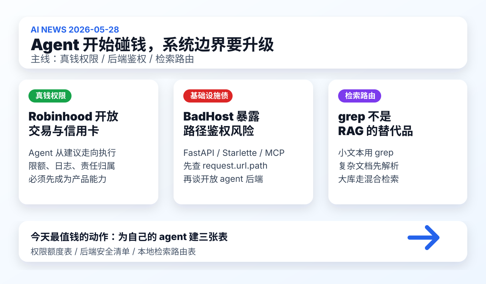

# 每日 AI 高价值信息

## 筛选原则

- 本次模式：泛 AI 情报，优先选择能影响你未来 1-4 周 agent 工作流、知识库建设、工具选型和安全边界的信号。
- 搜索时间窗：优先 2026-05-27 至 2026-05-28；早期工程信号扩展到近 7 天。采集时间：2026-05-28 01:41 CST。
- 来源范围：Robinhood 官方新闻稿、BadHost 官方漏洞页、LlamaIndex 官方博客、Hacker News 新帖、GitHub 新仓搜索、TechCrunch/Axios/Ars/Reuters 等二手核验源。
- 排除/降权：GitHub 新仓中只有营销描述或空仓的项目、HN 低热度且无可运行对象的 Show HN、没有一手链接的媒体复述、已在 2026-05-26 覆盖的 agent 路由/控制面主线。
- 验证边界：本轮没有把 X/KOL 单帖作为最终事实源；能稳定核验的一手来源优先。HN/GitHub 热度只作为注意力信号，不直接等同于质量。
- 只保留 3 条。今天的共同主线是：agent 从“会建议”走向“被授予真实权限”，但权限、后端鉴权和检索路由还没有同步成熟。

## 候选池与淘汰理由

| 候选 | 来源类型 | 状态 | 理由 |
| --- | --- | --- | --- |
| [Robinhood Agentic Trading / Agentic Credit Card](https://robinhood.com/us/en/newsroom/robinhood-is-now-open-to-agents/) | 官方发布 + 媒体复核 | 入选 | Agent 直接触达交易和支付权限，是“agentic finance”从概念到真实账户权限的强信号。 |
| [BadHost CVE-2026-48710](https://badhost.org/) | 安全披露 + HN/媒体传播 | 入选 | 影响 Starlette/FastAPI/MCP/LLM proxy/agent backend 的鉴权边界，和个人/企业 agent 后端建设高度相关。 |
| [LlamaIndex：grep vs RAG for agents](https://www.llamaindex.ai/blog/is-grep-all-you-need-lexical-vs-sematic-search-for-agents) | 官方技术文章 | 入选 | 直接回应你最近对 AnySearch、本地知识库、RAG 和 skill 路由的理解，行动价值高。 |
| [Provedex：tamper-evident audit logs for agents](https://github.com/provedex/provedex) | GitHub + HN 早期信号 | 暂缓 | 方向对，但当前采用度和生态验证不足；适合作为后续 agent 日志/审计专题候选。 |
| [Workplane：collaborative filesystem for humans and AI](https://workplane.co) | HN Show HN | 暂缓 | 与“人和 agent 共用工作区”相关，但证据主要来自作者自述，暂不压过三条入选主线。 |
| [RPCS-1：agent 配置协议](https://rpcs1.dev) | HN 早期信号 | 暂缓 | 问题意识接近“agent 不振荡、不超载”，但目前热度和外部验证都弱。 |
| [AI-agent supply-chain audit skill](https://github.com/javaid-codes/audit-supply-chain-agents) | HN Show HN + GitHub | 暂缓 | 主题重要，但仓库需要先审计代码、依赖和实际检测质量。 |
| [cellinlab/how-pi-agent-works](https://github.com/cellinlab/how-pi-agent-works) | GitHub 新星仓 | 暂缓 | 近两天新仓，stars 增长明显；更像教学/解释资产，暂不作为市场情报主线。 |
| [Why AI Agents Cannot Change Software Systems](https://phroneses.com/articles/build/notes/agents-cannot-maintain-systems.html) | HN 讨论 | 暂缓 | 讨论热度高，适合作为观点材料；不是新的硬事实或可运行对象。 |
| OpenAI / Anthropic / Google 官方大模型发布 | 官方源扫描 | 淘汰 | 本轮未发现比三条入选项更新且更有行动价值的硬发布；近期已覆盖过 Google I/O 与 Anthropic/Codex 相关主线。 |

## 1. Robinhood 开放 Agentic Trading / Agentic Credit Card：agent 开始碰真实钱

### 来源

- [Robinhood 官方：Robinhood is Now Open to Agents](https://robinhood.com/us/en/newsroom/robinhood-is-now-open-to-agents/)
- [Axios：Robinhood launches AI stock trading and credit card](https://www.axios.com/2026/05/27/robinhood-ai-trading-credit-card)
- [TechCrunch：Robinhood now lets your AI agents trade stocks](https://techcrunch.com/2026/05/27/robinhood-now-lets-your-ai-agents-trade-stocks/)

### 信号类型

- S2：官方产品上线 / beta
- 来源类型：官方新闻稿为主，媒体报道用于交叉确认
- 置信度：高；真实用户体验、合规风险和事故率仍需观察

### 一句话结论

Robinhood 把 AI agent 从“投资建议工具”推进到“可以执行交易和刷卡购买”的权限层，这会倒逼所有 agent 产品重新设计限额、日志、审批和责任边界。

### 事实 / 观点 / 推断

- 事实：Robinhood 在 2026-05-27 发布 Agentic Trading 和 Agentic Credit Card，允许客户把自己的 AI agent 连接到 Robinhood，帮助自动化交易和信用卡购买。
- 事实：接入方式是 Robinhood 的 AI-native MCP servers；官方称交易功能先以 beta 支持 equities，后续计划扩展到 options、crypto、event contracts、futures 等。
- 事实：Agentic Trading 使用独立的 agentic trading account，和主账户隔离；agent 只能访问用户放入该账户的资金，用户可看实时 activity feed、P&L，并可随时断开 agent。
- 事实：Agentic Credit Card 使用独立虚拟 Robinhood Gold Card，可设置 spending limit，并可选择是否要求人工审批；默认 agent 不能访问主卡号和其他 Robinhood 账户信息。
- 事实：Robinhood 披露 AI agent 可能误解指令、基于不完整或过期信息行动；Robinhood 不控制、监督、推荐或审计第三方 AI agent，用户承担 agent 下单和数据共享风险。
- 观点：这条的价值不是“AI 炒股”，而是金融产品开始正式承认第三方 agent 是一个新的权限主体。
- 推断：接下来 3-12 个月，agentic commerce / agentic finance 会从“能不能做”变成“如何限制它能做什么、花多少钱、出了问题谁负责”。

### 为什么重要

你现在搭建的知识库和 skill 系统，本质上也在给 agent 更多权限：读本地资料、联网检索、生成文档、改文件、提交 git、调用浏览器。Robinhood 这条把同一问题推到更高风险场景：当 agent 能操作钱，权限设计就不能停留在“相信模型会听话”。

### 对我的启发

- 任何高价值 agent 工作流都应该先有“权限额度表”：能读什么、能写什么、能花多少钱、能否联网、是否需要人工确认。
- 对个人知识库来说，下一步不是无脑接更多 skill，而是给每个 skill 标注权限等级和失败后果。
- 对产品判断来说，MCP 会从开发者工具协议变成真实商业系统的接入面，安全、审计和合规会成为差异化能力。

### 待验证点

- Beta 阶段的真实交易范围、延迟、撤单、风控和用户纠纷处理细节仍需观察。
- 第三方 agent 接入后的数据流向、日志可见性、责任分配和 API 限制需要看完整文档和用户实测。
- 媒体会倾向放大“AI 自动炒股”的标题，实际价值要看权限隔离与风控，而不是宣传案例。

### 可行动作

- 建一份 `agent_permission_budget.md`：把本地 Codex、视频分析、AI news、AnySearch 候选、浏览器、git 操作按权限和风险分级。
- 后续评估任何 MCP / skill 时，先问三件事：它拿什么权限、日志在哪里、能否一键撤销。
- 若未来做“AI 投资/消费/自动下单”相关研究，先记录监管、责任和数据离开平台后的边界，而不是先测收益。

## 2. BadHost：一个 Host header 漏洞暴露 agent 后端的老安全债

### 来源

- [BadHost 官方漏洞页：CVE-2026-48710](https://badhost.org/)
- [GitHub Advisory：GHSA-86qp-5c8j-p5mr](https://github.com/Kludex/starlette/security/advisories/GHSA-86qp-5c8j-p5mr)
- [Ars Technica：AI agents imperiled by critical vulnerability in open source package](https://arstechnica.com/information-technology/2026/05/millions-of-ai-agents-imperiled-by-critical-vulnerability-in-open-source-package/)

### 信号类型

- S2：公开安全漏洞 / 官方修复建议
- 来源类型：漏洞披露页、GitHub advisory、媒体传播
- 置信度：高；具体项目是否受影响要看部署方式和自定义 middleware

### 一句话结论

BadHost 提醒我们：agent 后端不是“AI 问题”，它首先是普通 Web 安全问题；一旦 MCP、LLM proxy 和推理服务暴露在外，旧的鉴权错误会变成新的 agent 权限事故。

### 事实 / 观点 / 推断

- 事实：BadHost / CVE-2026-48710 影响 Starlette 1.0.1 之前版本；Starlette 使用 Host header 构造 `request.url`，恶意 Host 可影响 `request.url.path`。
- 事实：如果应用在 middleware 中用 `request.url.path` 做路径型鉴权、allowlist、denylist、CSRF exemption、rate limiting 或 payment gate，攻击者可能绕过鉴权。
- 事实：官方修复建议包括升级 Starlette 到 1.0.1+、避免 path-based auth middleware、把鉴权绑定到 endpoint、使用合规反向代理、必要时用 `scope["path"]` 而不是 `request.url.path`。
- 事实：BadHost 页面明确点名 FastAPI/Starlette 应用、vLLM、LiteLLM、AI agent frameworks、MCP gateways、Google ADK-Python、Ray Serve、BentoML 等在特定条件下可能相关。
- 观点：这类漏洞会被低估，因为它不是“模型被 prompt injection 了”，而是 agent 周边的普通工程层没按生产安全要求处理。
- 推断：未来 agent 事故很可能不是模型能力不够，而是权限、代理、MCP、反向代理、日志和依赖版本这些基础设施环节失守。

### 为什么重要

你正在构建长期可用的知识库和 agent 工作流。随着后续接入 AnySearch、MCP、视频抓取、浏览器、自动化和外部 skill，本地系统会越来越像一个小型 agent 后端。BadHost 的价值在于把“先上能力、后补安全”的风险具体化了。

### 对我的启发

- 所有本地/自托管 agent 服务都应该先做最小安全清单：版本、反向代理、鉴权位置、日志、密钥、可回滚。
- MCP server 不能因为“只是本地工具”就默认安全；一旦监听端口或被代理出去，就必须按 Web 服务对待。
- 对外部 skill 的评估要增加一项：它是否启动本地服务、暴露端口、依赖 FastAPI/Starlette、如何鉴权。

### 待验证点

- 不是所有 FastAPI 应用都自动受影响；标准 FastAPI `Depends()` / `Security()` 路由级鉴权相对安全，风险主要在自定义 middleware 和 path-based 判断。
- 对你当前知识库后台是否存在类似风险，需要单独检查技术栈、监听范围和鉴权方式；本日报不直接断言已受影响。
- BadHost 官方 scanner 只能扫描授权目标，不能对第三方服务随意测试。

### 可行动作

- 建 `agent_backend_security_checklist.md`：包含 Starlette/FastAPI 版本、`request.url.path` 搜索、反向代理、端口暴露、MCP server 鉴权、API key 位置。
- 在本知识库里先跑一次代码搜索：`request.url.path`、`BaseHTTPMiddleware`、`FastAPI`、`uvicorn`、`mcp`。
- 后续安装 AnySearch 或第三方 MCP 前，先检查它是否启动 HTTP 服务，以及默认监听地址是不是 `127.0.0.1`。

## 3. LlamaIndex 的 grep vs RAG：本地知识库需要检索路由，不是单一搜索器

### 来源

- [LlamaIndex：Is grep all you need? Lexical VS Semantic Search for Agents](https://www.llamaindex.ai/blog/is-grep-all-you-need-lexical-vs-sematic-search-for-agents)

### 信号类型

- S1/S2：官方技术观点 + 可行动工具链
- 来源类型：LlamaIndex 官方博客
- 置信度：中高；文章带有 LlamaIndex 产品立场，但问题拆解对本地知识库很有参考价值

### 一句话结论

`grep`、RAG、OCR、metadata 和 hybrid search 不是互相替代，而应该由 agent 根据任务、语料和证据等级自动路由。

### 事实 / 观点 / 推断

- 事实：LlamaIndex 文章认为 `grep`/lexical search 很适合小规模纯文本语料、精确 token、函数名、错误字符串和可扩展上下文阅读。
- 事实：文章指出 `grep` 的两个核心限制：无法直接处理 PDF、图片、Office 等非结构化文档；在百万级文件规模下会遇到延迟、召回和噪声问题。
- 事实：文章建议先用文档解析/OCR 层解锁非结构化文档，再根据场景组合 lexical search、semantic search、metadata filtering、hybrid search 和 reranking。
- 事实：文章提到 LlamaParse MCP、LiteParse 和 agent skills，可把解析能力接入 agent 工具链。
- 观点：对个人知识库而言，最优解不是“装一个万能搜索 skill”，而是建立一张轻量路由表。
- 推断：AnySearch 这类工具的价值应该放在“本地检索决策层”里评估，而不是直接塞进 `AI news` 生产流程。

### 为什么重要

这条直接接上你前面对 AnySearch 的理解：它如果有价值，不是替代所有搜索，而是在本地已有 skill、知识库和资料的前提下，帮助判断该用关键词、RAG、线上链接、视频补证、官方文档，还是直接读本地文件。

### 对我的启发

- 你的知识库应该先沉淀 `retrieval_router.md`：按任务类型决定检索路径。
- 对 `AI news` 来说，候选来源也要显式记录采集路径：官方、GitHub、HN、视频、知识库、外部搜索。
- 对视频分析来说，证据不足时应继续执行当前策略：自动降级 raw/medium，并列补证路径，不硬凑结论。

### 待验证点

- LlamaIndex 文章有产品倾向，不能把它当成中立 benchmark。
- 本地知识库的真实瓶颈要靠任务样本验证：比如 AI news、视频报告、skill 推荐、人物 lens、历史日报检索。
- AnySearch 是否值得接入，需要先看它能否透明输出“为什么选择这个检索路径”，否则会变成黑盒路由。

### 可行动作

- 起草 `retrieval_router.md`，字段包括：任务类型、首选来源、备选来源、是否联网、证据等级、失败降级路径。
- 给 `AI news` 模板加一列“采集路径 / 证据等级”，让后续日报可复盘信息从哪里来。
- 对 AnySearch 做隔离试用：用 5 个真实问题测试它是否会正确选择本地知识库、关键词、线上搜索、视频补证和官方文档。

## 今天的高价值动作清单

1. 优先建 `agent_permission_budget.md`，把每个 agent/skill 的读写、联网、花费、提交、调用外部 API 权限列清楚。
2. 建 `agent_backend_security_checklist.md`，先排查 FastAPI/Starlette/MCP/本地服务风险，再继续扩展外部 skill。
3. 建 `retrieval_router.md`，把 AnySearch 放进“检索路由候选”，不要直接放进生产 `AI news` 主链路。
