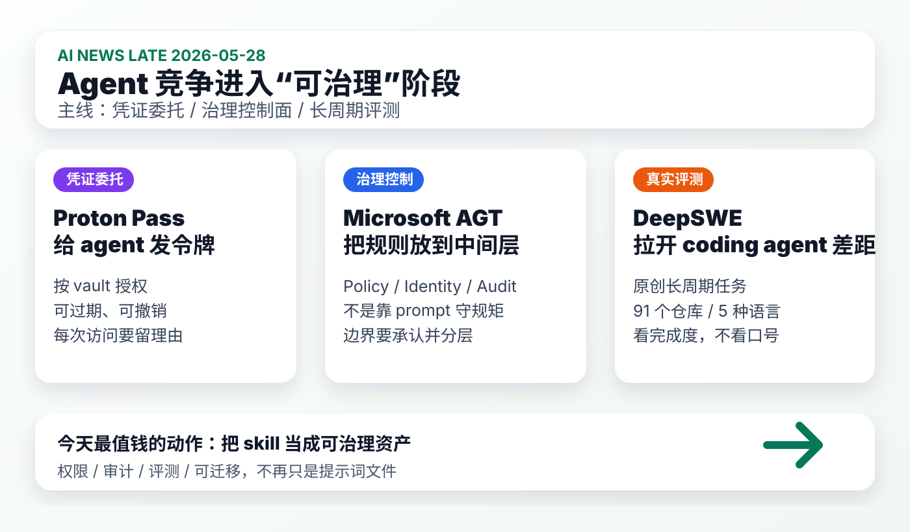

# 每日 AI 高价值信息：同日增量

## 筛选原则

- 本次模式：同日增量。今天 01:41 CST 已生成 `2026-05-28.md`，本篇不覆盖原文件，只补充不重复的新信号。
- 搜索时间窗：优先 2026-05-27 晚至 2026-05-28 上午；对高价值基础设施信号扩展到近 7-10 天。采集时间：2026-05-28 11:58 CST。
- 来源范围：Proton 官方博客、Microsoft GitHub repo、DataCurve DeepSWE、Hacker News 新帖、GitHub 近期推送/新仓、官方/论文/工程博客。
- 排除/降权：已入选早版的 Robinhood、BadHost、LlamaIndex 不重复；HN/GitHub 低热度早期项目只作为线索；缺少代码、文档或一手说明的营销页不入选。
- 验证边界：X/KOL 直接原帖本轮未稳定采集，不作为硬证据；社区热度只代表注意力，不等于事实成立。
- 只保留 3 条。今天增量的主线是：agent 竞争正在从“能做事”进入“能被授权、能被治理、能被评测”的阶段。

## 候选池与淘汰理由

| 候选 | 来源类型 | 状态 | 理由 |
| --- | --- | --- | --- |
| [Proton Pass for AI agents](https://proton.me/blog/pass-access-tokens) | 官方产品博客 | 入选 | 把 agent 凭证委托做成 access token、vault、过期、审计日志，直接影响个人/团队 agent 权限设计。 |
| [Microsoft Agent Governance Toolkit](https://github.com/microsoft/agent-governance-toolkit) | 官方 GitHub repo + HN 线索 | 入选 | 把 policy、identity、audit log、OWASP/NIST/EU AI Act 映射做成开源治理栈，适合转化为本地 agent/skill 检查清单。 |
| [DeepSWE](https://deepswe.datacurve.ai/) | Benchmark / 数据集 / 评测站 | 入选 | coding agent benchmark 正在从短题转向长周期真实工程任务；对 Codex/Claude/Kimi 对比有直接价值。 |
| [VAEN：portable AI coding-agent harnesses](https://github.com/sjhalani7/vaen) | GitHub + HN Show HN | 暂缓 | 与你的 skill 资产迁移高度相关，但当前 4 stars、无 release；先观察，不放入最终 3 条。 |
| [Dirty Frag: kernel zero-day vs container and microVM sandboxes](https://declaw.ai/blog/dirty-frag-microvm-isolation) | 厂商工程博客 + HN | 暂缓 | 对 agent sandbox 很重要，但主要来自单一厂商自测；可并入后续 sandbox 专题。 |
| [Multi-Agent LLM System for Automated Vulnerability Discovery and Reproduction](https://arxiv.org/abs/2605.21779) | arXiv + HN 高讨论 | 暂缓 | HN 关注度高，方向重要；但偏安全研究专题，本篇优先选择更通用的治理/评测工具。 |
| [Agent Security Is a Systems Problem](https://arxiv.org/abs/2605.18991) | arXiv | 暂缓 | 与早版 BadHost 和本篇治理主线重合；适合作为安全专题背景，不重复占位。 |
| [AIPass：persistent agent workspace](https://github.com/AIOSAI/AIPass) | GitHub + HN Show HN | 暂缓 | 身份、记忆、邮箱方向值得看，但证据仍主要是早期 repo 自述。 |
| [Meta testing AI subscription services](https://www.cnbc.com/2026/05/27/meta-testing-ai-subscription-services-cheapest-plan-at-7point99-a-month.html) | 媒体报道 | 淘汰 | 市场化信号存在，但对你的个人知识库和 agent 工作流行动价值低于入选项。 |
| GitHub pushed 热门仓：Buildkite agent、Dagu、MNN、Phoenix 等 | GitHub API | 淘汰/暂缓 | 大多是老仓近期推送或关键词误召回，不代表今天出现新 AI 能力；只作为生态背景。 |

## 1. Proton Pass for AI agents：agent 凭证委托开始产品化

### 来源

- [Proton 官方：Introducing Proton Pass for AI agents](https://proton.me/blog/pass-access-tokens)
- [Proton Pass CLI commands](https://protonpass.github.io/)

### 信号类型

- S2：官方产品能力
- 来源类型：Proton 官方博客 / 产品文档
- 置信度：高；具体可用性与体验仍需实际试用

### 一句话结论

Proton 把“把密码/API key 交给 agent”从临时复制粘贴，变成了可过期、可撤销、按 vault 限定、带审计理由的 access token 机制。

### 事实 / 观点 / 推断

- 事实：Proton 在 2026-05-21 发布 Proton Pass for AI agents，提供 `AI access tokens`，让用户把特定凭证共享给 AI agent。
- 事实：官方说明 agent 每次需要凭证时必须给出访问理由，并留下日志，用户可以回看 agent 为什么访问了某个凭证。
- 事实：Proton Pass 支持把凭证放入不同 vault，然后创建针对特定 vault 的 access token；agent 只获得所需条目，且不能创建或编辑条目。
- 事实：access token 可设置 1 小时到 1 年的过期时间，并可随时撤销；该能力包含在 Pass Plus、Pass Family、Pass Professional、Proton Workspace 等计划中。
- 观点：这不是一个密码管理器小功能，而是 agent 时代的“最小凭证委托层”。
- 推断：未来个人/团队 agent 要规模化使用，凭证管理会从 `.env`、手工复制、临时令牌，迁移到“可审计的代理访问通道”。

### 为什么重要

你正在评估 AnySearch、MCP、第三方 skill、视频采集、浏览器自动化和本地知识库。真正危险的不是 agent 不聪明，而是它拿到过大的凭证、没有访问理由、不能撤销、日志不可查。Proton 这条把“agent 凭证最小授权”做成普通用户可理解的产品形态。

### 对我的启发

- 本地知识库应该把密钥和凭证从 skill 配置中分离出来，不让 skill 文档携带任何真实 secret。
- 每个需要联网或访问外部账户的 skill，都要有 `credential_scope`：需要什么、能做什么、多久过期、日志在哪里。
- AnySearch 或外部 MCP 接入前，应先通过“只读、短期、可撤销”的凭证策略试运行。

### 待验证点

- Proton 的 AI access tokens 对不同 agent 客户端、CLI、MCP server 的集成顺滑程度需要实测。
- 它解决的是凭证访问，不自动解决 agent 是否应该执行某个业务动作。
- 对高风险账户，如金融、生产系统、云控制台，仍需额外人工审批和操作级 policy。

### 可行动作

- 新增 `agent_credential_policy.md`：列出哪些凭证可被 agent 用、默认只读还是可写、是否必须人工审批。
- 在现有 skill 元数据中加字段：`requires_credentials`、`credential_scope`、`revocation_path`。
- 后续测试第三方 skill 时，不使用主账号长期 token；先用隔离账号、只读权限、短期令牌。

## 2. Microsoft Agent Governance Toolkit：治理层正在从概念变成开源工程栈

### 来源

- [GitHub：microsoft/agent-governance-toolkit](https://github.com/microsoft/agent-governance-toolkit)
- [HN 线索：Agent Governance Toolkit](https://news.ycombinator.com/item?id=48300396)

### 信号类型

- S1/S2：开源 repo + 可安装工具链
- 来源类型：Microsoft GitHub 仓库、HN 注意力信号
- 置信度：中高；repo 可信，但实际生产可用性和边界需要审计

### 一句话结论

Microsoft 的 Agent Governance Toolkit 把 agent 管理拆成 policy engine、identity、audit log、sandbox、SRE、compliance 等层，说明 agent 安全不再能靠 prompt 约束。

### 事实 / 观点 / 推断

- 事实：该 repo 将自己定位为 AI Agent Governance Toolkit，覆盖 policy enforcement、zero-trust identity、execution sandboxing、reliability engineering，并声明覆盖 OWASP Agentic Top 10。
- 事实：README 把问题拆成三问：这个动作是否允许、哪个 agent 做的、能否证明发生了什么。
- 事实：其核心流程是 `Agent -> Policy Engine -> Identity -> Audit Log`，可用 YAML/OPA/Cedar 做 policy，用 SPIFFE/DID/mTLS 做身份，用 tamper-evident 记录做审计。
- 事实：repo 提供 `agt verify`、`red-team scan`、`lint-policy` 等命令；最新 release 页面显示 v3.7.0，日期为 2026-05-18。
- 事实：README 明确承认 AGT 在应用 middleware 层执行治理，不是 OS kernel 级隔离；生产建议仍要把每个 agent 放进单独容器等分层防御。
- 观点：这类工具的真正价值，是把“agent 应该守规矩”从道德要求变成可执行、可审计、可失败的工程控制面。
- 推断：未来高价值 agent 工作流会有三张基础表：policy、identity、audit。没有这三张表，能力越强，长期风险越高。

### 为什么重要

你的知识库现在已经有多个可运行 skill：AI news、视频分析、OpenAI docs、coding guardrails、shared memory。下一步如果继续增加 AnySearch、自动化、MCP 和第三方 skill，系统就不只是文件夹，而是 agent 操作面。AGT 给了一个可借鉴的结构：先治理，再扩权。

### 对我的启发

- 可以把当前 skill 系统升级成轻量治理表：每个 skill 的权限、输入、输出、证据等级、失败降级、日志位置。
- `AI news` 的候选池其实已经是审计层雏形；下一步可以把采集路径和证据等级字段标准化。
- 对外部 skill 不要只看功能，要看它能不能被 policy 拦截、被日志解释、被撤销和回滚。

### 待验证点

- 仓库虽然在 Microsoft 组织下，但我们仍需审计安装脚本、依赖、权限和实际命令行为。
- AGT 的 README 信息密度很高，可能存在路线图式表述；实际成熟度需要看 issue、release、测试覆盖和最小 demo。
- 该工具不能替代 OS 级沙箱、密钥隔离和网络隔离。

### 可行动作

- 把 `agent_permission_budget.md` 扩展为 `agent_governance_matrix.md`：policy、identity、audit、sandbox、rollback 五列。
- 给每个本地 skill 加 `risk_level` 和 `audit_output`：低风险只读、中风险写文件、高风险联网/凭证/git/执行命令。
- 如果以后试 AGT，先用空仓库和假凭证跑 `agt doctor` / `agt verify`，不要直接接入主知识库。

## 3. DeepSWE：coding agent 评测开始转向长周期真实工程任务

### 来源

- [DeepSWE](https://deepswe.datacurve.ai/)
- [DeepSWE GitHub](https://github.com/datacurve-ai/deepswe)

### 信号类型

- S1/S2：公开 benchmark / leaderboard / 数据说明
- 来源类型：DataCurve 评测站、GitHub、HN 线索
- 置信度：中；方法看起来有价值，但仍需第三方复核和样本审计

### 一句话结论

DeepSWE 试图用原创、长周期、跨仓库的工程任务拉开 coding agent 差距，比只看短题或已污染 benchmark 更接近你真正使用 Codex 的场景。

### 事实 / 观点 / 推断

- 事实：DeepSWE 定位为测量 frontier coding agents 在原创长周期工程任务上的表现。
- 事实：官方称任务从零编写，不改编自已有 commit 或 PR，以降低训练数据污染风险。
- 事实：任务覆盖 91 个仓库、5 种语言；官方称 prompts 约为 SWE-bench Pro 的一半长度，但解决方案需要 5.5 倍代码和约 2 倍输出 tokens。
- 事实：DeepSWE 使用手写 verifiers 检查软件行为，而不是实现细节。
- 事实：页面 leaderboard 显示 GPT-5.5[xhigh] 为 70%±4%，GPT-5.4[xhigh] 为 56%±5%，Claude Opus 4.7[max] 为 54%±5%，Claude Sonnet 4.6[high] 为 32%±4%。
- 观点：这种评测比单次 prompt 评测更接近“agent 能不能完成真实工程任务”，尤其适合比较 Codex、Claude Code、Kimi Code、Gemini CLI。
- 推断：未来 coding agent 的核心差距会越来越体现在长周期规划、代码编辑稳定性、测试修复、上下文管理和失败恢复，而不是单题代码生成。

### 为什么重要

你现在对 Codex 的需求不是“能回答”，而是能长期维护知识库、生成图、分析视频、改 skill、跑验证、提交代码。DeepSWE 这种评测方向可以帮助我们设计自己的小型本地 benchmark：用真实知识库任务测 agent，而不是被厂商宣传牵着走。

### 对我的启发

- 可以建立 `codex_workflow_eval.md`：把你常用任务拆成 10 个长周期样本，记录成功率、人工干预、耗时、错误类型。
- 评估 Kimi Code / Claude Code / Codex 时，应该用同一组真实任务，而不是看各自 demo。
- `AI news`、视频分析、SVG 精华图、shared memory 更新、git 提交，都是很好的本地长期任务样本。

### 待验证点

- DeepSWE 是 DataCurve 自发布 benchmark，不等于独立权威结论；任务质量、评分器和样本公开程度需要继续检查。
- Leaderboard 上的模型配置、工具权限、预算、是否允许重试等会显著影响分数。
- GPT-5.5 / Claude 等分数只能作为方向线索，不能直接替代你自己的本地工作流评测。

### 可行动作

- 建一个本地 `agent_eval_tasks/` 清单：每日 AI 情报、视频补证、skill 优化、网页抽取、图形摘要、git 发布。
- 每次试新工具，只跑 3 个固定任务，记录成功/失败原因，不被单次惊艳 demo 误导。
- 把“长周期任务完成度”作为未来选择 agent 工具的第一指标，而不是只看模型榜单。

## 今天的高价值动作清单

1. 建 `agent_credential_policy.md`：凭证最小授权、过期、撤销、审计。
2. 建 `agent_governance_matrix.md`：每个 skill 的 policy、identity、audit、sandbox、rollback。
3. 建 `codex_workflow_eval.md`：用你的真实知识库任务评测 Codex / Claude Code / Kimi Code。
