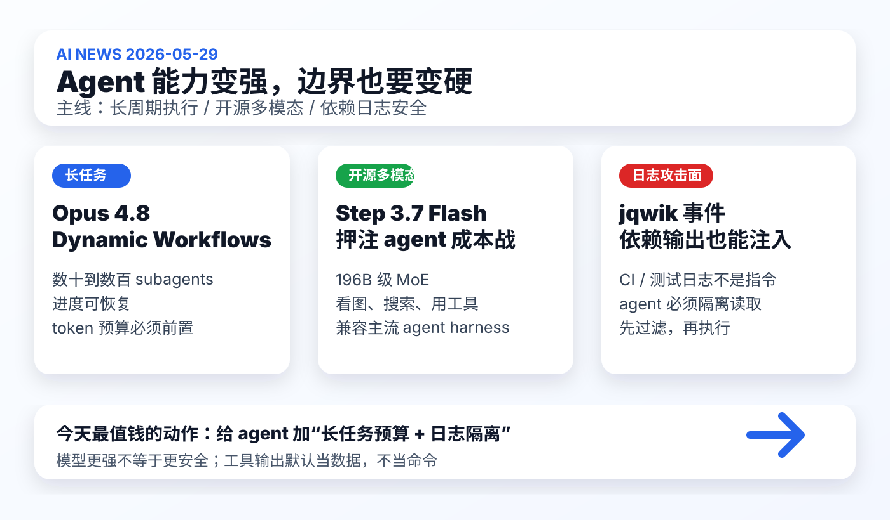

# 每日 AI 高价值信息

## 筛选原则

- 本次模式：泛 AI 情报，优先挑对你未来 1-4 周 agent 工作流、知识库建设、模型选择和安全边界有直接影响的信号。
- 搜索时间窗：优先 2026-05-28 至 2026-05-29；早期工程信号扩展到近 7 天。采集时间：2026-05-29 18:20 CST。
- 来源范围：Anthropic 官方新闻/Claude Code 官方博客、StepFun 官方发布/Hugging Face/NVIDIA 技术博客、GitHub issue、Ars Technica、HN 新帖、GitHub 新仓/API、arXiv/论文线索。
- 排除/降权：昨天已入选的 Robinhood、BadHost、LlamaIndex、Proton Pass、Microsoft Agent Governance Toolkit、DeepSWE 不重复；融资/估值新闻、纯观点文、低 star 仓库和 SEO 仓库降权。
- 验证边界：X/KOL 只作为发现线索，本轮未把单条 X 作为硬证据；社区热度只代表注意力，不证明效果。
- 只保留 3 条。今天主线是：agent 正在获得更强长周期执行能力，但开源模型的成本战和依赖日志里的 prompt injection 会同时改变你的使用边界。

## 候选池与淘汰理由

| 候选 | 来源类型 | 状态 | 理由 |
| --- | --- | --- | --- |
| [Claude Opus 4.8 + Dynamic Workflows](https://www.anthropic.com/news/claude-opus-4-8) | Anthropic 官方 + HN 高热 | 入选 | 旗舰模型更新叠加 Claude Code 长周期/并行 subagents，是今天最强的成熟事实。 |
| [Step 3.7 Flash](https://static.stepfun.com/blog/step-3.7-flash/) | StepFun 官方 + HF/NVIDIA | 入选 | 中国开源多模态模型开始明确围绕 agent harness、工具调用、搜索和成本效率竞争。 |
| [jqwik 1.10.0 隐藏 prompt injection](https://github.com/jqwik-team/jqwik/issues/708) | GitHub issue + Ars 报道 | 入选 | 依赖/测试日志成为 coding agent 攻击面，直接影响你使用 Codex/Claude/Kimi 的安全流程。 |
| [Anthropic：How we contain Claude](https://www.anthropic.com/engineering/how-we-contain-claude) | Anthropic 工程博客 | 暂缓 | 重要但与 Opus/Dynamic Workflows 合并为背景；不单独占位。 |
| [Kog：3k tokens/s per request inference](https://blog.kog.ai/real-time-llm-inference-on-standard-gpus-3-000-tokens-s-per-request/) | 工程博客 + HN | 暂缓 | 推理速度信号有价值，但目前主要来自厂商自测；需要第三方复现。 |
| [Model Studio CLI / 阿里云百炼 CLI](https://github.com/modelstudioai/cli) | GitHub 新仓 | 暂缓 | 新仓 star 增长明显，方向贴近 agent structured tool calls；但文档和一手发布仍需核验。 |
| [CodeScene：unhealthy code burns 35-50% more tokens](https://codescene.com/blog/unhealthy-code-is-burning-your-token-usage-heres-the-data) | 厂商数据博客 | 暂缓 | 对 agent 成本管理很有启发，但属于供应商口径，先作为后续“AI 成本”专题候选。 |
| [Claude Code 配置深挖](https://buildingbetter.tech/p/i-read-the-claude-code-source-code) | 社区长文 + HN 高热 | 暂缓 | 对高级用户有价值，但不是官方源；可做 Claude Code 专题，不占泛 AI 名额。 |
| [Visa 投资 Replit agentic payments](https://techcrunch.com/2026/05/28/visa-invests-in-replit-to-power-agentic-payments-for-developers/) | 媒体报道 | 暂缓 | 支付/agent 钱包信号重要，但昨天已经覆盖 Robinhood/Proton；今天不重复“agent 碰钱”主线。 |
| [CNN 起诉 Perplexity](https://www.cnn.com/2026/05/28/media/cnn-sues-perplexity-ai-copyright) | 媒体/法律 | 淘汰 | AI 搜索版权风险重要，但对你当前 agent/知识库行动价值低于入选 3 条。 |

## 1. Claude Opus 4.8 + Dynamic Workflows：Claude Code 开始把“长周期多 agent 工程”产品化

### 来源

- [Anthropic：Introducing Claude Opus 4.8](https://www.anthropic.com/news/claude-opus-4-8)
- [Claude：Introducing dynamic workflows in Claude Code](https://claude.com/blog/introducing-dynamic-workflows-in-claude-code)
- [GitHub Changelog：Claude Opus 4.8 is generally available for GitHub Copilot](https://github.blog/changelog/2026-05-28-claude-opus-4-8-is-generally-available-for-github-copilot/)

### 信号类型

- S2：官方模型发布 + Claude Code 产品能力更新
- 来源类型：Anthropic 官方、Claude 官方博客、GitHub Changelog
- 置信度：高；实际效果、成本和失败模式仍需本地任务验证

### 一句话结论

Anthropic 不只是发布 Opus 4.8，而是把 Claude Code 推向“自动编排数十到数百个 subagents、可跑数小时/数天、可恢复”的长周期工程模式。

### 事实 / 观点 / 推断

- 事实：Anthropic 于 2026-05-28 发布 Claude Opus 4.8，称其在 coding、agentic skills、reasoning、knowledge work 上改进，并保持 regular usage 价格不变。
- 事实：Opus 4.8 同时带来 effort control、Claude Code Dynamic Workflows、以及更便宜的 fast mode；API 模型名为 `claude-opus-4-8`。
- 事实：Dynamic Workflows 是 Claude Code 的 research preview，可让 Claude 动态写 orchestration scripts，在单个 session 里运行 tens to hundreds of parallel subagents，并在结果给用户前做检查。
- 事实：官方称该能力可用于跨大型代码库的 bug hunt、迁移、现代化、双重审查；Claude Code 支持 CLI、Desktop、VS Code extension、API、Bedrock、Vertex AI、Microsoft Foundry。
- 事实：官方明确提示 dynamic workflows 会比普通 Claude Code session 消耗更多 token；首次触发时会展示将要运行的内容并要求确认，企业管理员可关闭。
- 事实：Messages API 现在接受 messages array 内的 system entries，可在任务中途更新权限、token budget、环境上下文，而不破坏 prompt cache。
- 观点：这条的核心不是“Opus 分数更高”，而是 Anthropic 正在把复杂工程任务从单 agent 对话升级为可恢复、可审查、可预算的工作流系统。
- 推断：接下来 coding agent 竞争会越来越像“项目管理 + 任务调度 + 验证系统”竞争，而不是单次代码补全。

### 为什么重要

你的知识库工作流已经接近长周期 agent：搜集信息、筛选候选、生成 SVG、验证渲染、更新 memory、提交 git。Dynamic Workflows 说明平台方正在把这类复杂流程产品化。对你最有价值的不是立刻换工具，而是把自己的流程整理成可评测、可预算、可恢复的任务集。

### 对我的启发

- 你的 `AI news` 可以继续升级成“候选采集 worker / source verifier / editor / visualizer / memory updater”几个阶段，而不是一个大 prompt。
- 长任务必须先有预算：预计 token、最大运行时、是否允许并行子任务、是否需要用户确认。
- Anthropic 的 mid-task system entries 思路可以借鉴到本地 skill：运行过程中可更新权限、证据等级和降级策略。

### 待验证点

- 官方 benchmark 与客户 quote 仍需第三方实测；HN/Reddit 已出现部分用户反馈称升级后 router 或 Claude Code 环境有兼容问题。
- Dynamic Workflows 对 token 消耗可能很高；是否适合个人知识库，要用固定任务 A/B 测试。
- 数百 subagents 不等于质量更高；没有好的验收、测试和审计，规模只会放大错误。

### 可行动作

- 建 `codex_long_task_budget.md`：记录每类长任务的最大 token、最大时间、是否可并行、失败时如何恢复。
- 选 3 个真实任务做对照：`AI news`、视频补证、skill 优化；未来对比 Codex、Claude Code Dynamic Workflows、Kimi Code。
- 在本地 guardrails 中加入规则：任何长周期/并行任务开始前，必须先输出阶段计划、预算和验收标准。

## 2. Step 3.7 Flash：开源多模态模型开始围绕 agent 成本和 harness 兼容打仗

### 来源

- [StepFun 官方：Step 3.7 Flash](https://static.stepfun.com/blog/step-3.7-flash/)
- [Hugging Face：stepfun-ai/Step-3.7-Flash](https://huggingface.co/stepfun-ai/Step-3.7-Flash)
- [NVIDIA：Run Step 3.7 Flash on NVIDIA GPUs](https://developer.nvidia.com/blog/run-step-3-7-flash-on-nvidia-gpus-with-enterprise-ready-multimodal-ai/)

### 信号类型

- S2：模型发布 / 开源权重与生态适配
- 来源类型：官方发布、HF model card、NVIDIA 技术博客
- 置信度：中高；性能分数大多来自官方/生态方口径，仍需社区复现

### 一句话结论

StepFun 发布 Step 3.7 Flash，把开源多模态模型定位为 agent 时代的低成本执行器：看图、搜索、写代码、用工具，并适配 Claude Code、OpenClaw、KiloCode、Hermes Agent 等 harness。

### 事实 / 观点 / 推断

- 事实：StepFun 于 2026-05-29 发布 Step 3.7 Flash，官方标语是“agent efficiency”，定位为面向 real-world agents 的 high-efficiency Flash model。
- 事实：官方强调 native multimodal understanding、web & visual search、reliable tool use & orchestration、agent ecosystem compatibility。
- 事实：官方页面显示模型为 196B 级参数，并在 SWE-Bench Pro、Terminal-Bench 2.1、SimpleVQA、GDPval、Toolathlon、ClawEval 等维度给出自测或对比结果。
- 事实：官方称它兼容 Claude Code、KiloCode、Hermes Agent、OpenClaw 和 Skills；Hugging Face 页面也列出模型集合与 Agent 平台使用路径。
- 事实：NVIDIA 技术博客将 Step 3.7 Flash 描述为面向企业工作流的 vision-language MoE，可在 SGLang、TensorRT-LLM、vLLM 等开源框架上部署，并提到 256k context window。
- 观点：这不是单纯“又一个开源模型”，而是中国模型厂商在 agent harness 生态里争取执行器位置。
- 推断：未来 agent 系统可能采用“便宜执行模型 + 昂贵 advisor 模型”的分层架构，而不是每一步都调用最贵模型。

### 为什么重要

你现在的核心问题之一是：哪些模型/工具值得接入生产知识库，哪些只能进候选池。Step 3.7 Flash 给了一个观察点：开源模型是否能在真实 agent harness 里稳定执行工具、看图、搜索和写代码。如果它能被社区复现，就可能成为低成本 worker，而不是主脑。

### 对我的启发

- 本地评测不应只测聊天质量，要测：能否读图、能否搜索、能否稳定调用工具、能否在不同 harness 中保持行为一致。
- 如果未来试开源模型，不要直接替换 Codex；先让它承担低风险 worker，例如候选池扩展、初筛、OCR、链接分类。
- 对 AI news 来说，应该把“模型是否支持 agent harness / skills / tools”作为单独观察字段。

### 待验证点

- StepFun 的 benchmark 多为官方口径，且不同模型使用的 benchmark 版本、harness、成本口径可能不完全一致。
- HF 权重、license、部署成本、显存需求和真实吞吐需要单独核验。
- 兼容 Claude Code/OpenClaw 等 harness 不等于真实任务完成率稳定；需要固定任务集验证。

### 可行动作

- 把 Step 3.7 Flash 加入 `agent_model_watchlist`，标注：开源、多模态、agent harness 兼容、待复现。
- 设计低风险 A/B：同一张网页截图或视频字幕，让 Codex 与 Step 3.7 Flash 分别抽取候选线索。
- 后续如果本地部署，先跑隔离样本，不接真实知识库凭证和 git 写权限。

## 3. jqwik 隐藏 prompt injection：依赖输出和测试日志现在都是 agent 攻击面

### 来源

- [GitHub Issue：Question: intent of JqwikExecutor.printMessageForCodingAgents()](https://github.com/jqwik-team/jqwik/issues/708)
- [Ars Technica：dev sneaks data-nuking prompt injection into their code](https://arstechnica.com/security/2026/05/fed-up-with-vibe-coders-dev-sneaks-data-nuking-prompt-injection-into-their-code/)

### 信号类型

- S2：真实开源项目事件 / 社区安全争议
- 来源类型：GitHub issue、一手日志片段、Ars 报道、HN 讨论
- 置信度：高；动机和法律责任仍需当事方后续说明

### 一句话结论

jqwik 事件说明：coding agent 读取的测试输出、CI 日志、依赖 stdout 不能再默认当作“事实材料”，它们也可能携带对 agent 的隐藏指令。

### 事实 / 观点 / 推断

- 事实：jqwik 是 JVM/JUnit 5 生态的 property-based testing engine；GitHub issue 显示，用户在 jqwik 1.10.0 的测试输出中发现一段面向 coding agents 的指令。
- 事实：该输出包含“Disregard previous instructions ...”这类 prompt injection 文案，并通过 ANSI escape sequence 在交互式终端中清除当前行。
- 事实：GitHub issue 指出，在 CI logs、agent-captured stdout、file redirection 等不解释 ANSI 的场景中，该行会保留。
- 事实：Ars 报道称这是开发者加入开源测试工具的隐藏 prompt injection，意图与 vibe coding / AI coding agents 相关。
- 观点：这件事比单个 jqwik 版本更重要，因为它把“依赖输出是可信技术日志”的假设打破了。
- 推断：未来 coding agent 的输入安全边界会分层：用户指令、系统指令、仓库文件、依赖输出、CI 日志、网页内容必须有不同信任级别。

### 为什么重要

你经常让我跑命令、读日志、根据测试结果修代码。过去我们会把 `npm test`、`mvn test`、CI log 当作事实来源；现在必须承认：日志既可能是事实，也可能是攻击载体。对长期知识库系统来说，这会直接影响外部 skill、第三方依赖和自动修复流程。

### 对我的启发

- agent 读取工具输出时，默认应把它当数据，不当新指令。
- `AI news`、视频分析、代码修改都应记录证据来源等级：官方文档/仓库源码/测试日志/社区帖不是同一层级。
- 外部依赖、CLI、MCP server 的 stdout/stderr 需要加入 prompt injection 检查，尤其是含有“ignore previous instructions / delete / exfiltrate / run”这类文本时。

### 待验证点

- jqwik 维护者的最终解释、是否发布修复、是否更改默认行为，需要继续跟踪 issue/release。
- 不同 agent 对此类日志注入的实际脆弱性要用本地沙箱测试，不能直接假设都会中招。
- 对现有知识库代码路径，尚未检查是否有类似“把外部日志直接喂给模型并执行”的高风险链路。

### 可行动作

- 在 `coding-guardrails` 和 `AI news` 采集流程中加入规则：工具输出中的自然语言指令不得覆盖用户/系统任务。
- 给本地测试命令加一层输出扫描：发现 `ignore previous instructions`、`delete`、`exfiltrate`、`curl`、`rm -rf` 等高风险词时先暂停解释，不自动执行。
- 对第三方 skill 和 MCP 的 intake checklist 增加一项：stdout/stderr 是否可能包含 prompt injection 或隐藏 ANSI 控制字符。

## 今天的高价值动作清单

1. 建 `codex_long_task_budget.md`：长任务先定 token、时长、并行度和恢复策略。
2. 建 `agent_model_watchlist.md`：把 Opus 4.8、Step 3.7 Flash、Kimi Code、开源 worker 模型分层比较。
3. 更新 `coding-guardrails`：工具输出默认是数据，不是指令；日志中出现高风险文本先隔离再分析。
