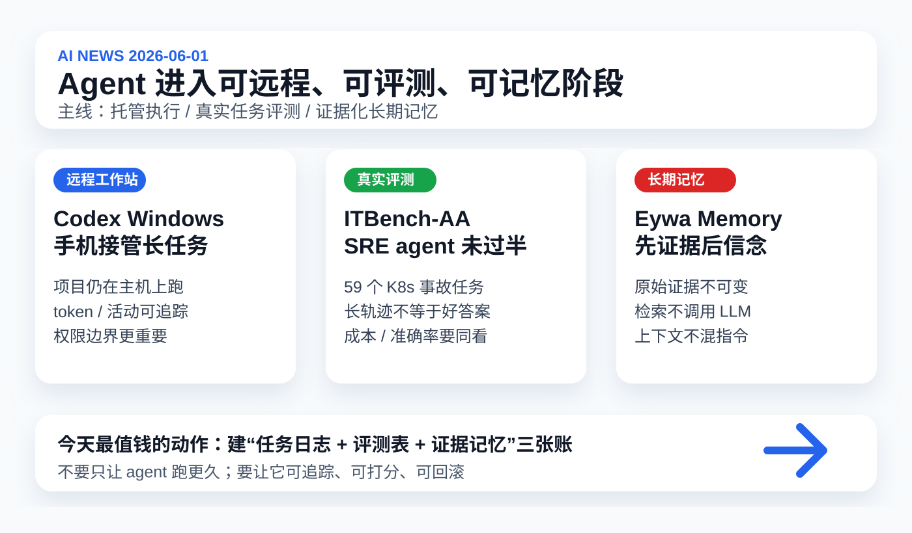

# 每日 AI 高价值信息

## 筛选原则

- 本次模式：泛 AI 情报，优先挑对你未来 1-4 周 Codex/Claude/Kimi 工作流、知识库长期记忆、agent 评测与成本治理有直接影响的信号。
- 搜索时间窗：优先 2026-05-29 至 2026-06-01；若近 24 小时信息密度不足，扩展到近 7 天。采集时间：2026-06-01 10:35 CST。
- 来源范围：OpenAI Help Center / Developers / 官方 PDF、Hugging Face / IBM Research / Artificial Analysis、arXiv API、GitHub releases / README、GitHub 新仓搜索、HN / Reddit / 技术媒体搜索线索。
- 排除/降权：历史已覆盖的 Claude Opus 4.8 / Dynamic Workflows、Step 3.7 Flash、jqwik prompt injection、Codex Appshots / Goal mode、Anthropic Compliance API、Midscene 不重复。
- 验证边界：X/KOL 今天只作为潜在线索，没有作为硬证据；GitHub stars、Reddit 讨论和 HN 热度只代表注意力，不证明质量。GitHub API 在后续查询中触发 rate limit，因此新仓星数以已获取快照和网页可见信息为准。
- 只保留 3 条。今天主线是：agent 继续从“会执行”升级为“可远程托管、可评测、可记忆”。

## 候选池与淘汰理由

| 候选 | 来源类型 | 状态 | 理由 |
| --- | --- | --- | --- |
| [OpenAI Codex：Windows Computer Use、远程控制、Profiles](https://help.openai.com/en/articles/6825453-chatgpt-release-notes) | OpenAI 官方 release notes / docs / PDF | 入选 | 直接影响当前 Codex 工作流：从 Mac 本地操作扩到 Windows host、手机接管和 token/活动可观测。 |
| [ITBench-AA：企业 SRE agent benchmark](https://huggingface.co/blog/ibm-research/itbench-aa) | IBM / Artificial Analysis / HF / GitHub dataset | 入选 | 真实 Kubernetes 事故诊断任务里，frontier models 仍低于 50%；对“怎么验收 agent”价值很高。 |
| [Eywa：Provenance-Grounded Long-Term Memory for AI Agents](https://arxiv.org/abs/2605.30771) | arXiv 论文 + artifact 链接 | 入选 | “先证据后信念、检索不调用 LLM、上下文不混指令”高度贴合知识库长期记忆升级。 |
| [Hermes Agent v0.15.0 / v0.15.2](https://github.com/NousResearch/hermes-agent/releases/tag/v2026.5.28) | GitHub release | 暂缓 | 工程密度很高：kanban swarm、MCP catalog、promptware defense、session_search；但体量大，需单独审计后再推荐接入。 |
| [Odysseus self-hosted AI workspace](https://github.com/pewdiepie-archdaemon/odysseus) | GitHub 新星仓库 | 暂缓 | 2026-05-31 新仓，star 增长快，定位本地优先 AI 工作台；但无 release，安全和真实性待验。 |
| [Hugging Face：Agentic RL TITO](https://huggingface.co/blog/huggingface/tito) | HF 技术博客 | 暂缓 | 对训练 tool-using agents 的 token buffer 很有价值，但偏训练底层；对你当前工作流行动性不如入选 3 条。 |
| [Physics Is All You Need?](https://arxiv.org/abs/2605.30353) | arXiv case study | 暂缓 | Claude Code 科学编程 57 sessions 案例很有启发，但 N=1；适合后续做“agent 监督方法”专题。 |
| [Reverse engineering AI agents prompt injection 论文组](https://arxiv.org/abs/2605.30677) | arXiv 安全论文 | 暂缓 | 重要安全信号，但与 2026-05-29 jqwik 日报核心风险相近；今天只作为安全边界补充。 |
| [OpenAI GPT-Realtime-2 / Translate / Whisper](https://developers.openai.com/api/docs/models/gpt-realtime-whisper) | OpenAI API docs / 媒体 | 淘汰 | 5 月上旬发布，已过最新窗口；除非做 voice agent 专题，否则今天不占位。 |
| OpenClaw / Hermes 社区 watch 与 Reddit Codex 用量讨论 | 社区 / 二手聚合 | 淘汰 | 有线索价值，但证据层级低，且可操作结论已被 Codex Profiles / ITBench-AA / Eywa 覆盖。 |

## 1. OpenAI Codex 5/29 更新：Codex 正在变成跨设备远程工作站，而不是单机 coding 工具

### 来源

- [OpenAI Help Center：ChatGPT Release Notes - May 29, 2026](https://help.openai.com/en/articles/6825453-chatgpt-release-notes)
- [OpenAI Developers：Computer Use - Codex app](https://developers.openai.com/codex/app/computer-use)
- [OpenAI Developers：Remote connections - Codex](https://developers.openai.com/codex/remote-connections)
- [OpenAI PDF：How OpenAI uses Codex](https://cdn.openai.com/pdf/6a2631dc-783e-479b-b1a4-af0cfbd38630/how-openai-uses-codex.pdf)

### 信号类型

- S2：官方产品发布 / 官方文档更新
- 来源类型：OpenAI release notes、Codex docs、官方实践 PDF
- 置信度：高；区域可用性、账号可用性和本地稳定性仍需实测

### 一句话结论

OpenAI 把 Codex 从 macOS 本地 agent 进一步推成“Windows host + 手机/ Mac 远程接管 + 使用画像/ token 活动”的跨设备工作站。

### 事实 / 观点 / 推断

- 事实：OpenAI 2026-05-29 release notes 称，Codex app 现在支持 Windows Computer Use；符合条件的用户可让 Codex 看、点击、输入 Windows 应用。
- 事实：同一更新支持从 Windows 机器启动工作，并用 ChatGPT iOS / Android 或 Mac Codex 检查进度、继续线程、回应提示和调整方向；Windows 主机保留项目文件、shell、app server 和本地上下文。
- 事实：OpenAI 同时提到 in-app browser 速度、稳定性和网页兼容性改进，以及 Codex Profiles：可查看 Codex identity、活动时间线、个人资料、usage stats 和 token activity。
- 事实：官方 remote connections 文档说明，手机发送 prompts、approvals 和 follow-up messages；实际仓库文件、本地文档、shell、插件、MCP servers、skills、browser access、Computer Use 都来自 connected host，sandbox 和 approvals 仍然适用。
- 事实：官方说明 Windows host 上的 Computer Use 当前在前台运行；如果用于远程任务，需要让主机保持解锁和可用。
- 事实：OpenAI 的 Codex 内部使用 PDF 把实践集中在代码理解、迁移重构、性能优化、补测试、任务队列、AGENTS.md、Best of N 和像 GitHub issue 一样写 prompt。
- 观点：这不是一个孤立功能，而是 Codex 从“帮你写代码”走向“可以被托管、接管、审计、计量”的 agent 工作站。
- 推断：接下来个人/小团队的效率差距会来自 host 环境和任务管理，而不是只来自模型选择。

### 为什么重要

你最近已经在用 Codex 做长期知识库任务：拉源、写日报、生成 SVG、浏览器验收、更新 memory、commit/push。OpenAI 这次更新说明平台方向正在补齐三件事：远程接管、真实桌面操作、用量可观测。它会让 agent 更接近“后台同事”，但也会放大权限、token、主机状态和审批误操作风险。

### 对我的启发

- 你的知识库后台可以考虑保持一个“长期 host”思路：本地服务、浏览器、git、脚本、插件和凭证都在固定环境里，不在每次任务中临时重建。
- Codex Profiles / token activity 的方向说明，个人知识库也该记录每次任务的 token/时间/工具调用/失败点，而不是只记录最终产物。
- 手机远程接管适合处理“批准/拒绝/改方向”，不适合盲批高风险命令；尤其是 git push、网络下载、凭证读取和桌面操作。

### 待验证点

- Windows Computer Use 在不同应用、中文输入法、权限弹窗、前台抢占下是否稳定，需要真实机器验证。
- Profiles 的 token activity 是否足够细，能否导出或接入本地账本，官方文档目前还不充分。
- 远程控制依赖 host 在线、未睡眠、已登录、环境完整；它不是云端无状态 agent。

### 可行动作

- 给本地知识库建 `agent_task_ledger.md`：每次任务记录目标、模型/工具、耗时、token/usage、验证命令、失败点、commit。
- 把 `AI news`、视频分析、skill 升级都改成固定验收模板：开始目标、候选池、证据、输出、截图验证、git 结果。
- 对远程/Computer Use 任务加一条硬规则：涉及付款、凭证、删除、push、系统设置时必须明确二次确认。

## 2. ITBench-AA：真实企业 SRE 任务里，frontier agent 还没有过 50% 线

### 来源

- [Hugging Face / IBM Research：ITBench-AA](https://huggingface.co/blog/ibm-research/itbench-aa)
- [GitHub：itbench-hub/ITBench](https://github.com/itbench-hub/ITBench)
- [Artificial Analysis：ITBench-AA leaderboard](https://artificialanalysis.ai/evaluations/itbench-aa)

### 信号类型

- S1/S2：新 benchmark / 可检查数据与 harness
- 来源类型：IBM Research、Artificial Analysis、Hugging Face、GitHub
- 置信度：中高；榜单和成本口径仍需持续更新与第三方复核

### 一句话结论

IBM 和 Artificial Analysis 发布 ITBench-AA SRE 评测，59 个 Kubernetes 事故诊断任务中，Claude Opus 4.7、GPT-5.5 等 frontier models 的最高分仍低于 50%。

### 事实 / 观点 / 推断

- 事实：ITBench-AA 是面向 agentic enterprise IT tasks 的 benchmark，第一阶段评测 Site Reliability Engineering 任务。
- 事实：SRE 集包含 59 个任务，其中 40 个公开、19 个 held-out；每个任务提供 Kubernetes incident snapshot，包括 alerts、events、traces、metrics、logs 和 application topology。
- 事实：模型/agent 需要通过 sandboxed file system 和 shell 调查事故，并提交导致事故的最小 root-cause Kubernetes entities。
- 事实：官方使用 open-source Stirrup reference harness，100-turn cap，每个任务 3 次重复。
- 事实：报告给出的 key findings 包括：Claude Opus 4.7 Max Effort 47%、GPT-5.5 xhigh 46%、Qwen3.7 Max 42%；所有 frontier models 低于 50%。
- 事实：报告称更长 trajectories 不等于更高准确率；例如 GPT-5.5 xhigh 平均 31 turns 得 46%，Gemini 3.1 Pro Preview 平均 83 turns 得 30%。
- 事实：成本/表现差异很大；报告称 Gemma 4 31B Reasoning 以约 $0.14/task 达到 37%，GLM-5.1 Reasoning 以约 $1.23/task 达到 40%，Claude Opus 4.7 以约 $5.38/task 领先。
- 观点：这类 benchmark 比“能不能写一个 demo”更接近企业真实 agent 采用门槛，因为它要求 agent 在噪声日志里找最小可解释根因。
- 推断：未来 agent 采用会越来越看“任务级胜率、成本、turn budget、误报惩罚、可解释 evidence”，而不是单一模型分数。

### 为什么重要

你判断 AI 工具时容易遇到一个陷阱：看起来 agent 跑了很多步、读了很多文件、输出很长，就像很努力。但 ITBench-AA 显示，更长的调查路径可能只是在制造更多假阳性。对知识库和 coding agent 来说，关键不是“让它多跑”，而是给它一个可打分的任务定义。

### 对我的启发

- `AI news` 的验收不该只是“写出 3 条”，而应有评分项：候选覆盖率、去重正确率、一手来源比例、事实/观点/推断分离、行动建议可执行度。
- 视频分析也可以借鉴：字幕证据不足时宁可降级，不要用长篇推断填空。
- 对 agent 评测要记录 turn count 和成本；同样质量下，短轨迹、低成本、少误报更有价值。

### 待验证点

- ITBench-AA 是新 benchmark，是否代表更广泛的企业 IT/SRE 场景，需要后续更多任务类型验证。
- 榜单中模型版本、reasoning effort、价格和 harness 细节可能继续变化。
- 官方评分强调最小 root cause；对某些真实事故，工程团队可能也需要保留相关症状和次要因素，两者目标不同。

### 可行动作

- 建 `agent_eval_matrix.md`，先给 3 个本地任务打分：AI news、视频分析、前端图预览修复。
- 每个任务记录：成功标准、最大 turn/token、必须引用的一手证据、允许的推断边界、失败降级策略。
- 把“长轨迹不等于好答案”写进 `coding-guardrails`：多读文件、多跑命令不能替代清晰根因和最小修改。

## 3. Eywa：长期记忆要从“聊天记录堆进 prompt”升级为“证据先行的可审计系统”

### 来源

- [arXiv：Eywa: Provenance-Grounded Long-Term Memory for AI Agents](https://arxiv.org/abs/2605.30771)
- [Eywa artifact site](https://eywa.to/research)

### 信号类型

- S1：论文 / 研究原型 / 可检查 artifact
- 来源类型：arXiv API、论文摘要、artifact 链接
- 置信度：中；指标来自作者报告，尚需社区复现

### 一句话结论

Eywa 提出“evidence before belief”的 agent 记忆架构：先保存不可变原始证据，再抽取 canonical facts，并用确定性检索路径把上下文和回答指令分开。

### 事实 / 观点 / 推断

- 事实：论文发布于 2026-05-29，关注持久化 agent 如何检索、审计、更新和删除长期记忆。
- 事实：作者指出，现有 memory systems 经常把 source evidence、extracted facts、retrieved context 和 answer policy 混成一条不透明 prompt path，导致错误难以定位。
- 事实：Eywa 先存储 immutable source evidence，再派生 canonical facts，并用 typed signals 与 source support 验证抽取出的 memories。
- 事实：Eywa 的 retrieval 使用 deterministic multi-route read path，检索内部不调用 LLM；检索出的 context 与 answer instructions 分开返回。
- 事实：作者报告在 LoCoMo C1-C4 split 上达到 90.19% judge accuracy，在 LongMemEval-S 上达到 88.2% retrieval-sufficiency accuracy，在 BEAM 上达到 81.45% mean nugget score。
- 事实：论文称发布了 per-question artifacts，包括问题、gold answers、model answers、retrieved context 和 labels。
- 观点：长期记忆的关键不是“记得越多越好”，而是每条记忆要能追到证据、版本、抽取方式和适用边界。
- 推断：对个人知识库，最危险的不是忘记，而是把未经验证的推断写成长期事实，未来被 agent 当作硬依据反复使用。

### 为什么重要

你的 shared memory 已经在承担跨设备、跨 agent 的任务交接功能。现在的问题不是缺一个更长的上下文，而是缺一个更硬的记忆制度：哪些是原始证据，哪些是事实抽取，哪些是我的判断，哪些只是待验证线索。Eywa 的价值在于把这件事拆成工程边界，而不是继续往 prompt 里塞更多历史。

### 对我的启发

- `memory.md` 不应无限增长为混合叙事入口；应该逐步拆成 evidence store、canonical facts、decisions、open loops、artifact index。
- 检索结果必须作为“数据”给 agent，而不是作为新的系统指令；这也能降低 prompt injection 和旧记忆污染风险。
- 每条长期记忆都应有来源路径、证据等级、更新时间、失效条件和是否可被自动用于决策。

### 待验证点

- Eywa 是否有完整开源实现、artifact 是否足以复现指标，还需要进一步拉取检查。
- 论文指标使用 Claude Sonnet 4.6 write / QA roles；换成本地模型或低价模型时表现可能下降。
- 该架构用于个人知识库时，最难的不是检索，而是写入时的事实抽取、冲突处理和删除/更正机制。

### 可行动作

- 给 shared memory 增加一层 schema：`raw_evidence`、`canonical_fact`、`decision`、`inference`、`open_loop` 分开存。
- 在 `AI news` 和视频分析报告里统一加入 `evidence_level` 与 `confidence`，并让 memory 只吸收高置信事实和明确决策。
- 做一个小型 Eywa-style 实验：从最近 10 篇日报中抽取事实卡片，再让 agent 回答“某个决策为什么这么做、证据来自哪里、是否仍有效”。

## 今天的高价值动作清单

1. 建 `agent_task_ledger.md`：每次 agent 任务都记录目标、耗时、token/usage、工具调用、验证、commit 和失败点。
2. 建 `agent_eval_matrix.md`：先评估 `AI news`、视频分析、顶部图质量这三个高频任务，不急着追新工具。
3. 升级 shared memory：从“总结文档”往“证据库 + 事实库 + 决策库 + 待验证清单”演进。
