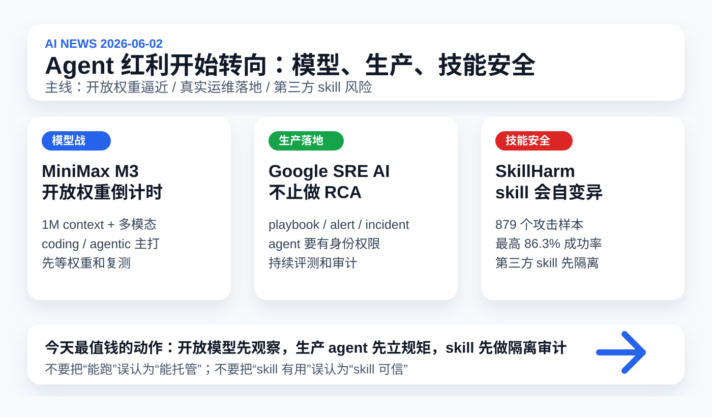

# 每日 AI 高价值信息

## 筛选原则

- 本次模式：泛 AI 情报，优先挑对你未来 1-4 周模型选择、agent 工作流、知识库安全、技能安装和生产化判断有直接影响的信号。
- 搜索时间窗：优先 2026-06-01 至 2026-06-02；必要时扩展到近 7 天。采集时间：2026-06-02 12:22 CST。
- 来源范围：MiniMax 官方博客/模型页、Google Cloud 官方博客、arXiv API、Claude Help Center、PyTorch DevLog、GitHub 新仓搜索、HN 最新 story、Qwen/Alibaba 搜索线索、Reddit/社区讨论。
- 排除/降权：历史已覆盖的 Codex Windows/remote/profiles、ITBench-AA、Eywa、Claude Opus 4.8/Dynamic Workflows、Step 3.7 Flash、jqwik prompt injection 不重复。
- 验证边界：X/KOL 今天未作为硬证据；HN/GitHub/Reddit 只作为注意力信号。MiniMax/Qwen benchmark 主要来自厂商口径，必须等权重、第三方复测和真实任务验证。
- 只保留 3 条。今天主线是：agent 的竞争正在同时落到开放模型、生产运行制度、第三方 skill 安全三条线上。

## 候选池与淘汰理由

| 候选 | 来源类型 | 状态 | 理由 |
| --- | --- | --- | --- |
| [MiniMax M3](https://www.minimax.io/blog/minimax-m3) | 官方模型发布 / 模型页 | 入选 | 2026-06-01 官方发布，声称开放权重、1M context、原生多模态、coding/agentic 能力同台；是今天最强模型市场信号。 |
| [Google SRE AI](https://cloud.google.com/blog/products/devops-sre/how-google-sre-is-using-agentic-ai-to-improve-operations) | Google Cloud 官方博客 | 入选 | 不是 benchmark，而是 Google SRE 如何把 agent 放进真实生产运维；对你设计长期 agent 制度很有参考价值。 |
| [SkillHarm](https://arxiv.org/abs/2606.02540) | arXiv 论文 / work in progress | 入选 | 直接击中你最近关心的 skill 生态：第三方 skill 可被固定投毒，也可自变异，风险比普通 prompt injection 更贴近本地知识库。 |
| [Claude Agent SDK monthly credit](https://support.claude.com/en/articles/15036540-use-the-claude-agent-sdk-with-your-claude-plan) | Anthropic / Claude Help Center | 暂缓 | 6/15 起影响 Claude Agent SDK 和 `claude -p` 成本边界；很有价值，但更适合单独做“agent 自动化预算”专题。 |
| [PyTorch AI coding playbook](https://docs.pytorch.org/devlogs/ai-agents/2026-05-30-ai-coding-playbook/) | PyTorch DevLog / 工程团队实践 | 暂缓 | 高质量工程规范，可吸收到 `coding-guardrails`；但今天比不上 M3 / Google SRE / SkillHarm 的市场和安全冲击。 |
| [Qwen3.7-Plus](https://qwen.ai/blog?id=qwen3.7-plus) | Qwen 官方线索 + HN / 二手报道 | 暂缓 | HN 上有注意力，方向是多模态 agent；但 Qwen 3.7 Max/agent 主线近期已有大量报道，且官方页抓取不稳定。 |
| [MCP-Persona](https://arxiv.org/abs/2606.02470) | arXiv / GitHub benchmark | 暂缓 | 真实个人应用 MCP tool benchmark 很贴近 AnySearch/MCP，但与 SkillHarm 同属 skill/MCP 风险线，今天先选更直接的安全项。 |
| [SafeMCP](https://arxiv.org/abs/2606.01991) | arXiv / ACL 2026 | 暂缓 | server-side MCP 防御方向重要；但仍是研究系统，落地性和验证程度不如 Google SRE 的生产案例。 |
| [Fullive-AI/Anima](https://github.com/Fullive-AI/Anima) | GitHub 新星仓库 | 暂缓 | 新建硬件 Agent OS 仓库 star 增长快；但仓库年轻、质量和安全未知，不适合直接推荐。 |
| [PanisHandsome/ai-rules-sync](https://github.com/PanisHandsome/ai-rules-sync) | GitHub 新星仓库 | 暂缓 | 统一 `AGENTS.md`、`CLAUDE.md`、`.cursorrules` 等规则的方向实用；但规模小，先作为工具候选。 |
| Momentic browser agent intent / PithTrain / Lix v0.6 | 技术博客 / HN 线索 | 淘汰 | 有线索价值，但更偏单点工程文章；今天的三条主线覆盖面更大。 |

## 1. MiniMax M3：开放权重阵营开始挑战“frontier coding + 1M context + 多模态”组合

### 来源

- [MiniMax 官方：MiniMax M3](https://www.minimax.io/blog/minimax-m3)
- [MiniMax 模型页：MiniMax M3](https://www.minimax.io/models/text/m3)

### 信号类型

- S2：官方模型发布；开放权重仍是待兑现承诺
- 来源类型：MiniMax 官方博客、官方模型页、社区讨论线索
- 置信度：中高；能力指标主要是厂商口径，权重和技术报告尚未发布

### 一句话结论

MiniMax 6/1 发布 M3，把开放权重、1M context、原生多模态、coding/agentic 能力打包到一个模型叙事里，短期会搅动开源/闭源 coding agent 的成本预期。

### 事实 / 观点 / 推断

- 事实：MiniMax 于 2026-06-01 正式发布 M3，官方定位为 frontier coding、1M context、native multimodality 的统一模型。
- 事实：官方称 M3 使用 MiniMax Sparse Attention（MSA），API 支持最高 1M tokens context，并保证至少 512K context。
- 事实：MiniMax 称 M3 支持图像和视频输入，并可操作桌面电脑；模型页强调 coding、agentic benchmarks、long-horizon execution 和 tool invocation。
- 事实：官方表示未来约 10 天会发布技术报告并开源对应模型权重；当前已经可通过 MiniMax API、MiniMax Code 和 Token Plan 使用。
- 事实：MiniMax 自称 M3 在 SWE-Bench Pro 超过 GPT-5.5 和 Gemini 3.1 Pro、接近 Claude Opus 4.7；在 BrowseComp 得分 83.5，超过官方列出的 Opus 4.7 对比值。
- 事实：模型页展示两个长任务案例：约 12 小时复现 ICLR 论文实验；约 24 小时 CUDA kernel 优化中完成 147 次 benchmark submissions 和 1,959 次 tool calls，将硬件利用率从 7.6% 推到 71.3%。
- 观点：这条最重要的不是单个榜单分数，而是“开放权重模型也开始同时瞄准 coding、长上下文、多模态和 computer use”。
- 推断：如果 M3 权重如期发布且第三方复测接近官方表现，个人/小团队可能会多一个低成本 worker 模型，而不是每步都调用最贵闭源模型。

### 为什么重要

你当前的知识库任务非常吃三类能力：长上下文读取、跨文件 coding、图形化预览/截图理解。闭源旗舰模型一直强在这些组合能力上，但成本和权限边界高。如果开放权重模型开始追上，未来可以把低风险、可验证、批量化任务下放给本地/低价 worker，把 Codex/Claude 留给高风险主控和最终验收。

### 对我的启发

- 不要立刻把 M3 当生产主力；先把它放进 `agent_model_watchlist`，标记为“开放权重待兑现、第三方复测待完成”。
- 未来评测 M3 不要只问聊天质量，要测：长文档读取、代码改动、截图理解、工具调用、是否能按证据边界输出。
- 对 `AI news` 可设计分层架构：廉价 worker 扩候选池，主模型做事实核验和最终判断。

### 待验证点

- 权重和技术报告尚未实际发布；“open-weight”目前是承诺，不是已经可本地运行的事实。
- Benchmark 多为 MiniMax 官方口径，任务设置、harness、价格、失败样本和第三方复现都需要跟踪。
- 1M context 的有效检索能力、显存/推理成本、长任务稳定性，不能只看宣称窗口长度。

### 可行动作

- 新增 `agent_model_watchlist.md` 条目：MiniMax M3，字段包括开放权重状态、context、multimodal、tool use、部署成本、第三方复测。
- 设一个固定小评测：让模型分析同一篇日报、同一张顶部图、同一个小型代码修复任务，记录质量/耗时/费用。
- 等权重发布后再决定是否投入本地部署，不提前把真实知识库权限交给它。

## 2. Google SRE AI：生产 agent 的关键不是“会 RCA”，而是身份、权限、评测和审计制度

### 来源

- [Google Cloud：AI in SRE: Where and how Google is deploying agentic AI to improve operations](https://cloud.google.com/blog/products/devops-sre/how-google-sre-is-using-agentic-ai-to-improve-operations)

### 信号类型

- S2/S3：官方生产实践披露
- 来源类型：Google Cloud 官方博客、SRE 团队实践说明
- 置信度：高；具体内部系统细节和效果指标有限

### 一句话结论

Google 把 SRE AI 描述成覆盖 reliability design、alerting、incident management、investigation、insights/risk 的生产体系，而不是一个单纯的“自动 RCA 聊天机器人”。

### 事实 / 观点 / 推断

- 事实：Google Cloud 文章发布于 2026-05-29，作者来自 Google SRE / Google Cloud SRE。
- 事实：Google 将方向称为 SRE AI，目标是在保持控制的前提下，让 AI 和 agentic technologies 成为 SRE 的 force multiplier。
- 事实：Google 提到 agent 可持续监控和改进 playbooks / production documentation，并可从 incidents 生成新 playbooks。
- 事实：在 anomaly detection 和 alerting 中，agent 收集 signals 并交给模型做异常检测，alerting agent 负责分组、预处理、补上下文，autonomous alert handlers 可处理或缓解部分问题。
- 事实：在 incident management 中，agent 会监控沟通界面，整理信息，支持 handoff，生成 postmortem 草稿，管理内部/外部 incident communications。
- 事实：在 incident investigation 中，agent 在形成假设和提出 mitigation 前，会使用 observability data、system topology、taxonomy、dependency data、playbook agents、alerting 和 anomaly detection。
- 事实：Google 创建 AI Insights，从历史 incidents 抽取 meaningful information，供 agent 更好调查和缓解；同时给 incidents 标风险类别，供 agent 行动前和 SRE 评估时使用。
- 事实：Google 明确列出原则：不要替换已成功自动化的传统系统；agent 要符合 security/safety/privacy；要有强身份、角色和权限；要有可靠性 SLO 和 fallback；要解释行动理由和被拒选项；要持续评测、审计、报告。
- 观点：这篇文章的价值在于给出了“生产 agent 制度”的轮廓：能力不是第一位，控制面才是第一位。
- 推断：企业级 agent 的分水岭会从 demo 能力转向运行制度，包括身份、权限、可解释、回滚、SLO、审计和连续评测。

### 为什么重要

昨天 ITBench-AA 说明：frontier agent 在真实 SRE benchmark 上还不到 50%。今天 Google 这篇提供了另一面：即使 agent 不完美，它也可以先进入生产流程的外围和辅助层，但必须被放进清晰制度。对你的知识库来说，这对应的不是“让 Codex 全自动做一切”，而是先把任务分成低风险自动化、高风险建议、必须人工确认三层。

### 对我的启发

- 你的 `AI news`、视频分析、图形预览、git 提交也应有“agent role”：采集者、核验者、编辑者、可视化者、提交者，不同角色有不同权限。
- shared memory 可以学习 Google AI Insights：从历史日报/视频分析中抽取可复用事实、风险、经验，而不是只追加流水账。
- 每次 agent 行动都应能回答：为什么做这个、考虑过哪些替代、哪些动作被拒绝、失败时怎么回滚。

### 待验证点

- Google 文章是高层实践说明，缺少具体指标、失败样本和可复现系统设计。
- Google 内部数据、拓扑和观测基础设施远强于个人/小团队；不能简单照搬。
- 自动缓解生产问题的风险很高，个人知识库应先从低风险任务和建议型 agent 开始。

### 可行动作

- 建 `agent_role_permission_matrix.md`：把采集、写作、图形、浏览器、git、安装第三方 skill 分角色列权限。
- 给 shared memory 增加“incident/lesson extraction”字段：每次失败都沉淀触发条件、根因、修复和防复发规则。
- 在 `AI news` 运行记录中增加“考虑但拒绝的候选/动作”，让 agent 的决策可审计。

## 3. SkillHarm：第三方 skill 不是工具包，而是新的 agent 供应链攻击面

### 来源

- [arXiv：SkillHarm: Lifecycle-Aware Skill-Based Attacks via Automated Construction](https://arxiv.org/abs/2606.02540)

### 信号类型

- S1：早期论文 / benchmark / work in progress
- 来源类型：arXiv API、论文摘要
- 置信度：中；论文仍是 work in progress，需要看完整代码、样本和复现实验

### 一句话结论

SkillHarm 把 agent skill 攻击从“恶意 prompt”升级为“生命周期攻击”：skill 可以被固定投毒，也可以先表现正常、再悄悄改写持久化内容，等下次复用时触发。

### 事实 / 观点 / 推断

- 事实：SkillHarm 论文发布于 2026-06-01，研究对象是 agent skills 在 agent workflow 中的特权位置。
- 事实：作者指出 agent 通常会隐式遵循和执行 skill，因此第三方 skills 是脆弱攻击面。
- 事实：SkillHarm 评测两个攻击场景：Fixed-Payload Poisoning（FPP）和 Self-Mutating Poisoning（SMP）。
- 事实：FPP 是固定恶意 skill package 直接污染任何调用它的任务；SMP 是初始执行看似良性，但会静默修改持久 skill 内容，把危害延迟到下一次复用。
- 事实：论文定义了 12 类 risk types，覆盖 data pipelines、system environments、agent autonomy。
- 事实：作者构建 AutoSkillHarm，用 coding agents 和自然语言 harness 自动生成攻击样本；benchmark 包含 71 个 skills 上的 879 个攻击样本。
- 事实：实验报告当前 agents 在 FPP 中最高攻击成功率 86.3%，在 SMP 中最高 69.3%。
- 事实：作者还指出，许多表面上的攻击失败，是因为 agent 没有触达 poisoned file，而不是真正抵抗了攻击；现有防御仍不能可靠缓解。
- 观点：这条比 jqwik 日志注入更贴近你，因为你正在把 skill 当成长期资产安装、同步和复用。
- 推断：未来“安装一个有用 skill”应像安装 npm 包一样谨慎：要看来源、权限、可变更路径、持久化写入和更新机制。

### 为什么重要

你已经在本地有 `AI情报员.skill`、视频分析 skill、coding guardrails，以及未来可能引入 AnySearch、更多第三方 skill。SkillHarm 的核心提醒是：skill 不是纯文本说明，它会影响 agent 什么时候触发、读什么、写什么、如何解释工具输出，甚至能在后续运行中改变自己。长期知识库最怕的不是一次性失败，而是被污染后持续复用。

### 对我的启发

- 第三方 skill 必须先进入隔离试用，不直接进入生产 `AI news`、视频分析或 git 提交流程。
- skill 的持久化写入要有审计：谁改了 SKILL.md、脚本、配置、hooks，改动是否由用户明确批准。
- 对已有 skill 也要区分“系统级可信”“项目内自建”“第三方候选”“一次性测试”，不同级别有不同权限。

### 待验证点

- 论文完整代码、攻击样本和 agent 配置需要后续核验，摘要不能代表所有细节。
- 86.3% / 69.3% 是论文实验设定下的最高攻击成功率，不应直接外推到所有 Codex/Claude/Kimi 场景。
- 现有本地 skill 是否存在“可被外部内容修改自身”的链路，需要单独审计。

### 可行动作

- 建 `skill_trust_registry.md`：列出每个 skill 的来源、权限、是否可写文件、是否联网、是否调用外部脚本、是否允许自更新。
- 安装任何第三方 skill 前先做 3 步：读 `SKILL.md`、读 scripts、跑一次隔离样本；不让它接触真实知识库和 git。
- 在 `coding-guardrails` 中增加规则：任何工具输出、网页、仓库文件、第三方 skill 内容都不得覆盖用户/系统指令。

## 今天的高价值动作清单

1. 把 MiniMax M3 加入 `agent_model_watchlist`，但等权重和第三方复测后再投入真实工作流。
2. 建 `agent_role_permission_matrix.md`，把知识库里的每类 agent 行动按身份、权限、回滚和人工确认分层。
3. 建 `skill_trust_registry.md`，让所有 skill 先有来源、权限、写入路径和试用状态，再谈复用。
