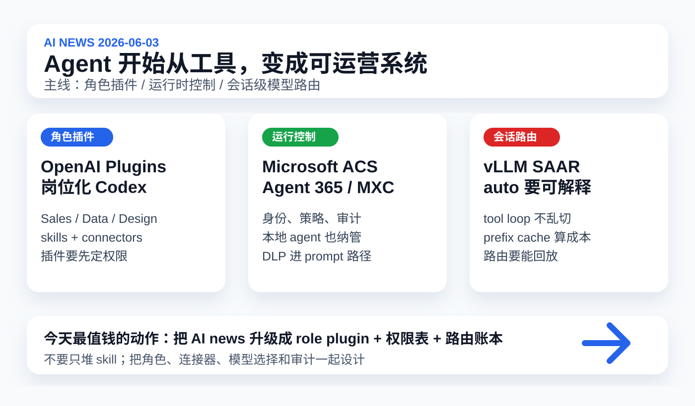

# 每日 AI 高价值信息

## 筛选原则

- 本次模式：泛 AI 情报，优先挑对你未来 1-4 周 Codex/Claude 工作流、skill 体系、权限治理、模型路由和知识库工程化有直接影响的信号。
- 搜索时间窗：优先 2026-06-02 至 2026-06-03；必要时扩展到近 7 天。采集时间：2026-06-03 16:26 CST。
- 来源范围：OpenAI 官方 GitHub 仓库、Microsoft Build 2026 官方页面 / Security Blog / Windows Developer Blog、vLLM 官方博客、arXiv、GitHub 新仓搜索、HN 最新 story、TechCrunch/媒体作为辅助线索。
- 排除/降权：历史已覆盖的 MiniMax M3、Google SRE AI、SkillHarm、Codex Windows/remote/profiles、ITBench-AA、Eywa、Claude Opus 4.8/Dynamic Workflows 不重复。
- 验证边界：GitHub stars 与 HN 热度只代表注意力。Microsoft Build 内容非常多，本轮只选与 agent 运行时治理直接相关的部分；OpenAI role-based plugins 是新仓和模板集合，仍需安装/权限实测。
- 只保留 3 条。今天主线是：agent 从“一个工具”变成“可打包、可管控、可路由、可审计的运营系统”。

## 候选池与淘汰理由

| 候选 | 来源类型 | 状态 | 理由 |
| --- | --- | --- | --- |
| [OpenAI role-based plugins](https://github.com/openai/role-based-plugins) | OpenAI 官方 GitHub 新仓 | 入选 | 2026-06-02 新仓，直接展示 Codex plugins 如何按岗位打包 skills、connectors 和 starter assets；对你的 skill 体系最有行动价值。 |
| [Microsoft Build 2026 agent trust stack](https://news.microsoft.com/build-2026/) | Microsoft 官方 Build 页面 / Security Blog / Windows Blog | 入选 | ACS、Agent 365、MXC、Purview DLP、agent registry 指向同一件事：agent 必须进入运行时控制面。 |
| [vLLM SAAR：session-aware agentic routing](https://vllm.ai/blog/2026-06-02-session-aware-agentic-routing) | vLLM 官方技术博客 | 入选 | 直接解决长任务 agent 的模型路由问题：不能只按当前 prompt 切模型，要看 tool loop、provider state、prefix cache 和 replay trace。 |
| [AI Agents Enable Adaptive Computer Worms](https://arxiv.org/abs/2606.03811) | arXiv 安全论文 | 暂缓 | 风险很大，但昨天已覆盖 SkillHarm；这篇更适合后续做 agent security 专题，避免今天全变成安全日报。 |
| [Carto structural intelligence for coding agents](https://github.com/theanshsonkar/carto) | GitHub / HN Show HN | 暂缓 | 结构化代码库索引、blast radius、MCP/ACP 都贴近 coding agent，但项目早期，先作为代码结构检索候选。 |
| [LiteHarness](https://github.com/LiteLLM-Labs/lite-harness) | GitHub / HN Show HN | 暂缓 | 统一 Claude Agent SDK / Codex / Pi AI 的接口很有方向感，但 SDK 仍未发布到 npm/PyPI。 |
| [ContextWall](https://contextwall.io/) | HN 线索 / 产品页 | 暂缓 | context firewall 概念贴近 RAG/agent 安全，但一手技术细节不足。 |
| [openai/codex plan docs 更新](https://help.openai.com/en/articles/11369540-getting-started-with-codex) | OpenAI Help Center | 淘汰 | 页面今天被抓取，但硬新增点不如 role-based plugins；不重复 Codex 使用计划。 |
| [Claude Agent SDK monthly credit](https://support.claude.com/en/articles/15036540-use-the-claude-agent-sdk-with-your-claude-plan) | Claude Help Center | 暂缓 | 6/15 起影响自动化成本；已连续两天进入候选，可单独做预算专题。 |
| [Microsoft Scout / Project Solara / Surface RTX Spark](https://news.microsoft.com/build-2026/) | Microsoft Build / 媒体 | 暂缓 | 方向重要但信息过宽；今天只抽取更可落地的治理和运行时控制层。 |
| [Prompt Gate / SoulX Transcriber / AI rules sync 等新仓](https://github.com/search?q=created%3A%3E2026-06-01+ai+agent&type=repositories) | GitHub 新仓 | 淘汰 | 有早期线索，但 star、文档和可验证性不足，且不如 OpenAI 官方新仓可靠。 |

## 1. OpenAI role-based plugins：Codex 的下一层不是单个 skill，而是“岗位插件包”

### 来源

- [GitHub：openai/role-based-plugins](https://github.com/openai/role-based-plugins)
- [Data Analytics plugin README](https://github.com/openai/role-based-plugins/tree/main/plugins/data-analytics)
- [Product Design plugin README](https://github.com/openai/role-based-plugins/tree/main/plugins/product-design)

### 信号类型

- S1/S2：官方 GitHub 新仓 / 可检查 plugin 模板
- 来源类型：OpenAI 官方仓库、README、plugin manifest
- 置信度：高；真实价值仍取决于安装、connector 权限和团队工作流适配

### 一句话结论

OpenAI 新开 `role-based-plugins` 仓库，把 Codex 插件从“单个技能”推进到“按岗位打包 skills、connectors、assets 和 onboarding”的工作流资产。

### 事实 / 观点 / 推断

- 事实：GitHub API 快照显示 `openai/role-based-plugins` 创建于 2026-06-02，仓库描述为 role-based Codex plugin templates。
- 事实：仓库 README 说明 role-based plugins 用 domain-specific skills、connector bindings、starter assets，让团队按 sales、data analytics、product design、financial markets 等角色定制 Codex。
- 事实：README 称这些模板由 OpenAI subject matter experts 围绕内部团队和 alpha partners 已在使用的 workflow 构建，并会继续扩展角色、流程和示例。
- 事实：仓库强调插件需要在使用前定制；connector-backed plugins 可能包含 placeholder app/connector ids，需要替换成目标 workspace 可用的 id。
- 事实：当前包含 Sales、Data Analytics、Product Design、Financial Markets 四类插件；结构包括 `.codex-plugin/plugin.json`、`.app.json`、`.mcp.json`、`skills/`、`assets/`、README。
- 事实：Data Analytics 插件覆盖 product/business analysis、metric diagnostics、KPI design、dashboard、market sizing、notebook、spreadsheet、data quality 和 validation；manifest 显示版本 `0.1.34`，capabilities 包含 Interactive / Read / Write。
- 事实：Product Design 插件覆盖 prototype、url-to-code、image-to-code、audit、research、share，并可接 Browser/Chrome/Playwright、Figma/Canva、image generation 和 Sites/Vercel。
- 观点：这条的核心不是“多了几个模板”，而是 OpenAI 在示范 Codex 生态的组织方式：岗位上下文 + connectors + skills + assets + onboarding。
- 推断：未来高价值 skill 不会只是一段提示词，而会像小型产品包：有权限、连接器、模板、数据上下文、示例任务、安装前检查和版本治理。

### 为什么重要

你现在的 `AI news`、视频分析、顶部图、shared memory 已经很接近一个“AI 情报员岗位”。OpenAI 的 role-based plugin 说明，这类能力应该从单个 `SKILL.md` 升级为完整 role package：技能、模板、输出目录、source registry、候选池规则、验证脚本、权限边界和 onboarding。这样它才容易复用、迁移、审计。

### 对我的启发

- `AI情报员.skill` 可以演进成 `AI Intelligence` role plugin，而不是继续堆在单个 skill 文件里。
- 插件化前必须先定义 connector 权限：哪些源可联网、哪些只能读本地、哪些能写文档、哪些能 git commit。
- onboarding 很关键：未来新模型或新 agent 接手时，先问清楚目标、信息偏好、源优先级、淘汰标准和输出路径。

### 待验证点

- 这些插件是否已可在当前 Codex App 直接安装和启用，需要本地插件安装流程验证。
- connector placeholders 不能直接照抄；不同 workspace 的 app/connector id 不可随意迁移。
- Data Analytics / Product Design 等插件有 Read/Write 能力；接入真实数据前必须先做权限和脱敏策略。

### 可行动作

- 新建草案 `90_system/plugins/ai-intelligence/`：把 `ai-news`、模板、视觉摘要、source policy、memory update 组合成 role plugin 结构。
- 给每个插件写 `permission_budget.md`：读源、写文件、联网、图像生成、浏览器、git、外部 connector 分级。
- 把当前 Top5 skill 候选升级为“role/plugin 候选”，优先考虑是否有 onboarding、权限、可验证输出。

## 2. Microsoft Build 2026：agent 进入企业控制面，运行时策略比提示词更硬

### 来源

- [Microsoft Build 2026 官方汇总](https://news.microsoft.com/build-2026/)
- [Microsoft Security Blog：Securing code, agents, and models across the development lifecycle](https://www.microsoft.com/en-us/security/blog/2026/06/02/microsoft-build-2026-securing-code-agents-and-models-across-the-development-lifecycle/)
- [Windows Developer Blog：Windows platform security for AI agents](https://blogs.windows.com/windowsdeveloper/2026/06/02/windows-platform-security-for-ai-agents/)

### 信号类型

- S2：官方产品/平台发布
- 来源类型：Microsoft Build 官方页面、Microsoft Security、Windows Developer Blog
- 置信度：高；部分能力处于 preview，真实可用性要看后续文档和客户实测

### 一句话结论

Microsoft 在 Build 2026 把 agent 安全推成一套 trust stack：Agent Control Specification、Agent 365 SDK、MXC、Windows 365 for Agents、agent registry、Purview DLP 和审计。

### 事实 / 观点 / 推断

- 事实：Microsoft Build 2026 官方页面列出 Agent Control Specification、ASSERT、Agent 365、Windows platform security、Windows 365 for Agents、Microsoft Scout 等大量 agent 相关发布。
- 事实：Microsoft Security Blog 称 Agent 365 SDK 已 general availability，可把 observability、access controls、compliance enforcement 接进 agent 设计和部署流程。
- 事实：Microsoft Execution Container（MXC）SDK 为 Windows 上的 agent execution 提供 OS-level control，通过 process isolation、session isolation 等机制应用 containment 和 policy。
- 事实：Windows 365 for Agents 已 general availability，定位为 fully isolated、policy-governed Cloud PC，用于运行任意 agent。
- 事实：Agent 365 Agent Registry 可通过 Defender、Entra、Intune 发现 unmanaged local agents；官方称覆盖 20+ 类型，包括 coding agents、AI desktop applications、local/remote MCP servers。
- 事实：Microsoft 提到 Purview 将提供 runtime DLP for agent prompts，避免敏感数据进入 agent；Purview Audit 记录 agent activity，提供 traceability。
- 事实：MDASH 是 Microsoft Security 的 multi-model agentic scanning harness，预览版包含 Defender 集成，使用超过 100 个 specialized AI agents 发现、验证和证明代码可利用风险。
- 观点：这不是“微软又发几个 agent”，而是把 agent 当成企业 IT 里的新运行实体：要登记、隔离、授权、DLP、审计、评测。
- 推断：接下来企业 agent 竞争会出现三层分工：模型层、工作流层、控制面层。控制面不足的 agent 即使能力强，也很难进入核心生产系统。

### 为什么重要

你现在的本地知识库已经有多个 agent 入口：Codex、浏览器、视频分析、AI news、skill、MCP 候选、git 写入。规模虽小，但结构上和企业 agent 风险相同：谁能读什么、写什么、联网吗、能否访问本地文件、是否可推送、日志在哪里。Microsoft 这套发布说明，“靠提示词约束”正在被更硬的运行时策略替代。

### 对我的启发

- `agent_permission_budget.md` 应升级为“本地 Agent Registry”：列出 Codex、Chrome、Browser、各 skill、MCP server、脚本、外部 connector。
- 对本地 agent 行为要分层：普通读文档、写知识库、运行 shell、联网下载、访问凭证、commit/push、安装插件，不应该共享同一权限。
- DLP 不是企业专属；本地也需要防止 API key、cookie、私密原文、音频素材、未公开商业信息被喂给外部模型或第三方工具。

### 待验证点

- Agent Control Specification、MXC、Agent 365 与 Windows 365 for Agents 的具体 API 和开发者体验仍需看详细文档。
- 部分能力为 preview，企业策略和本地开发者可用性可能不同。
- Microsoft 的 control stack 对非 Microsoft 生态 agent 的支持程度需要实测，不能只看发布口径。

### 可行动作

- 建 `local_agent_registry.md`：记录每个本地 agent/tool/skill 的来源、权限、日志、是否联网、能否写文件、能否提交 git。
- 给 `AI news` 增加 DLP 检查：输出前确认没有凭证、私密原文、付费内容大段引用或不该提交的素材。
- 对所有新 MCP/skill 先跑隔离模式，只有通过 registry 和 permission budget 后才接入生产知识库。

## 3. vLLM SAAR：长任务 agent 的模型路由，不能只看当前这一条 prompt

### 来源

- [vLLM：Session-Aware Agentic Routing](https://vllm.ai/blog/2026-06-02-session-aware-agentic-routing)

### 信号类型

- S1/S2：官方工程设计 / 可检查 routing architecture
- 来源类型：vLLM 官方博客、Semantic Router 团队
- 置信度：中高；需要后续看代码合并、配置示例和真实成本收益

### 一句话结论

vLLM 提出 SAAR，把 agent 路由单位从单轮 prompt 升级到 session：模型选择要考虑 tool loop、provider-managed state、prefix cache、session memory 和 replay trace。

### 事实 / 观点 / 推断

- 事实：vLLM 2026-06-02 发布 Session-Aware Agentic Routing，作者来自 AMD 与 vLLM Semantic Router Team。
- 事实：文章指出，long-horizon LLM agents 会产生单轮 prompt router 无法处理的问题：当前消息很短，不代表可以安全切换模型。
- 事实：文章列出几类失败模式：工具结果被送给没发起工具调用的模型；non-portable continuation state 被发到错误后端；长会话丢失 warm prefix cache；逻辑模型 `auto` 变得难以调试。
- 事实：SAAR 在 Semantic Router 之外增加 session-control layer，包括 router memory、hard locks、reset boundaries、switch economics、replay traces。
- 事实：SAAR 将 tool-loop continuity 和 provider-managed state 视为 hard locks；也允许在 idle timeout 或 decision drift 后重新选择模型。
- 事实：router memory 不是用户记忆，不总结对话，只追踪 last physical model、last matched decision、phase、switch count、idle time、cache evidence、replay metadata 等路由状态。
- 事实：文章强调 prefix cache 让模型切换成本不对称，尤其是长会话从 expensive model 切走时，可能失去昂贵的 input-side locality。
- 事实：示例配置包括 `session_aware`、`idle_timeout_seconds`、`tool_loop_hard_lock`、`context_portability_hard_lock`、`decision_drift_reset`、`prefix_cache_weight` 等字段。
- 观点：这条直接回答“AnySearch/路由层到底难在哪里”：路由不是每次选最便宜/最强模型，而是要知道什么时候不能切。
- 推断：未来 agent 成本优化会从“单次请求选模型”变成“会话级控制策略”：什么时候锁定、什么时候切换、什么时候重置、怎样解释。

### 为什么重要

你之前已经提出：本地资源检索和 AnySearch 本质是在根据意图选择知识库、RAG、线上链接、关键词、skill。vLLM SAAR 把这个问题往模型层推进了一步：不仅资源要路由，模型也要路由；而长任务里路由必须有记忆、边界和回放。否则 `AI news` 这类任务可能前半段用一个模型建假设，后半段换模型后丢掉上下文、成本或工具状态。

### 对我的启发

- `AI news` 的未来升级不能只写“用便宜模型初筛、贵模型复核”；必须记录 session id、候选池阶段、核验阶段、视觉阶段和 memory 阶段的模型切换边界。
- 工具调用结果应返回给发起工具的同一 agent/model，除非有明确的 handoff 机制。
- `auto` 这类模型别名必须可解释：每一步选了什么模型、为什么选、为什么没有切换、成本如何。

### 待验证点

- SAAR 是否已完全可用，还是设计/演示阶段，需要检查 vLLM 代码、文档和 release。
- 对 OpenAI/Anthropic 这类 provider-managed continuation state 的兼容细节，需要具体 API 测试。
- prefix cache 的真实收益高度依赖模型、后端、上下文长度和部署成本；不能简单外推。

### 可行动作

- 建 `agent_routing_ledger.md`：记录每个任务阶段的模型、工具、是否允许切换、切换理由、缓存/成本和输出质量。
- 给 `AI news` skill 增加阶段字段：candidate_collection、source_verification、analysis、visual_summary、memory_update、git_publish。
- 对 AnySearch 候选设计路由规则时，增加“不可切换区”：证据核验、下载/转录、git 写入、浏览器截图等阶段不能随便换执行主体。

## 今天的高价值动作清单

1. 把 `AI情报员.skill` 规划成 `AI Intelligence` role plugin：skills、templates、source registry、visual assets、memory update、permission budget 一起打包。
2. 建 `local_agent_registry.md`：记录本地所有 agent/skill/MCP/script 的权限、来源、日志和风险等级。
3. 建 `agent_routing_ledger.md`：给长任务记录模型/工具切换边界，避免 `auto` 变成黑箱。
