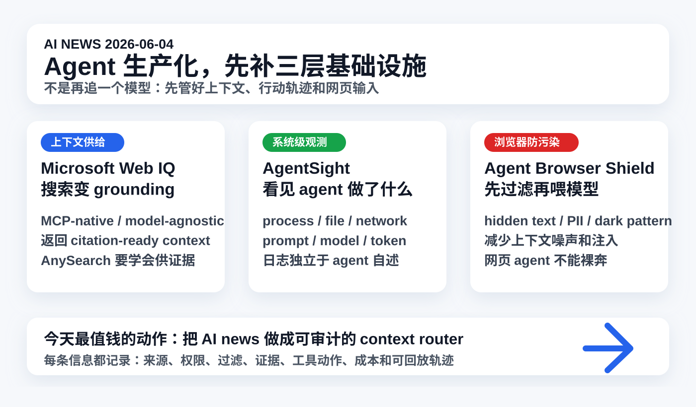

# 每日 AI 高价值信息

## 筛选原则

- 本次模式：泛 AI 情报，优先挑对你未来 1-4 周 Codex、AI news、AnySearch、本地知识库、浏览器自动化和 agent 治理有直接行动价值的信号。
- 搜索时间窗：优先 2026-06-03 至 2026-06-04；必要时扩展到近 7 天。采集时间：2026-06-04 11:16 CST。
- 来源范围：Microsoft 官方 Build / Web IQ / Work IQ 页面、GitHub 新仓与近期 release、Hacker News 最新 story、OpenAI / Anthropic 官方页面、社区工程博客与产品页。
- 排除/降权：昨天已入选的 OpenAI role-based plugins、Microsoft agent trust stack、vLLM SAAR 不重复；再早已覆盖的 SkillHarm、AI worms、Agent Governance Toolkit、BadHost、Codex Windows/remote 不重复。
- 验证边界：GitHub stars、HN points、产品自述只代表注意力和方向，不证明质量。今天入选的两个 GitHub/开源信号都需要隔离验证，尤其涉及浏览器扩展、sudo/eBPF 或敏感日志时不能直接接入生产工作流。
- 只保留 3 条。今天主线是：agent 生产化的瓶颈正在从“模型够不够强”转向“上下文如何供应、行动如何观测、网页输入如何防污染”。

## 候选池与淘汰理由

| 候选 | 来源类型 | 状态 | 理由 |
| --- | --- | --- | --- |
| [Microsoft Web IQ / Microsoft IQ](https://www.microsoft.com/en-us/webiq) | Microsoft 官方 Build / 产品页 / 工程博客 | 入选 | 把 web search 明确重构为 agent grounding layer，MCP-native、model-agnostic、citation-ready context；直接影响 AnySearch 和 AI news 的设计。 |
| [AgentSight](https://github.com/eunomia-bpf/agentsight) | GitHub / HN / 近期 release | 入选 | 用 eBPF 从系统边界观察 Claude Code、Codex、Gemini CLI 等 agent 的进程、文件、网络、prompt、token；对本地 agent registry 最有启发。 |
| [agent-browser-shield](https://github.com/pixiebrix/agent-browser-shield) | GitHub / HN Show HN / Chrome extension | 入选 | 浏览器 agent 正在遇到 prompt injection、dark pattern、context pollution；这个项目把“喂给模型前先净化页面”做成可检查扩展和 benchmark。 |
| [Hyper：Company brain for agentic development](https://news.ycombinator.com/item?id=48387095) | HN Launch / 产品页 | 暂缓 | 公司记忆层方向很强，且提到 Claude Code / Codex / Cursor hooks；但公开技术细节和权限策略仍不足，先作为企业 memory layer 候选。 |
| [tastyeffectco/sandboxes](https://github.com/tastyeffectco/sandboxes) | GitHub 新仓 / HN | 暂缓 | 自托管 dev sandbox + preview URL 很适合 coding agents，但与近期 runtime/sandbox 主线有重叠；后续可做执行环境专题。 |
| [mnemo](https://github.com/zaydmulani09/mnemo) | GitHub / HN Show HN | 暂缓 | local-first memory layer 贴近个人知识库，但仍是早期项目；价值更适合放入 AnySearch / memory 专题做实测。 |
| [Lookspan](https://github.com/JoniMartin27/lookspan) | GitHub / HN Show HN | 暂缓 | 本地 agent observability dashboard 有价值，但需要 agent 主动 emit span；今天 AgentSight 的系统边界观测更稀缺。 |
| [AI Gauge](https://github.com/jpajak/ai-gauge) | GitHub / HN Show HN | 暂缓 | 对多订阅用户监控 Claude / Codex / Copilot 额度很实用，但战略信息差低于上下文、观测和安全三条。 |
| [OpenAI ChatGPT Active sessions](https://help.openai.com/en/articles/6825453-custom-instructions) | OpenAI Help Center release notes | 暂缓 | 账号会话安全重要，且提到 ChatGPT / Codex / API Platform sessions；但本次更关注 agent 生产化基础设施。 |
| [Anthropic 6/4 agent webinars](https://www.anthropic.com/webinars/building-agents-on-claude-opus-4-8-live-demos-with-letta-and-browserbase) | 官方活动页 | 暂缓 | Letta / Browserbase 实操可能有价值，但录制和可核验内容尚未公开，先等回放或工程材料。 |
| [I spent $1,500 seeing if LLMs could hack my app](https://news.ycombinator.com/item?id=48392343) | HN 高讨论 / 个人实测博客 | 暂缓 | 安全实测值得看，但需要复核任务设置、模型和评测方法；不占今天 3 条。 |

## 1. Microsoft Web IQ：搜索正在从“给人看的链接”变成“给 agent 用的证据供应层”

### 来源

- [Microsoft Web IQ](https://www.microsoft.com/en-us/webiq)
- [Microsoft：Grounding at scale: Engineering the retrieval system for the agentic web](https://commandline.microsoft.com/grounding-system-agentic-web-engineering-retrieval/)
- [Microsoft IQ](https://www.microsoft.com/en-us/ai/microsoft-iq)
- [Microsoft 365 Developer Blog：Work IQ](https://devblogs.microsoft.com/microsoft365dev/work-iq-production-ready-intelligence-for-every-agent/)
- [Microsoft Build 2026 官方博客](https://blogs.microsoft.com/blog/2026/06/02/microsoft-build-2026-be-yourself-at-work/)

### 信号类型

- S2：官方产品/平台发布
- 来源类型：Microsoft 官方产品页、Build 博客、工程深度文章、开发者博客
- 置信度：高；性能与质量 claim 仍需第三方实测

### 一句话结论

Microsoft Web IQ 把 Bing 级搜索能力改造成 agent 的 grounding API：返回可直接注入模型上下文的结构化、可引用、MCP-native 证据，而不是传统搜索结果页。

### 事实 / 观点 / 推断

- 事实：Microsoft Web IQ 官方页把它定义为面向 AI agents and assistants 的 grounding service，可返回 web、news、images、video 等真实世界信息的 ranked、citation-ready context。
- 事实：官方 FAQ 称 Web IQ 支持 REST、MCP JSON-RPC 2.0 和 SDK，返回 title、URL、snippet、timestamp、provenance 等结构化 JSON，目标是直接注入 LLM context window。
- 事实：Microsoft 官方称 Web IQ model-agnostic、MCP-native、不是 SERP scraping，并基于 Bing 二十年搜索基础设施和授权/结构化数据源。
- 事实：Microsoft Command Line 工程文章称 Web IQ 是为 agentic web 设计的 grounding system，重点是 semantic-first retrieval、passage/sub-document granularity、ANN index 和 token-efficient grounding。
- 事实：Microsoft IQ 官方页把 Work IQ、Fabric IQ、Foundry IQ、Web IQ 组合成 shared intelligence layer，让 Copilot 和 agents 复用组织上下文。
- 事实：Work IQ 开发者博客称 Work IQ APIs 将在 2026-06-16 GA，包含 A2A、redesigned remote MCP server、REST API，并用集中治理和成本控制管理 agent 使用。
- 观点：这条的核心不是“微软出了新搜索”，而是搜索正在变成 agent 的底层上下文供应链。
- 推断：未来高价值检索系统不会停留在 keyword search / RAG / 网页摘要，而会交付 citation-ready context、权限过滤、provenance、freshness、latency、cost 和可回放 trace。

### 为什么重要

你之前对 AnySearch 的理解是：根据用户 prompt 智能判断该用知识库、RAG、线上链接、关键词还是 skill。Web IQ 说明这个方向正在平台化。真正有价值的不是“能搜到”，而是把搜索结果变成 agent 可用的证据包：来源、时间、引用、权限、格式、注入位置、是否可信、是否过期。

### 对我的启发

- `AI news` 不能只做“搜索后总结”，要升级成 `context router`：每条候选记录 source type、provenance、freshness、confidence、rejection reason。
- AnySearch 的 MVP 不应先追“全网搜索大而全”，而应先做你最需要的“可审计证据供应”：本地知识库、GitHub、官方源、HN、视频证据、网页快照。
- 对个人知识库来说，Web IQ 的价值在于设计原则：结果必须带出处和可注入上下文，而不是只给一堆链接。

### 待验证点

- Web IQ 当前是 limited access，普通开发者可用性、定价、API 限制、MCP 体验需要后续验证。
- 官方速度和质量 claim 需要第三方 benchmark 或真实 agent 任务实测。
- Microsoft IQ 对非 Microsoft 生态的数据和 agent 支持程度仍需看具体集成。

### 可行动作

- 新增 `context_router_schema.md`：定义每条情报候选的 `source_type / provenance / freshness / permissions / confidence / rejected_reason`。
- 给 `AI news` 增加“证据包”字段：每条入选至少保留 1 个一手链接、1 个可检查对象、1 个验证边界。
- AnySearch 试验优先做“本地知识库 + 官方源 + GitHub + HN”的小闭环，不急着接入过多源。

## 2. AgentSight：agent 可观测性不能只相信 agent 自己写的日志

### 来源

- [GitHub：eunomia-bpf/agentsight](https://github.com/eunomia-bpf/agentsight)
- [HN 线索：AgentSight: System-wide AI agent tracing and monitoring with eBPF](https://news.ycombinator.com/item?id=48386737)

### 信号类型

- S1：可检查开源工程信号 / 近期 release
- 来源类型：GitHub README、HN 注意力信号
- 置信度：中高；需要 Linux/eBPF 环境实测，且敏感日志风险较高

### 一句话结论

AgentSight 用 eBPF 从操作系统边界追踪 AI agent：进程、文件、网络、prompt、response、model、token，而不是只看框架内部 trace。

### 事实 / 观点 / 推断

- 事实：AgentSight README 将其定位为 local-first、类似 `perf/top/strace/nsight` 的 AI agent tracing tool。
- 事实：README 称可围绕 Claude Code、Codex、Gemini CLI、OpenCode、OpenClaw 或任意命令运行，记录 processes、child processes、shell commands、cwd、argv、exit status、duration。
- 事实：它还记录 files created/written/truncated/renamed/deleted、network destinations、prompts、responses、tool intent、LLM/model/token。
- 事实：项目强调无需 SDK、无需代理、无需 vendor integration，通过 eBPF 和 TLS traffic tracing 观察闭源 CLI agent。
- 事实：README 显示 latest release 为 `v0.2.9`，日期为 2026-06-03；GitHub 页面显示约 370 stars。
- 事实：项目提示 eBPF probes 需要 root/sudo；`record` 和 `stat` 默认把 sessions 存在本地 SQLite，捕获数据可能包含 prompts、responses、paths、headers、network targets，应按敏感数据处理。
- 观点：这类工具的关键价值，是让 agent 行动轨迹独立于 agent 自述；当 agent 会写日志时，日志本身也可能不完整或被误导。
- 推断：未来个人 agent 工作流也需要“系统级黑盒记录”：不是为了监控模型，而是为了知道它到底读了什么、写了什么、联网到哪里、花了多少 token。

### 为什么重要

你现在的知识库已经让 Codex 执行浏览器、shell、写文件、生成图、commit/push。随着 skill 和 MCP 增多，最大风险不是“agent 不会做”，而是“做了什么无法复盘”。AgentSight 提醒我们，应用层日志不够；至少要有一套独立的 agent action ledger，记录文件、网络、命令、模型、成本和证据链。

### 对我的启发

- `local_agent_registry.md` 不能只列权限，还要配 `agent_observability_log.md`：每次任务的 shell、文件、网络、浏览器、git 操作都要能复盘。
- 对高风险任务，如视频下载、网页登录、第三方 skill 安装、MCP 接入、git push，应记录“动作轨迹 + 证据边界”，不是只写最终结论。
- AgentSight 当前偏 Linux/eBPF；macOS 上不能照搬，但可以借鉴结构，用 `fs_usage`、网络日志、shell session、git diff、浏览器截图和本地任务 ledger 做轻量替代。

### 待验证点

- AgentSight 对 macOS 不适用；本机如果要使用，需要 Linux 或容器/远端环境。
- eBPF/TLS tracing 需要 sudo，捕获内容敏感，不适合未经隔离直接跑在生产账户上。
- README claim 的低性能开销和 closed-source CLI 可观测能力需要本地复测。

### 可行动作

- 建 `agent_action_ledger.md`：任务 id、使用工具、写入文件、外部请求、模型/成本、验证命令、commit hash。
- 给 `AI news` 输出增加采集轨迹摘要：扫过哪些源、哪些被拒绝、哪些无法验证。
- 后续若试 AgentSight，只在隔离 Linux 环境、无敏感 token、无真实个人浏览器 cookie 的条件下测试。

## 3. agent-browser-shield：浏览器 agent 的安全边界，要在网页进模型前处理

### 来源

- [GitHub：pixiebrix/agent-browser-shield](https://github.com/pixiebrix/agent-browser-shield)
- [HN 线索：Agent-browser-shield](https://news.ycombinator.com/item?id=48386116)

### 信号类型

- S1：可检查工程信号 / source-available browser extension
- 来源类型：GitHub README、HN Show HN、Chrome extension、demo / benchmark harness
- 置信度：中；alpha prototype，规则和许可边界都需要实测

### 一句话结论

agent-browser-shield 把浏览器 agent 的风险从“提示词里提醒小心”前移到页面净化：隐藏注入、PII、暗黑模式、广告和干扰内容先被过滤，再进入模型上下文。

### 事实 / 观点 / 推断

- 事实：README 称该项目是 Chromium extension，目标是让 agentic browser-use 更有效、更安全，当前为 alpha prototype。
- 事实：项目声称包含 30+ rules；GitHub release 区显示 latest `v2026.6.3.17`，日期为 2026-06-03。
- 事实：README 列出三类目标：token efficiency、security & compliance、accuracy。
- 事实：具体机制包括 strip page chrome、cookie banners、chat widgets、sponsored content；mask PII 和 credentials；suppress hidden text、HTML comments、user-generated content 中可能携带的 prompt-injection payloads。
- 事实：项目还关注 manipulative dark patterns、engagement rails 等会干扰模型判断的内容，并提供 mock e-commerce demo site 和 benchmark harness。
- 事实：它可通过 Chrome Web Store 安装，也可为 Browserbase 这类 agent browser session 打包扩展；README 还列出 Claude Code skills 和 ClawHub skill。
- 事实：许可是 PolyForm Shield 1.0.0，不是普通 MIT；可以内部/研究/商业使用，但不能用来构建竞争产品。
- 观点：这条的价值在于重新定义 browser agent 的输入边界：网页不是中立事实源，而是可能带有广告、操纵、隐藏文本和注入攻击的污染上下文。
- 推断：未来 browser-use agent 的默认流程应是 `页面抓取 -> 净化/标注 -> 证据摘要 -> agent 决策`，而不是直接把 DOM/a11y tree/截图喂给模型。

### 为什么重要

你最近频繁让我分析抖音、B站、网页、GitHub、知识库后台。浏览器自动化很强，但网页内容经常有广告、推荐、登录弹窗、隐藏字段、营销话术和潜在 prompt injection。如果不先做净化，AI news 和视频分析可能被页面噪声带偏，甚至把不该进模型的敏感信息送出去。

### 对我的启发

- `视频链接分析员.skill` 和 `AI news` 的网页采集环节应该增加 `browser_evidence_sanitizer` 思路：隐藏文本、评论区、广告、cookie banner、推荐流默认降权。
- 对网页来源，必须区分 `page_raw`、`page_visible`、`page_sanitized`、`model_context` 四层，避免把“页面里有”误判成“用户要看”。
- 对任何需要登录态/浏览器 cookie 的采集，要先执行 DLP 检查：凭证、手机号、邮箱、私密账号信息不能进报告或提交。

### 待验证点

- 规则是否会误删真正有价值的页面信息，需要用真实任务 A/B 测试。
- 浏览器扩展本身有权限风险；安装前要审计 manifest、content script、网络请求和本地存储。
- 它对不同 agent runtime 的视图差异有限：DOM、a11y tree、截图、视觉模型看到的内容不完全一样。

### 可行动作

- 给 `AI news` 增加网页证据过滤清单：广告/赞助/评论/隐藏文本/cookie banner/登录弹窗/推荐流/疑似注入。
- 把浏览器采集结果写入报告时标注 `visible evidence` 与 `inferred context`，不要把页面噪声当事实。
- agent-browser-shield 可进入隔离试用清单，但安装前先看 manifest 和规则目录，不直接接入生产 Chrome。

## 今天的高价值动作清单

1. 把 `AI news` 升级成 `context router`：每条候选记录来源、证据、权限、过滤、置信度、淘汰理由和可回放链接。
2. 建 `agent_action_ledger.md`：记录 Codex / Browser / Chrome / shell / git 的关键动作，先轻量，不上重型监控。
3. 给网页和视频采集加 `browser_evidence_sanitizer`：先净化页面，再让模型做判断。
