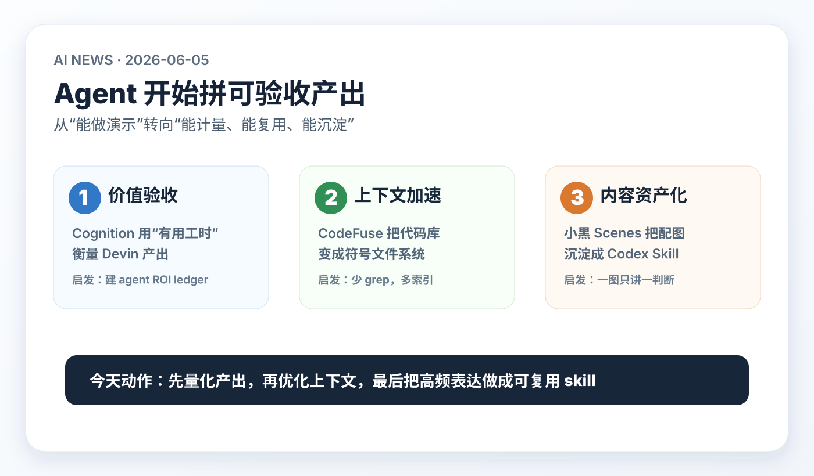

# 每日 AI 高价值信息

## 筛选原则

- 本次模式：泛 AI 情报，优先挑对你未来 1-4 周 Codex、知识库、AI news、视频分析、AnySearch 和个人 AI 复利系统有直接行动价值的信号。
- 搜索时间窗：优先 2026-06-04 至 2026-06-05；必要时扩展到近 30 天。采集时间：2026-06-05 10:37 CST。
- 来源范围：官方博客、GitHub 新仓/近期活跃仓库、Hacker News 最新线索、项目 README、已知历史日报去重。本轮没有拿到可复核的 X 原帖，因此不把二手 X 转述作为事实源。
- 排除/降权：近期已覆盖的 Microsoft Web IQ、AgentSight、agent-browser-shield、OpenAI role-based plugins、凭证委托、SkillHarm、OpenClaw 不重复；只有营销叙事、缺少可检查对象或与个人系统价值较弱的候选降权。
- 验证边界：GitHub stars、HN points 只代表注意力，不代表质量。早期 skill / repo 只进入隔离验证，不直接接入生产知识库流程。
- 只保留 3 条。今天主线是：Agent 生产化正在从“演示能力”转向“可验收产出、可索引上下文、可复用内容工作流”。

## 候选池与淘汰理由

| 候选 | 来源类型 | 状态 | 理由 |
| --- | --- | --- | --- |
| [Cognition: AI Productivity Guarantee](https://cognition.ai/blog/ai-guarantee) | 官方博客 / 企业产品承诺 | 入选 | 把 AI coding agent 从 usage metrics 推向 outcome metrics，并用最高 $10M credits 承担企业价值缺口，是强市场信号。 |
| [Cognition: Estimating the Productivity of an Autonomous AI Software Engineer](https://cognition.ai/blog/ai-productivity) | 官方技术方法 | 入选支撑 | 不是单独新闻，但支撑上一条：官方称用 human-equivalent hours 衡量 Devin 产出。 |
| [zzszmyf/codefuse](https://github.com/zzszmyf/codefuse) | GitHub 新仓 / 可检查工程信号 | 入选 | 2026-06-05 新建，直接解决 coding agent 反复 grep、上下文浪费和符号定位问题，适合进入隔离试用。 |
| [helloianneo/ian-xiaohei-scenes](https://github.com/helloianneo/ian-xiaohei-scenes) | GitHub 新仓 / Codex Skill | 入选 | 2026-06-04 新建，59 stars；把中文文章视觉表达沉淀成 Codex Skill，与你的“知识库先用图收敛”需求高度贴合。 |
| [AIXP-Labs/AISOP](https://github.com/AIXP-Labs/AISOP) | GitHub / HN 线索 / 协议草案 | 暂缓 | Mermaid/JSON 定义 agent workflow 的方向有启发，但 repo 近期代码活跃和外部采用不足，先作为 workflow-as-code 观察对象。 |
| [Bitwarden: secure Agentic AI credential access](https://bitwarden.com/blog/how-bitwarden-helps-secure-agentic-ai-access-to-your-credentials/) | 官方博客 / 安全产品组合 | 暂缓 | Agent 凭证安全重要，但发布时间是 2026-05-05，且凭证委托方向近期已覆盖；作为安全参考，不占今天 3 条。 |
| [cellebrite-labs/ghidra-rpc](https://github.com/cellebrite-labs/ghidra-rpc) | GitHub 新仓 / 垂直 agent skill | 淘汰 | “Ghidra agentic reverse engineering skill”说明专业工具正在 agent 化，但与你当前知识库/编程主线的直接价值弱于 CodeFuse。 |
| [lucasastorian/llmwiki](https://github.com/lucasastorian/llmwiki) | GitHub 活跃仓库 / MCP 知识库 | 暂缓 | LLM wiki 和 MCP second brain 很贴近你，但刚分析过 Codex + Obsidian 自生长知识库，核心观点有重复。 |
| [Mrbaeksang/deepcloak](https://github.com/Mrbaeksang/deepcloak) | GitHub 新仓 / Web 采集 agent | 淘汰 | “读完整网页并绕过反机器人”方向有信息采集诱惑，但合规和账号风险较高，不建议作为个人知识库基础设施。 |
| [myccarl/ai-shortVideo-pipeline](https://github.com/myccarl/ai-shortVideo-pipeline) | GitHub 新仓 / 内容流水线 | 暂缓 | 多模型短视频生产流水线有内容生产价值，但今天小黑 Scenes 对“知识库视觉收敛”的直接复用更强。 |

## 1. Cognition AI Productivity Guarantee：AI agent 开始被要求“交付可验收产出”

### 来源

- [Cognition: AI should earn its keep: Introducing the AI Productivity Guarantee](https://cognition.ai/blog/ai-guarantee)
- [Cognition: Estimating the Productivity of an Autonomous AI Software Engineer](https://cognition.ai/blog/ai-productivity)

### 信号类型

- S2：官方发布 / 企业承诺
- 来源类型：Cognition 官方博客、官方技术方法页
- 置信度：高；衡量方法仍需第三方复核

### 一句话结论

Cognition 开始把 Devin 的企业价值从 tokens、代码行数、任务数，推进到“有用工程产出小时数”，并承诺如果价值不足就给企业客户补偿 credits，最高 $10M。

### 事实 / 观点 / 推断

- 事实：Cognition 在 2026-06-04 发布 AI Productivity Guarantee，称如果 Devin 给企业客户交付的工程价值低于付费金额，会提供 credits，最高 $10M。
- 事实：官方称其 estimator 会检查每个完成的 Devin session，判断是否产生有用输出，并估计人类工程师完成同等工作需要多久。
- 事实：官方称 estimator 可访问用户 prompt、PR、Devin 的全部动作，以及来自 DeepWiki 的 codebase context；未合并 PR 或被归为无效的 session 不计为 useful output。
- 事实：Cognition 同时承认这衡量的是 engineering productivity baseline，不等于完整 ROI；完整 ROI 还需要业务价值上下文。
- 观点：这不是单纯营销承诺，而是 coding agent 市场从“展示能力”进入“采购验收”阶段的信号。
- 推断：未来企业和个人都会问同一个问题：这个 agent 不是帮我忙了多少次，而是交付了多少可复用、可审核、可变现的产出。

### 为什么重要

你现在的知识库和 Codex 工作流已经能写报告、分析视频、生成图、commit/push。下一阶段的瓶颈不是“能不能做”，而是“产出是否值得持续投入”：哪些任务真的省时间，哪些只是看起来热闹；哪些 skill 能复用，哪些每次都要重来；哪些结论能推动行动，哪些只是摘要。

### 对我的启发

- `AI news` 应该从“今日三条信息”升级为“情报 ROI 系统”：记录每条信息是否触发了工具试用、知识库升级、投资观察、学习计划或工作流改造。
- Codex 任务也应该有轻量 `agent_roi_ledger`：任务目标、产物链接、预计人工耗时、实际返工、是否复用、是否进入长期资产。
- 对 AI 工具采购和订阅，判断标准要从“能力惊艳”改成“一个月后还能留下什么资产”。

### 待验证点

- Cognition 的 estimator 是官方自建，第三方是否认可还未知。
- “人类工程师需要多久”本身很难精确估计，不同团队、代码库和任务复杂度会造成偏差。
- credits 承诺适用于企业客户，个人用户不能直接类比成价格保障。

### 可行动作

- 新建或扩展 `agent_action_ledger` / `agent_roi_ledger`：每次高价值 Codex 任务记录产物、节省时间、复用价值和下一步动作。
- 给 `AI news` 每篇结尾增加“30 天后复盘点”：哪些入选信号需要回看是否真的产生价值。
- 对新工具保持“先验收，再迷信”：只有能进入知识库、skill、自动化、资产沉淀的工具才值得长期关注。

## 2. CodeFuse：coding agent 的下一层效率，不是再多 grep，而是预索引上下文

### 来源

- [GitHub: zzszmyf/codefuse](https://github.com/zzszmyf/codefuse)
- [GitHub API: zzszmyf/codefuse](https://api.github.com/repos/zzszmyf/codefuse)

### 信号类型

- S1：可检查开源工程信号 / 早期新仓
- 来源类型：GitHub README、GitHub repository metadata
- 置信度：中；项目很新，需要隔离实测

### 一句话结论

CodeFuse 把代码库预索引成可查询的 symbols、file outlines 和 FUSE virtual filesystem，让 agent 可以 `ls` / `cat` 符号视图，而不是每次用 grep 重扫全仓。

### 事实 / 观点 / 推断

- 事实：GitHub API 显示 `zzszmyf/codefuse` 创建于 2026-06-05 01:03:46 UTC，采集时约 11 stars、2 forks，主语言 Go。
- 事实：README 将 CodeFuse 定义为 “Code Virtual File System for AI Agents”，目标是让 AI agents 用熟悉的文件操作探索 symbols、file outlines 和 FUSE-mounted filesystem。
- 事实：README 称其支持 `codefuse index`、`query`、`outline`、`vfs generate`、`mount` 等命令；支持 Go、TypeScript/TSX、JavaScript/JSX、Python、Rust。
- 事实：默认模式用 Go AST 和 regex fallback；tree-sitter 模式可提高多语言符号抽取准确度；后续有 cross-reference、semantic search、LSP integration 路线图。
- 观点：这条的价值不是“又一个代码搜索工具”，而是把 agent context 供给从临时搜索变成可缓存、可导航、可版本化的本地基础设施。
- 推断：如果 coding agent 继续变长周期，预索引、结构化 outline、符号级读取会比盲目扩大 context window 更经济。

### 为什么重要

你现在大量依赖 Codex 修改知识库、Web 后台和自动化脚本。每次任务如果都从 `rg`、`sed`、`cat` 重新摸索，会浪费大量上下文和操作次数。CodeFuse 提醒我们：Agent 的效率提升不只来自更强模型，也来自把本地项目整理成 agent 容易读取的形态。

### 对我的启发

- AnySearch 的本地资源检索不应该只有“关键词查文档”，还应支持结构化索引：目录、标题、frontmatter、来源类型、任务产物、commit、相关 skill。
- 对代码项目，可以探索 `symbol index + outline index + recent diff index`，让 Codex 先读索引再读文件。
- 对知识库项目，类似思想可以转化为 `note outline VFS`：每日 AI、视频分析、wiki、skills、memory 都生成可被 agent 快速读取的摘要视图。

### 待验证点

- 项目很新，安装、跨平台、FUSE 稳定性、忽略规则、增量索引可靠性都需要实测。
- README 中安装命令与仓库 owner 存在不一致线索：README 示例使用 `github.com/yifanmeng/codefuse`，当前仓库是 `zzszmyf/codefuse`，需要核对是否迁移或文档未同步。
- 生成 `.codefuse/` 后要确认不会把临时索引、敏感路径或大文件误提交。

### 可行动作

- 在隔离副本里测试 CodeFuse，不直接污染当前知识库主仓：先跑 `index`、`outline`、`vfs generate`，观察输出质量。
- 若效果好，给本地知识库自研一个轻量版 `kb-index`：只索引 Markdown frontmatter、标题、链接、视觉图、证据等级和最近更新时间。
- 把 `.codefuse/` 或类似生成目录加入 `.gitignore`，除非明确要把索引作为知识库产物版本化。

## 3. Ian Xiaohei Scenes：高频内容表达正在变成 Codex Skill 资产

### 来源

- [GitHub: helloianneo/ian-xiaohei-scenes](https://github.com/helloianneo/ian-xiaohei-scenes)
- [GitHub API: helloianneo/ian-xiaohei-scenes](https://api.github.com/repos/helloianneo/ian-xiaohei-scenes)

### 信号类型

- S1：可检查 Codex Skill / 早期中文内容生产信号
- 来源类型：GitHub README、GitHub repository metadata
- 置信度：中高；视觉生成质量需要实测

### 一句话结论

Ian Xiaohei Scenes 把“中文文章配图”封装成 Codex Skill：先理解内容处境，再用“小黑 + 真实物件 + 物理动作 + 短标签 + 留白叙事”做正文图或长卷故事图。

### 事实 / 观点 / 推断

- 事实：GitHub API 显示 `helloianneo/ian-xiaohei-scenes` 创建于 2026-06-04 05:23:49 UTC，采集时约 59 stars、3 forks，license 为 MIT。
- 事实：README 称该仓库是 Codex Skill，用于为中文文章、帖子、教程、案例、项目复盘和个人经历生成“小黑 2.0”视觉配图。
- 事实：README 把 2.0 与 1.0 区分为：1.0 更像白板手绘解释图，2.0 更像白色摄影棚里的真实物件小现场。
- 事实：工作流程包括读取文章、提炼读者处境、锁定母版、选择真实物件、让小黑承担核心动作、生成图片、按 QA checklist 检查。
- 观点：这条对你不是“装饰型图片工具”，而是验证了一个方向：可复用的表达风格、视觉 QA、shot list、失败信号，都可以沉淀成 skill。
- 推断：以后高价值知识库不只是 Markdown，而是 `文本结论 + 视觉收敛 + 生成准则 + 复盘标准` 的组合资产。

### 为什么重要

你已经明确要求“以后的知识库优先用图片先进行最直观的内容收敛呈现”。这类 skill 的价值不在于是否采用“小黑”这个 IP，而在于它把抽象表达拆成稳定流程：理解处境、只选一个物理动作、用短标签、保留留白、QA 不要像 PPT。

### 对我的启发

- 你当前日报的 SVG 视觉图可以继续保留“决策卡片”路线，但应吸收它的原则：一张图只讲一个核心判断，少字，不堆正文。
- 可以为知识库建立 `visual_summary.skill`：输入任意分析文档，输出 1 个核心判断、3 个视觉节点、1 个行动句，再生成 SVG/PNG。
- 视频分析、AI news、专题情报、人物 lens 都可以共享视觉摘要 QA：不糊、不黑底、不塞长段、不做目录式堆砌。

### 待验证点

- 中文标签在图像模型里容易错字，实际使用时可能需要 SVG 后期或低文字方案。
- 小黑风格是否适合所有知识库主题需要判断；严肃投资/安全/技术报告可能更适合当前的白底决策卡片。
- 如果要安装 skill，需要先审计 prompts、assets、license 和是否会引入过强个人 IP 风格。

### 可行动作

- 不急着直接安装。先抽取其 workflow 思路，升级我们自己的 `visual_summary` 规范。
- 选 1 篇已有视频分析和 1 篇 AI news 做 A/B：当前 SVG 决策卡片 vs 小现场隐喻图，看哪种更适合你快速理解。
- 给每张知识库图加一个更严格的验收项：用户 3 秒内是否能说出“这篇文章最值得带走的一句话”。

## 今天的高价值动作清单

1. 建一个轻量 `agent_roi_ledger`：不要只记录 agent 做了什么，还要记录它留下了什么可复用资产。
2. 把 AnySearch / 本地知识库检索继续往“结构化索引”推进：先索引标题、frontmatter、证据等级、链接、视觉图、最近更新时间。
3. 抽取 Ian Xiaohei Scenes 的方法，不急着套 IP：把“少字、单判断、物理化、QA 明确”纳入自己的知识库视觉规范。
