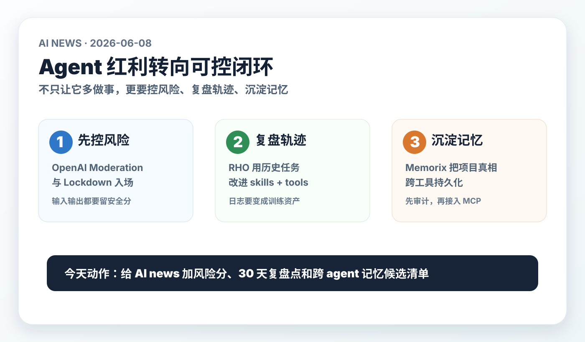

# 每日 AI 高价值信息

## 筛选原则

- 本次模式：泛 AI 情报，优先挑对你未来 1-4 周 Codex、AI news、视频分析、AnySearch、本地知识库、Agent 工作流和个人 AI 投资判断有直接行动价值的信号。
- 搜索时间窗：优先 2026-06-07 至 2026-06-08；由于周末官方硬发布较少，扩展到 2026-06-04 至 2026-06-08。采集时间：2026-06-08 11:29 CST。
- 来源范围：OpenAI 官方 release notes / Help Center、GitHub 新仓与近期活跃仓库、GitHub README、arXiv / 项目页、Hacker News / Reddit 搜索线索。X 原帖本轮未拿到稳定可复核来源，不作为硬事实。
- 排除/降权：近期已入选的 Web IQ、AgentSight、agent-browser-shield、Cognition Productivity Guarantee、CodeFuse、Ian Xiaohei Scenes 不重复；疑似破解/擦边/蹭名仓库、只有营销口号或无可检查对象的内容淘汰。
- 验证边界：GitHub stars 只代表注意力，不证明质量；RHO 的实验结果来自作者论文/README，尚需第三方复现；Memorix / Lore 这类记忆工具涉及本地历史与敏感信息，不能未经审计直接接入。
- 只保留 3 条。今天主线是：Agent 的竞争点正在从“更多能力”转向“可控风险、可复盘轨迹、可迁移记忆”。

## 候选池与淘汰理由

| 候选 | 来源类型 | 状态 | 理由 |
| --- | --- | --- | --- |
| [OpenAI Release Notes: moderation scores / Lockdown Mode / memory](https://openai.com/products/release-notes/) | 官方 release notes | 入选 | 2026-06-04 更新，直接影响 agent 安全边界、输入输出风险评分和长期记忆控制，是成熟硬信号。 |
| [ChatGPT Release Notes: Lockdown Mode / memory](https://help.openai.com/en/articles/6825453-chatgpt-release-notes) | 官方 Help Center | 入选支撑 | 支撑上一条：解释 Lockdown Mode 限制 web、deep research、agent mode、下载等网络能力，以及 memory 更新边界。 |
| [wbopan/retro-harness, RHO](https://github.com/wbopan/retro-harness) | GitHub 新仓 / arXiv 论文 | 入选 | 2026-06-07 新仓；用无标签历史 trajectories 改进 skills + tools，对 agent 日志、复盘和 harness 优化非常关键。 |
| [AVIDS2/memorix](https://github.com/AVIDS2/memorix) | GitHub 活跃仓库 / MCP 记忆层 | 入选 | 500+ stars，定位 cross-agent memory control plane；三层记忆、Git Memory、skills 生成和本地 SQLite 直接贴合你的知识库长期方向。 |
| [JimLiu/baoyu-design](https://github.com/JimLiu/baoyu-design) | GitHub 新星 / Agent Skill | 暂缓 | 2026-06-07 新仓、热度很高；但与 6 月 5 日视觉 skill 主线重合，且“repackage Claude Design”需先看 license / 边界，适合单独做视觉工作流专题。 |
| [MCPJam Inspector](https://github.com/MCPJam/inspector) | GitHub 活跃仓库 / MCP 测试与 eval | 暂缓 | MCP / Apps SDK / ChatGPT apps 调试和 CI gate 很有价值；但今天 3 条优先保留安全、轨迹优化和记忆层，后续可做 MCP 工程质量专题。 |
| [jordanhindo/lore](https://github.com/jordanhindo/lore) | GitHub 新仓 / session memory MCP | 暂缓 | “全量会话历史跨 agent 可搜”非常贴近需求，但新仓成熟度低于 Memorix；先作为轻量 session memory 候选观察。 |
| [hututuo/codex-token-dashboard](https://github.com/hututuo/codex-token-dashboard) | GitHub 新仓 / Codex 本地用量仪表盘 | 暂缓 | 对 Codex token 成本可视化实用，但范围较窄；可纳入 `agent_roi_ledger` 工具候选。 |
| [RainyMarks/DeepX](https://github.com/RainyMarks/DeepX) | GitHub 新仓 / 本地 Windows coding agent | 暂缓 | Windows portable 本地 agent 方向值得观察，但非商业许可、平台限定，且与当前 macOS 知识库工作流距离较远。 |
| GitHub undress / premium / crack / 蹭名类 AI 仓库 | GitHub 新仓 | 淘汰 | 高 star 但风险/违法/低可信，不能进入知识库工具链候选。 |

## 1. OpenAI 把 agent 风险控制下沉到 API 与产品开关

### 来源

- [OpenAI Release Notes](https://openai.com/products/release-notes/)
- [ChatGPT Release Notes](https://help.openai.com/en/articles/6825453-chatgpt-release-notes)

### 信号类型

- S2：官方发布 / GA
- 来源类型：OpenAI 官方 release notes、OpenAI Help Center
- 置信度：高；具体 API 细节仍需开发文档实测

### 一句话结论

OpenAI 6 月 4 日同时更新了 API moderation scores、ChatGPT Lockdown Mode 和更自动的 memory，这说明 agent 的产品竞争开始进入“实时风险评分 + 能力降权开关 + 记忆可控”的阶段。

### 事实 / 观点 / 推断

- 事实：OpenAI release notes 显示，2026-06-04 在 Responses API 和 Chat Completions API 中增加 moderation scores；请求里传入 `moderation` object 后，可在同一响应中拿到模型输入和生成输出的 moderation 结果。
- 事实：同日 release notes 和 Help Center 显示，Lockdown Mode 面向所有登录用户开放，是可选高级安全设置，用于限制 web 与外部服务访问，降低 prompt injection 导致的数据外泄风险。
- 事实：Lockdown Mode 开启后会限制 live web browsing、deep research、agent mode、file downloads 和部分 web-derived image support；个人用户可在 Settings > Security 开启，workspace admins 可通过 workspace settings 和 RBAC 配置。
- 事实：ChatGPT memory 更新为更自动地跟踪重要上下文，减少过期或矛盾记忆；Plus / Pro 美国用户先 rollout，且 memory capacity 翻倍。
- 观点：这不是单点安全功能，而是把 agent 生产化的三件事合并到产品层：输入输出要可评分，外部行动要可关停，长期记忆要能更新也能回退。
- 推断：未来 AI 工具链的默认设计会从“让模型尽量完成任务”变成“按任务风险动态开放能力”。

### 为什么重要

你现在的 `AI news` 和视频分析会访问网页、下载证据、读 GitHub、调用本地文件和浏览器。越是自动化，越需要把安全边界做成流程，而不是靠一句提示词“不要泄漏”。OpenAI 的更新给了一个明确方向：在采集、生成和行动三层都保留风险分和降级开关。

### 对我的启发

- `AI news` 可以增加 `risk_score` 字段：来源是否可信、是否需要登录态、是否含 prompt injection 风险、是否涉及敏感凭证/个人数据。
- 视频/网页采集应继续区分 `raw / visible / sanitized / inferred`，并在高风险网页默认降级分析置信度。
- 本地 memory 不能只追求“记得多”，还要能标记过期、矛盾、来源和可删除性。

### 待验证点

- `moderation` object 的具体 schema、模型覆盖范围、价格/延迟影响，需要在 OpenAI API docs 或实际调用中确认。
- Lockdown Mode 对 Codex、Browser、Deep Research 等具体组合能力的限制边界，需要真实账号实测。
- 自动 memory 的误更新、过期记忆纠正和 sources 可见性，需要长期观察。

### 可行动作

- 给 `AI news` 模板增加 `risk_score / evidence_sanitization / fallback_mode` 字段。
- 后续高风险网页或视频来源默认写“降级理由”，不要只给结论。
- 对本地 shared memory 增加“过期/冲突/来源”标记，避免旧判断长期污染新任务。

## 2. RHO：agent 日志不是垃圾桶，而是下一轮 skill/tool 优化数据

### 来源

- [GitHub: wbopan/retro-harness](https://github.com/wbopan/retro-harness)
- [arXiv: Retrospective Harness Optimization](https://arxiv.org/abs/2606.05922)

### 信号类型

- S1：可检查研究代码 / 早期论文信号
- 来源类型：GitHub README、arXiv、项目页
- 置信度：中；实验 claim 需第三方复现

### 一句话结论

RHO 提出用 agent 自己过去的无标签轨迹来改进 harness，也就是 skills、tools 和 workflows；这把“任务日志”从审计材料升级成 agent 能力改进材料。

### 事实 / 观点 / 推断

- 事实：`wbopan/retro-harness` README 称 RHO 全称为 Retrospective Harness Optimization，目标是通过 agent 自偏好和历史轨迹改进 LLM agent。
- 事实：README 称 RHO 不需要 ground-truth labels 或 validation set，而是从 past trajectories 中选择任务、并行重跑、提取 self-validation 与 self-consistency 信号，再提出 harness edits。
- 事实：README 报告单轮 retrospective pass 将 SWE-Bench Pro pass rate 从 59% 提升到 78%，并在 Terminal-Bench 2 和 GAIA-2 上也有提升。
- 事实：项目以 Codex CLI 作为 base agent，运行会持久化 prompts、completions、trajectories、diagnoses、candidate harnesses、harness diffs、configs、scores 和 held-out reports。
- 观点：这条的关键不在某个 benchmark 数字，而在方法方向：不用等人类标注，也可以从失败/成功轨迹里提炼 skill 和 tool 的改法。
- 推断：个人知识库里的 `AI news`、视频分析、coding 任务记录，如果结构化保存，就可以反过来优化 skill，不只是留档。

### 为什么重要

你最近已经在构建候选池、淘汰理由、视觉摘要、证据边界和 shared memory。RHO 说明这些历史产物不只是知识库内容，还是未来优化 agent 行为的训练样本。真正有复利的不是“今天又跑了一次日报”，而是每次日报都能让下一次筛选更准、证据更稳、图更清楚。

### 对我的启发

- `agent_roi_ledger` 要记录失败和返工，不只记录成功产物。
- `AI news` 可以每 30 天做一次 retrospective：哪些入选后来有用，哪些误判，哪些 source 噪声高，哪些 action 真执行了。
- Skill 优化不要只靠直觉改 prompt，应从历史任务中抽出模式：哪里经常证据不足，哪里视觉图过载，哪里候选筛选偏成熟源。

### 待验证点

- RHO 的提升结果来自作者公开实验，尚未看到第三方大规模复现。
- 它驱动 Codex CLI 重跑任务，实际成本和 token 消耗可能很高。
- 轨迹中可能包含 prompts、输出、路径、配置和敏感数据，不能直接上传或交给第三方处理。

### 可行动作

- 给 `AI news` 每篇新增 `30_day_review_trigger`：未来回看是否有行动价值。
- 把失败案例也写入轻量 ledger：证据不足、信息重复、视觉图不清、来源风险、误判。
- 暂不运行 RHO；先把本地任务轨迹结构化到足够干净，再评估是否隔离复现。

## 3. Memorix：跨 agent 记忆正在从“聊天历史”变成本地控制面

### 来源

- [GitHub: AVIDS2/memorix](https://github.com/AVIDS2/memorix)
- [Memorix README](https://raw.githubusercontent.com/AVIDS2/memorix/main/README.md)

### 信号类型

- S1/S2：可检查开源工具 / 活跃 MCP 记忆层
- 来源类型：GitHub README、GitHub 页面、NPM/CLI 说明
- 置信度：中高；需要本机隔离审计

### 一句话结论

Memorix 把 coding agent 的记忆做成本地 control plane：Observation、Reasoning、Git Memory 三层记忆，跨 Cursor、Claude Code、Codex、Windsurf、Copilot 等客户端，通过 MCP / CLI / TUI / dashboard 访问。

### 事实 / 观点 / 推断

- 事实：GitHub 页面显示 `AVIDS2/memorix` 约 500 stars，README 将其定位为 open-source cross-agent memory layer for coding agents。
- 事实：README 称 Memorix local-first，以 SQLite 为 canonical store，Orama 做搜索，无云依赖。
- 事实：它提供三层记忆：Observation Memory、Reasoning Memory、Git Memory；并强调 source-aware retrieval，what changed 问题更偏 Git Memory，why 问题更偏 reasoning。
- 事实：README 列出 Claude Code、Cursor、Windsurf 为 core，GitHub Copilot、Kiro、Codex 为 extended，Gemini CLI、OpenCode 等为 community。
- 事实：它还支持 workspace/rules sync、session lifecycle、Agent Team、multi-agent orchestration、dashboard、从 memory patterns 自动生成 SKILL.md。
- 观点：这类工具的意义不是“多一个记忆数据库”，而是把跨 agent 的项目真相、决策原因、Git 事实和 handoff 变成可查、可迁移、可审计的操作层。
- 推断：你的知识库已经在自建 shared memory；Memorix 是一个值得研究的外部参照，但不应未经审计直接替换现有系统。

### 为什么重要

你当前的痛点非常符合 Memorix 试图解决的问题：Codex、本地知识库、ChatGPT、视频分析、AI news、skills 和 future agents 都需要同一套“项目事实”。如果每个 agent 只记自己的线程，长期系统会不断重复解释和重复犯错。

### 对我的启发

- 现有 `90_system/shared_memory` 可以继续轻量化，但需要更明确地区分 observation、reasoning、git-derived facts。
- AnySearch 不应只搜 Markdown；应该能按“发生了什么 / 为什么这么做 / 哪个 commit 证明 / 哪个 skill 可用”路由到不同记忆层。
- 如果未来接入多 agent 并行，必须先有任务锁、handoff、session lifecycle 和敏感信息边界。

### 待验证点

- Memorix 会读取项目、Git、会话和本地历史，隐私面很大；接入前必须审计配置、存储路径、上传行为和 `.env` 处理。
- MCP / hook / rules sync 可能修改多个 agent 配置，必须先在临时用户目录或隔离项目试跑。
- `auto-generate SKILL.md` 很诱人，但也可能把噪声固化成规则，需要人工审批。

### 可行动作

- 不直接安装到主环境。先建立 `memory_tool_watchlist`，比较 Memorix、Lore、现有 shared memory 的边界。
- 先在一个临时 repo 里验证：本地 SQLite 是否可控、能否只读索引、是否会写入 agent config、能否完全卸载。
- 把 shared memory 下一步升级收敛为三层：事实观察、原因判断、Git/产物证据。

## 今天的高价值动作清单

1. 给 `AI news` 增加风险控制字段：source risk、sanitization、fallback mode、是否涉及登录态/外部服务。
2. 给知识库任务增加 30 天 retrospective：用历史轨迹改进 skill，而不是只追加文档。
3. 建 `memory_tool_watchlist`：先比较 Memorix / Lore / 自研 shared memory，再决定是否接入 MCP 记忆层。
