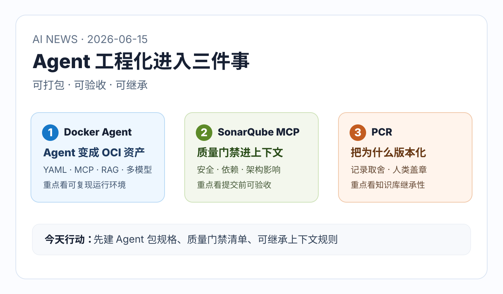

# 每日 AI 高价值信息

## 筛选原则

- 本次模式：泛 AI 情报，优先挑对你未来 1-4 周 Codex、知识库、Agent skill、工程质量和个人 AI 工作流有直接行动价值的信号。
- 搜索时间窗：优先 2026-06-14 至 2026-06-15；官方/成熟源扩展到近 7 天。采集时间：2026-06-15 15:51 CST。
- 来源范围：GitHub 新仓与近期活跃仓库、GitHub API 元数据、项目 README / docs、Docker / SonarSource 官方仓库、社区早期方法论仓库。X/KOL 搜索本轮没有拿到稳定可复核原帖，不作为硬事实。
- 排除/降权：近期已推荐的 RHO、Memorix、OpenAI moderation / Lockdown Mode、Web IQ、AgentSight 等不重复；疑似蹭名、破解、纯宣传、无 README 或无可运行对象的仓库淘汰。
- 验证边界：GitHub stars 只代表注意力，不证明质量；README 是一手项目说明，但 Docker Agent / SonarQube MCP 均未在本机安装实测；PCR 是 2026-06-14 新仓，方法论价值高但生态采用仍早。
- 只保留 3 条。今天主线是：Agent 生产化正在从“模型更强”转向“运行时可打包、交付可验收、项目判断可继承”。

## 候选池与淘汰理由

| 候选 | 来源类型 | 状态 | 理由 |
| --- | --- | --- | --- |
| [Docker Agent](https://github.com/docker/docker-agent) | Docker 官方 GitHub / docs / 活跃仓库 | 入选 | Docker 官方把 agent 做成 YAML、MCP、RAG、多模型、OCI registry 可分发的运行时，信号强且可检查。 |
| [SonarQube MCP Server](https://github.com/SonarSource/sonarqube-mcp-server) | SonarSource 官方 GitHub / MCP Server | 入选 | 把代码质量、安全、依赖和架构上下文接入 coding agent，直接对应 agent 交付验收。 |
| [Project Context Records](https://github.com/hyf0/project-context-records) | GitHub 新仓 / context engineering 方法论 | 入选 | 2026-06-14 新仓，提出 repo-versioned meta-context 与 `[VOUCHED]` 人类背书机制，贴合你的知识库长期方向。 |
| [CodexQB](https://github.com/alicankiraz1/CodexQB) | GitHub 新仓 / Codex planning skill | 暂缓 | repo-aware planning 与 gated handoff 有价值，但范围更窄，今天优先保留更通用的 PCR。 |
| [delegate-skills](https://github.com/amElnagdy/delegate-skills) | GitHub 新仓 / Codex delegation skill | 暂缓 | “把 Codex 当后台实现者”方向值得看，但 README 获取失败，证据不足，不作为主条目。 |
| [openloops](https://github.com/sholajegede/openloops) | GitHub 新仓 / 本地浏览历史意图线程 | 暂缓 | 本地 intent thread 对 AnySearch 有启发，但浏览历史隐私面大，需要隔离审计后再判断。 |
| [perfectpixel-studio](https://github.com/gykim80/perfectpixel-studio) | GitHub 新仓 / AI sprite studio | 暂缓 | 单 prompt 生成 sprite sheet 对游戏/视觉资产有趣，但与今天 Agent 工程化主线距离较远。 |
| [flowcat](https://github.com/AreevAI/flowcat) | GitHub 新仓 / voice agent runtime | 暂缓 | 实时语音 agent runtime 值得观察，但 star 与生态证据较弱，暂不进入 Top3。 |
| [huolala-figma-mcp](https://github.com/HuolalaTech/huolala-figma-mcp) | GitHub 新仓 / Figma MCP | 暂缓 | 企业内部 MCP 化设计到代码方向有信号，但生产验证、边界和文档信息不足。 |
| 疑似 crack / premium / 蹭名 AI 仓库 | GitHub 新星噪声 | 淘汰 | 注意力可能高，但安全、合法性和可验证性都不满足知识库筛选标准。 |

## 1. Docker Agent：Agent 正在变成可打包、可运行、可分发的 OCI 资产

### 来源

- [GitHub: docker/docker-agent](https://github.com/docker/docker-agent)
- [Docker Agent documentation](https://docker.github.io/docker-agent/)
- [GitHub API: docker/docker-agent](https://api.github.com/repos/docker/docker-agent)

### 信号类型

- S2：官方工程发布 / 可检查仓库
- 来源类型：Docker 官方 GitHub、README、docs、GitHub API 元数据
- 置信度：高；本机安装和真实项目运行效果未验证

### 一句话结论

Docker Agent 把 agent 定义成可版本化 YAML，并支持 MCP、RAG、多模型、多 agent 和 OCI registry 分发，这说明 agent 运行时开始走向容器化、标准化和可复现交付。

### 事实 / 观点 / 推断

- 事实：`docker/docker-agent` README 将其定位为 Docker Engineering 的 AI Agent Builder and Runtime，可通过 `docker agent` CLI 插件运行。
- 事实：README 展示了用 YAML 定义 agent、model、instruction、toolsets，并通过 `docker agent run agent.yaml` 运行的方式。
- 事实：README 明确列出多 agent、MCP 工具、本地/远程/Docker-based MCP server、多模型 provider、BM25/embedding/hybrid/reranking RAG、OCI registry 打包分发等能力。
- 事实：GitHub API 显示该仓库 2026-06-15 仍有 push，约 3.1k stars、390 forks，许可证为 Apache-2.0。
- 观点：这条的关键不是“又一个 agent CLI”，而是 Docker 这种基础设施厂商正在把 agent 当成可声明、可迁移、可运行的工程资产。
- 推断：未来高价值的 agent 工作流会更像 `Dockerfile + compose + CI`：不只写提示词，还要有模型、工具、权限、检索、记忆和分发规范。

### 为什么重要

你现在的知识库已经有 skills、模板、shared memory、web 后台、视频分析和 AI news。下一步如果要把这些能力变成可复制系统，最大的瓶颈不是“prompt 写得更长”，而是如何让一个 agent 的运行环境、工具、记忆、证据输入和输出约束可版本化、可复现。Docker Agent 给了一个很明确的市场信号：Agent 正在从聊天式工具迁移到工程运行时。

### 对我的启发

- 你的 `AI news` / 视频分析 / AnySearch 后续可以抽象为 `agent package spec`：输入、工具权限、证据级别、输出路径、视觉图、memory 更新、commit/push 策略。
- 不急着把 Docker Agent 接入主环境，但可以借鉴它的 YAML 化思路，把每个高价值 skill 的运行契约写清楚。
- 如果以后要让多个 agent 并行处理知识库，OCI / container 这种隔离与分发思路会比“全都共享本机权限”更稳。

### 待验证点

- Docker Desktop 4.63+ 预装、Homebrew 安装和本机 `docker agent` 行为需要实测。
- 它的 telemetry、API key 管理、MCP server 权限边界和本地文件访问策略需要审计。
- OCI 分发 agent 的最佳实践、私有 registry 权限和 secrets 处理还需要看 docs 与真实样例。

### 可行动作

- 抽一版 `agent_package_spec.md`：先用你的 `AI news` 定义输入、工具、证据、输出、回滚和验收字段。
- 选一个低风险临时项目，用 Docker Agent 跑最小 demo，只验证 YAML / MCP / RAG / secrets 边界，不接入主知识库。
- 在候选工具清单里新增 `agent_runtime_watchlist`：Docker Agent、Qwen Code、Codex CLI、Claude Code、OpenCode 分层比较。

## 2. SonarQube MCP Server：coding agent 的“质量门禁”正在进入上下文

### 来源

- [GitHub: SonarSource/sonarqube-mcp-server](https://github.com/SonarSource/sonarqube-mcp-server)
- [SonarQube MCP Server product page](https://www.sonarsource.com/products/sonarqube/mcp-server/)
- [GitHub API: SonarSource/sonarqube-mcp-server](https://api.github.com/repos/SonarSource/sonarqube-mcp-server)

### 信号类型

- S2：官方 MCP Server / 可检查仓库
- 来源类型：SonarSource 官方 GitHub、README、GitHub API 元数据
- 置信度：高；实际质量门禁效果取决于项目是否配置 SonarQube / SonarCloud

### 一句话结论

SonarQube MCP Server 把质量门禁、安全问题、依赖风险、代码结构和架构上下文接给 Codex / Claude Code / Cursor 等 agent，说明 coding agent 交付开始从“生成代码”转向“带验收约束地生成代码”。

### 事实 / 观点 / 推断

- 事实：README 称 SonarQube MCP Server 是 Model Context Protocol server，用于把 SonarQube Server / Cloud 的代码质量与安全能力接入 AI agent。
- 事实：README 给出了 Codex CLI、Claude Code、Cursor、GitHub Copilot coding agent、VS Code、Windsurf、Zed 等多客户端配置方式。
- 事实：工具面包括 quality gate status、issues、duplications、raw source、SCM info、system health、webhooks、architecture tools、guidelines 和 dependency checking。
- 事实：README 特别强调 workspace mount 可减少上下文膨胀：agent 传 `filePath`，server 直接从挂载项目读取文件，而不是把完整文件内容塞进上下文。
- 事实：GitHub API 显示该仓库 2026-06-15 仍活跃，约 574 stars、90 forks；许可证为 Sonar Source-Available License。
- 观点：这条的价值在于“把验收系统变成 agent 可调用工具”，而不是把静态分析报告再复制一遍给模型看。
- 推断：未来靠谱的 coding agent 工作流会默认带质量门禁、依赖检查、架构影响分析和提交前阻断，而不是生成完代码才靠人工 review 补救。

### 为什么重要

你当前经常让我改知识库、服务端、前端、skills 和自动化。如果 agent 只会“把需求做完”，风险会集中在隐藏的回归、依赖安全和架构漂移。SonarQube MCP 代表一个方向：把质量规则、项目事实和安全扫描变成 agent 任务执行时的上下文和工具，而不是事后报告。

### 对我的启发

- 你的 coding guardrails 可以继续保持轻量，但应增加“质量门禁思维”：改动范围、diff check、依赖风险、关键路径测试、是否需要架构上下文。
- 对知识库后台这类长期服务，未来可以加一个 `agent_quality_gate_checklist.md`，不必一开始接 SonarQube，也能先固定验收口径。
- AnySearch / AI news 也可以借鉴 workspace mount 思路：能传路径就不把大文件整段塞上下文，降低 token 噪声和泄露面。

### 待验证点

- 需要 SonarQube Cloud / Server token，不能在配置文件或命令历史里硬编码。
- SSAL source-available license 与内部/商业使用边界要读清楚。
- 对小型个人知识库项目，SonarQube 是否收益大于配置成本，需要用一次真实 PR 验证。

### 可行动作

- 先不接入 token。先写一份本地 `agent_quality_gate_checklist`：lint/test/diff check/secrets/dependency/architecture/risk note。
- 后续若接 SonarQube MCP，只在临时 repo 或单项目范围试跑，token 走环境变量，不进 git。
- 把“质量门禁可由 agent 调用”作为评估 coding agent 工具链的重要维度。

## 3. Project Context Records：把“为什么这么做”变成 repo 里的可继承资产

### 来源

- [GitHub: hyf0/project-context-records](https://github.com/hyf0/project-context-records)
- [README.zh-CN](https://github.com/hyf0/project-context-records/blob/main/README.zh-CN.md)
- [GitHub API: hyf0/project-context-records](https://api.github.com/repos/hyf0/project-context-records)

### 信号类型

- S1：GitHub 新仓 / 早期方法论信号
- 来源类型：新仓 README、AGENTS.md adoption block、GitHub API 元数据
- 置信度：中；方向价值高，但生态采用和长期维护仍待观察

### 一句话结论

PCR 提出把项目的 meta-context，也就是为什么、架构、维护者决策和意图，写成 repo-versioned records，并用 `[VOUCHED]` 区分人类背书与 AI 累积判断；这非常贴近你的长期知识库问题。

### 事实 / 观点 / 推断

- 事实：GitHub API 显示 `hyf0/project-context-records` 创建于 2026-06-14，约 42 stars、1 fork。
- 事实：README 将 PCR 定位为 context engineering 方法论，用于保存项目的 why、architecture、maintainer decisions、intent，让无记忆的 AI collaborator 继承判断，而不是每次重新推导。
- 事实：README 建议把规则写入 `AGENTS.md` / `CLAUDE.md`，records 默认放在 `.agents/docs/`，并要求 read first、record as you go、keep fresh。
- 事实：README 用 `[VOUCHED @handle]` 标记人类背书；无 stamp 的内容默认是 AI-accumulated，可以自由质疑和验证。
- 观点：这条不是工具热闹，而是解决 agent 时代最核心的管理问题：AI 能快速执行，但项目方向、取舍和人类确认不能被它自动伪造。
- 推断：你的 shared memory 已经在做 PCR 的一部分；下一步不一定要搬迁目录，但应该吸收“人类背书”和“当前真相保持新鲜”的机制。

### 为什么重要

你现在的系统已经有 AGENTS.md、shared memory、skills、raw/wiki/output 分层，以及“求真与做到极致”的协作原则。但这些内容里仍然混有事实、推断、行动建议和 AI 总结。PCR 的价值是给出一个非常清晰的分界：哪些只是 AI 累积材料，哪些是你明确认可、可以作为未来 agent 行动基础的判断。

### 对我的启发

- shared memory 可以新增 provenance 规则：默认 `AI-accumulated`，只有你明确要求时才标记 `[VOUCHED @momo]`。
- 重要决策不要只写在日报或聊天里，应沉淀到单独的 context record，例如 `ai_news_selection_policy.md`、`knowledge_base_operating_model.md`。
- 这比单纯加 RAG 更关键：RAG 能搜到内容，但不能告诉 agent 哪些判断是你真正背书的。

### 待验证点

- PCR 是新仓，stars 很低，不能证明它会成为行业标准。
- 目录、格式和 stamp 规则是否适合当前知识库，需要小范围试行，不应大规模重构。
- `[VOUCHED]` 只能由你明确授权添加；我不能把“你没反对”当成人类确认。

### 可行动作

- 先在 shared memory 协议里增加一段轻量 provenance policy，不迁移目录。
- 选 2-3 个高价值长期规则做 context record：AI news 筛选、视频证据降级、agent 提交/验收。
- 以后当你说“这条确认”，我再加 `[VOUCHED @momo]`，否则所有新增知识默认可质疑。

## 今天的高价值动作清单

1. 建一个 `agent_package_spec`：把 `AI news` 这类能力写成可版本化、可验收、可迁移的 agent 规格。
2. 建一个 `agent_quality_gate_checklist`：先不用 SonarQube，也要把 lint/test/diff/secrets/依赖/架构影响写成固定验收步骤。
3. 给 shared memory 增加 provenance 规则：AI 累积与人类背书分开，防止未来 agent 把推断当成已确认事实。
