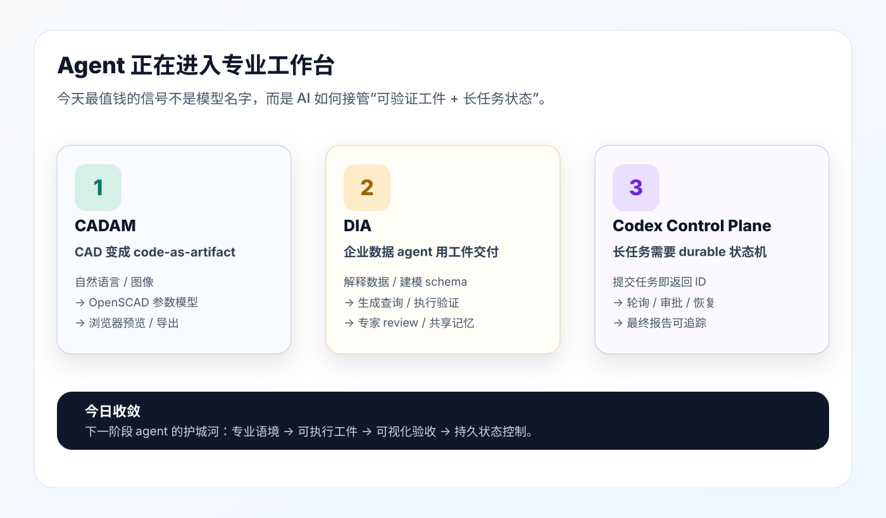

# 每日 AI 高价值信息

## 筛选原则

- 本次模式：广谱 `AI news`，优先寻找能改变工作流、产品形态或个人知识库能力的早期高价值信号。
- 搜索时间窗：以 2026-06-17 至 2026-06-18 为主，必要时向前扩展 7 天核验背景。
- 来源范围：GitHub 新仓/活跃仓、Hacker News、arXiv、项目 README / API 元数据、官方或一手项目材料；社交媒体只作氛围信号，不直接当事实。
- 排除/降权：重复近期日报主题、缺少一手来源、只剩营销标题、成熟但没有新变化的内容。
- 只保留 3 条。兼顾成熟事实与早期信号；早期信号必须标注置信度和待验证点。

## 候选池与淘汰理由

| 候选 | 来源类型 | 状态 | 理由 |
| --- | --- | --- | --- |
| Adam-CAD/CADAM | HN Launch + GitHub + README | 入选 | 开源 text-to-CAD 获得高关注，核心是把专业设计转成“可执行 CAD 代码 + 可视化验收”。虽然专业制造能力仍有明显边界，但方向非常重要。 |
| Data Intelligence Agents (DIA) | arXiv | 入选 | 企业数据场景把 agent 定义为“生成、执行、验证、修复工件”的系统，并声称已在企业客户生产环境部署，和知识库/数据 agent 方向高度相关。 |
| aresyn/codex-control-plane-mcp | GitHub + README + PyPI 信息 | 入选 | 新出现的 Codex Desktop 长任务 MCP 控制面，直指长任务、审批、重试、持久状态和最终报告，和当前 Codex 工作流强相关。 |
| OmniAgent | arXiv + GitHub + README | 暂缓 | 对长视频/多模态分析很有价值，但更适合单独升级“视频分析 skill”；今天 3 条优先保留工作台、企业数据和 Codex 控制面。 |
| polymr-platform/mcp-sql | HN + GitHub | 暂缓 | 安全数据库访问方向重要，但和 2026-06-16 的 agent 授权/治理主题相近，且仓库元数据仍很早期。 |
| mupt-ai/relaymux | HN + GitHub | 暂缓 | 本地 coding agents 的 tmux harness 很贴近个人工作流，但关注度和成熟度弱于 Codex Control Plane MCP。 |
| Plaer1/junction | GitHub | 暂缓 | VS Code 本地 agent 侧边栏热度高，但默认分支和产品边界仍需进一步验证，暂不作为最终情报。 |
| headroom | GitHub 活跃仓 | 暂缓 | token 压缩/输出压缩有实用价值，但这次未核验到足够明确的当天新变化。 |
| “GPT-5.5 / Claude Mythos”等非官方传闻 | 二手网页 / 搜索噪声 | 淘汰 | 未找到可靠官方或一手来源，容易把标题党当事实。 |

## 1. CADAM：专业工作台正在被重写成“可执行工件”

### 来源

- GitHub: https://github.com/Adam-CAD/CADAM
- HN Launch: https://news.ycombinator.com/item?id=48572553
- 项目站点: https://adam.new/cadam

### 信号类型

早期产品信号 / 开源热度信号 / 专业软件 agent 化信号
置信度：`medium_high`。事实层面可靠，商业和专业制造能力仍需验证。

### 一句话结论

CADAM 的价值不在“用一句话生成漂亮 3D 模型”，而在它把 CAD 任务拆成了 `自然语言/图像 -> OpenSCAD 代码 -> 参数滑块 -> 浏览器预览 -> 导出文件` 这条可验收链路。

### 事实 / 观点 / 推断

事实：
- CADAM 是开源 text-to-CAD Web App，仓库显示 2026-06-17 有 push，采集时 GitHub 约 4.3k stars、553 forks。
- README 称它支持自然语言与图片参考生成 3D 模型，输出参数化 OpenSCAD，并支持 STL、SCAD、DXF 等格式导出。
- HN Launch 贴中，作者把它描述成面向 maker/hobbyist 的 “AI TinkerCAD”，并提到未来会支持 build123d / CadQuery、面/边选择和 viewport 图像上下文。

观点：
- HN 讨论里有明显分歧：支持者认为参数滑块和 3D 打印原型很实用；质疑者认为 OpenSCAD、容差、装配、GD&T、可制造性仍远远不够专业 CAD。

推断：
- AI 进入专业软件不会只靠 chat UI，而会先攻破“能被代码表达、能被渲染预览、能被人类修改验收”的子任务。
- CADAM 不是马上替代机械工程师，而是在验证一个更大的范式：agent 写专业领域代码，人用可视化和参数控制验收。

### 为什么重要

软件工程的 `prompt -> code -> test -> diff` 正在迁移到其他专业工作台。CADAM 给出的不是最终答案，而是一个可追踪中间物：OpenSCAD 源码和参数控件。这个结构比“生成一张图”更接近生产系统，因为它允许编辑、复用、导出和二次验证。

对 AI 市场来说，这意味着下一批高价值机会可能不在通用聊天，而在“专业领域工件层”：CAD、BOM、报价、仿真、数据 schema、合规报告、设计评审材料。

### 对我的启发

你的知识库和 AI 工作流也应该优先沉淀“可执行工件”，而不是只沉淀文字总结。比如：
- 视频分析不是只写观点，而是沉淀 transcript、证据片段、置信度和补证路径。
- AI news 不是只写 3 条结论，而是保留候选池、淘汰理由和最终选择。
- skill 不是只写提示词，而是写成可验证的流程、输入输出契约和失败降级策略。

### 待验证点

- CADAM 在真实工程约束、装配、容差、材料、仿真、BOM 等环节的可用性还未被充分证明。
- 开源 CADAM 与商业产品 Adam / Fusion / Onshape 插件之间的能力差异需要继续观察。
- “code-as-CAD” 是否能成为专业 CAD 主路径，仍取决于 BREP、约束建模、可制造性验证和工程数据接入。

### 可行动作

- 建一个观察项：`domain-agent = 自然语言 -> 领域代码/结构化工件 -> 可视化验收 -> 人类参数编辑 -> 导出`。
- 后续遇到 AI 产品时，优先问：它有没有可执行中间工件？有没有可视化验收？有没有确定性编辑路径？
- 若做专题，可对比 CADAM、Adam、ModelRift、ToolTrace、FreeCAD/CadQuery 生态，看谁更接近专业生产。

## 2. DIA：企业数据 agent 的关键不是回答，而是交付可审查工件

### 来源

- arXiv: https://arxiv.org/abs/2606.19319

### 信号类型

研究 / 企业生产架构信号
置信度：`medium`。arXiv 摘要信息清楚，但生产部署细节、客户规模和复现实验仍需看全文与后续代码/案例。

### 一句话结论

Data Intelligence Agents 把企业数据工作拆成三个 agent：Data Interpreter、Schema Creator、Query Generator；重点不是“生成答案”，而是生成、执行、验证、修复可被专家 review 的具体工件。

### 事实 / 观点 / 推断

事实：
- 论文发表于 arXiv，更新时间为 2026-06-17。
- 摘要称 DIA 用三个 agent 压缩数据 owner、engineer、analyst 之间反复且有损的交接。
- 摘要明确说这些 agent 不是只输出文本，而是生成、执行、验证、修复 concrete artifacts，并使用 shared memory 复用经验。
- 摘要称 DIA 已部署到企业客户生产环境；Query Generator 在 7 个 SQL benchmark 上全自动评估，并达到或超过已发表最佳结果。

观点：
- 作者的主张是：企业数据智能的核心瓶颈不只是 SQL 生成，而是从数据解释、结构化建模到查询验证的整条协作链。

推断：
- 企业 agent 真正落地时，会越来越像“小型工程组织”：有角色分工、有共享记忆、有可执行产物、有专家验收。
- 这和当前知识库系统高度同构：raw 输入、结构化分析、候选池、证据边界、可复用 skill、shared memory。

### 为什么重要

很多数据类 AI 产品容易停在“自然语言问数据库”。DIA 的重要性在于，它把企业数据问题从问答升级成可运行 workflow：解释数据、建立 schema、生成查询、执行验证、失败修复、交给专家审查。这个结构更接近真实企业采购的需求，因为企业买的不是一句回答，而是低风险、可追责、能进入生产流程的系统。

对 AI 市场来说，数据智能可能会成为 agent 落地最快的场景之一，因为企业数据价值高、流程重复、验证相对明确，同时人工交接成本巨大。

### 对我的启发

你现在的知识库可以吸收 DIA 的三个设计原则：
- 每个 agent 产出“工件”，而不是只产出解释。
- 共享记忆不是聊天历史，而是可复用经验、失败案例、schema、验证规则和决策记录。
- 专家 review 是流程的一部分，不是失败后的补丁。

这也说明 AnySearch / AI news / 视频分析 skill 的下一步不只是搜得更广，而是要把检索、证据、候选、淘汰、最终结论和行动建议都做成可审查链路。

### 待验证点

- 论文中的生产部署客户、数据规模、失败率、人类 review 成本和安全边界仍需进一步阅读全文。
- 7 个 SQL benchmark 的任务分布、数据泄露防护和真实业务难度，需要看实验设置。
- 是否有开源代码、系统图或可复现实验，当前摘要未能确认。

### 可行动作

- 给本地知识库增加一个“artifact-first agent”检查表：输入、产物、验证、修复、review、记忆更新。
- 把 AI news 的候选池和淘汰理由视为“Data Interpreter”的输出，把最终 3 条视为“Query/Decision artifact”。
- 后续单独阅读 DIA PDF，提取可迁移到知识库、数据分析和 RAG 的 agent 编排模式。

## 3. Codex Control Plane MCP：长任务 agent 需要持久控制面

### 来源

- GitHub: https://github.com/aresyn/codex-control-plane-mcp
- PyPI: https://pypi.org/project/codex-control-plane-mcp/

### 信号类型

早期工具链 / Codex 生态 / MCP 控制面信号
置信度：`medium`。仓库元数据与 README 可信，但当前 full live target 主要是 Windows；macOS / Linux 在 README 中标注为 protocol-only checks。

### 一句话结论

这个仓库不是又一个“调用 Codex 的薄 wrapper”，而是在尝试给长时间运行的 Codex Desktop 任务加一层持久状态机：提交任务拿 ID、轮询状态、处理审批、恢复中断、最后读取报告。

### 事实 / 观点 / 推断

事实：
- 仓库创建于 2026-06-17，采集时约 151 stars，描述为 “Durable MCP control plane for long-running Codex Desktop tasks”。
- README 称它提供 durable async queue、retry-safe `client_request_id`、active duplicate prompt detection、Plan Mode workflow、pending approvals/questions、SQLite 状态记录、health/diagnostics/repair。
- README 同时说明：当前 full live target 是 Windows + Codex Desktop + `codex-app-server`；Linux/macOS 目前是 protocol-only checks。

观点：
- 项目作者把问题定位在长任务自动化：不能让 MCP call 一直阻塞几小时，也不能让客户端重试后重复开 turn。

推断：
- 这类“agent 控制面”会成为 Codex / Claude Code / OpenClaw / Hermes 等本地 agent 的关键基础设施。
- 对你而言，它短期更适合作为架构参考和 watchlist，不适合不加审计地直接接入当前 Mac 工作流。

### 为什么重要

你近期的知识库工作已经多次遇到同一个问题：视频分析、AI news、图形化预览、提交推送、长任务恢复，都不是一次 prompt 能稳定解决的事情。真正可持续的 agent 系统需要：
- 任务 ID
- 状态机
- 审批/问题通道
- 重试幂等
- 本地历史
- 诊断与修复
- 最终报告契约

Codex Control Plane MCP 把这些问题系统化了。即使它当前对 macOS 还不是 full live target，它也说明 Codex 生态正在从“人盯着聊天窗口”走向“可编排的后台 worker”。

### 对我的启发

你的 AI news / 视频分析 / 知识库后台也可以采用类似控制面思想：
- 每个长任务都有 task id、source id、evidence level、status、final artifact。
- 中途需要人工判断时，不硬跑到底，而是进入 `waiting_for_approval` 或 `needs_more_evidence`。
- 失败后不只报错，而是保留诊断、补证路径和下一步恢复点。

这和你之前要求的“证据不足时自动降级 raw/medium，并列出补证路径”是同一个方向。

### 待验证点

- macOS 上现在只有 protocol-only checks，是否能接入你的本地 Codex Desktop 需要等项目进一步支持或自己做适配。
- 安全边界必须审计：README 明确提醒不要把它暴露为无认证网络服务。
- 与 Codex Desktop 内置 automation / heartbeat / thread 管理能力的重叠边界需要比较。

### 可行动作

- 暂不直接安装到生产知识库；先列入 `Codex 长任务控制面 watchlist`。
- 后续做一个小型本地设计：把 AI news 任务抽象成 `queued -> collecting -> candidate_review -> writing -> validating -> committed`。
- 如果项目继续支持 macOS，再单独开分支评估它是否能降低长任务中断和重复执行成本。

## 今天的总判断

今天三条线索其实指向同一个判断：AI agent 的下一阶段竞争不再只是“谁模型更强”，而是谁能把工作变成可追踪、可验证、可恢复的工件系统。

最值得沉淀到你知识库里的方法论是：

1. 专业场景优先找“可执行中间物”，例如 CAD 的 OpenSCAD、数据工作的 schema / SQL / validation artifacts。
2. 长任务必须有状态机，不能只靠聊天窗口上下文和人肉记忆。
3. 高价值信息收集要保留候选池和淘汰理由，因为这比直接给结论更能防止被噪声带偏。

## 后续观察清单

- CADAM / Adam 是否从 maker 原型走向专业 CAD 的 BREP、约束、GD&T、BOM 和仿真。
- DIA 是否公开系统细节、代码、企业案例或更完整的 benchmark 设置。
- codex-control-plane-mcp 是否补齐 macOS live target，并与 Codex Desktop 最新能力保持兼容。
- OmniAgent 是否能启发视频分析 skill：从“完整转录后总结”升级为“按问题主动取证、保留证据记忆、按置信度回答”。
