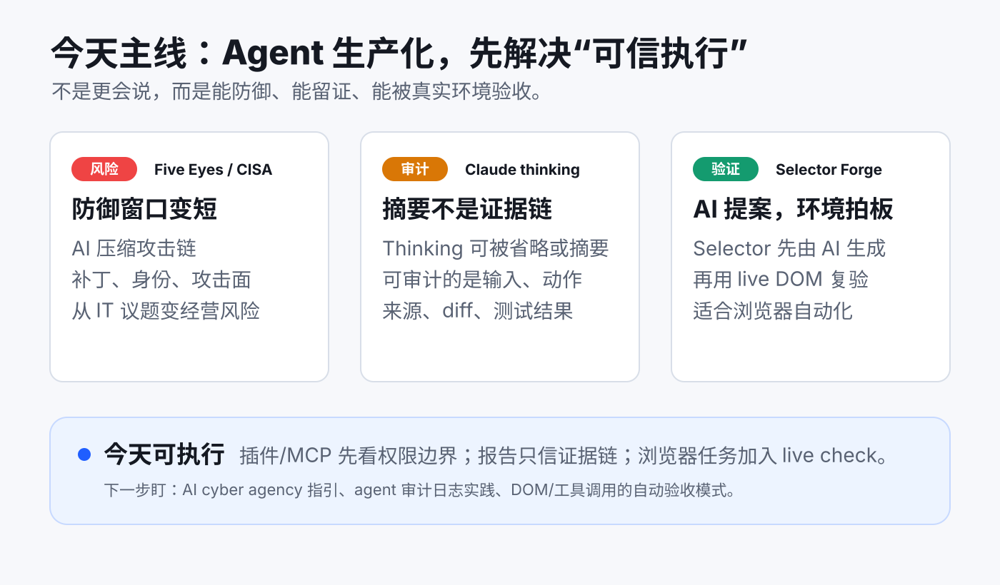

# 每日 AI 高价值信息

## 筛选原则

- 本次模式：泛 AI 情报，目标是选出 3 条对个人 AI 工作流、知识库、Agent 工程和市场判断最有行动价值的信息。
- 搜索时间窗：优先近 24 小时；不足时扩展到近 7 天。今天入选项均来自 2026-06-22 至 2026-06-23 的官方声明、文档、GitHub release 或社区讨论。
- 来源范围：官方安全机构声明、Anthropic 官方文档、技术博客、GitHub release/README、Hacker News 讨论、近期 GitHub 新仓与 MCP/Agent 工具信号。
- 排除/降权：不把媒体标题里的“某模型已经造成威胁”当一手事实；GitHub stars/HN 热度只作注意力信号；刚创建且无采用证据的仓库只作为早期线索。
- 今天主线：Agent 进入生产环境后，价值不只在模型能力，而在可防御、可审计、可被真实环境验证的执行闭环。

## 候选池与淘汰理由

| 候选 | 来源类型 | 状态 | 理由 |
| --- | --- | --- | --- |
| Five Eyes / CISA：AI cyber risk statement | 官方声明 / 政策安全 | 入选 | 2026-06-22 官方发布，明确把 frontier AI cyber risk 的时间尺度压到“months, not years”，对 MCP、插件、agent 自动化安全边界有直接约束。 |
| Claude Code extended thinking 审计边界 | 官方文档 + 技术博客 + HN | 入选 | Anthropic 文档明确存在 `summarized` / `omitted` thinking；社区讨论把它转成“不要把 thinking 当审计日志”的具体风险，直接影响我们的求真机制。 |
| Selector Forge | GitHub / HN / 浏览器自动化工具 | 入选 | 2026-06-22 最新 release，README 明确“AI proposes, browser verifies”；它不是最大工具，但模式对视频/网页证据采集很有复用价值。 |
| headroom v0.27.0 | GitHub release | 暂缓 | 有明确新版本，新增 token throughput、output-token reduction、表格压缩等能力；但 2026-06-18 已进入暂缓候选，今天优先放入“可信执行”主线。 |
| Prompt Preflight | GitHub 新仓 / Codex plugin | 暂缓 | 很贴合“高成本请求先做 prompt 预检”，但仓库刚出现，证据主要来自 README 和本地 benchmark，适合后续做 Codex workflow 专题。 |
| PMB local-first memory | GitHub / MCP 工具 | 暂缓 | 本地 SQLite + MCP 记忆对 Codex 有价值，但与 2026-06-08 Memorix 和现有 shared memory 主线重合，需要单独评估接入成本。 |
| Code-Duo | GitHub 新仓 / coding agent | 暂缓 | Claude + Codex 双 agent 互审思路有启发，但 stars 少、无 license、尚未看到稳定采用证据。 |
| Agentjacking / Sentry MCP 风险 | 技术媒体 | 暂缓 | 风险方向重要，但需要一手复现、披露材料或厂商响应；今天不把媒体标题当硬事实。 |
| GLM-5.2 / 新模型评测传闻 | 社区/评测线索 | 淘汰 | 搜索结果混杂可疑标题与二手转述，未找到足够可靠的一手模型卡或官方 release。 |

## 1. Five Eyes / CISA：AI 正在压缩网络攻防时间窗

### 来源

- 官方声明：[CISA - The AI shift in cyber risk: why leaders must act now](https://www.cisa.gov/news-events/news/five-eyes-cyber-security-agencies-statement)
- 官方 PDF：[Five Eyes cyber security agencies statement](https://www.cyber.gov.au/sites/default/files/2026-06/Five%20eyes%20cyber%20security%20agencies%20statement.pdf)
- 社区注意力线索：[Hacker News 讨论](https://news.ycombinator.com/item?id=48637477)

### 信号类型

- 成熟度：S2 已确认发布
- 来源类型：官方安全机构声明
- 置信度：高

### 一句话结论

Five Eyes 网络安全机构把 frontier AI 带来的攻防变化描述为“几个月而不是几年”的问题，AI 安全已经从模型安全扩展成经营连续性和组织韧性问题。

### 事实 / 观点 / 推断

- 事实：CISA 页面发布了 Five Eyes cyber security agencies statement，指出 AI 会加快网络威胁的速度、规模和复杂度，并要求领导者降低攻击面、加快补丁、处理 legacy systems、强化 identity/access controls、提前演练 incident response。
- 事实：声明也强调防御方应使用 AI，更早发现漏洞、提升软件质量、监控异常行为、加快响应。
- 观点：部分媒体把这条声明与 Anthropic 特定模型联系起来，但官方声明本身没有点名任何公司或模型；这部分只能作为媒体背景，不能当作官方事实。
- 推断：AI agent、MCP、浏览器自动化和本地插件会让个人/小团队也拥有更强执行力，同时也会把权限、凭证、日志、文件系统和本地服务暴露成新的攻击面。

### 为什么重要

这条不是传统安全新闻。它说明 AI 市场的竞争正在从“谁的模型更强”转向“谁能把强模型放进可控环境”。对个人而言，盲目安装热门 MCP、插件、浏览器扩展和本地 agent server，会很快变成系统性风险。

### 对我的启发

- `AI news` 之后筛选工具时，不能只看效率收益，也要记录权限边界、外部调用、凭证处理和本地端口暴露。
- 视频链接分析、网页自动化、知识库后台都属于本地 agent 生态的一部分，应默认纳入“最小权限 + 可回滚 + 可追踪”框架。
- 对早期工具的判断要从“能不能跑”升级到“出了问题能不能定位、止损、恢复”。

### 待验证点

- 官方声明没有给出具体模型能力 benchmark，也没有披露真实攻击样本；“months, not years”是机构级风险判断，不是单个模型能力证明。
- 对个人工作流而言，真正高风险点还需要本地盘点：哪些 MCP/插件拥有文件、浏览器、shell、网络或密钥访问权。

### 可行动作

- 给 `AI news` 候选池增加一列内部判断：`权限/攻击面`，对 MCP、插件、浏览器扩展、自动化 server 必填。
- 做一次本地 agent surface audit：列出 `127.0.0.1` 服务、Codex skills、MCP/插件、浏览器扩展、API key 存储位置。
- 对未来安装的新工具执行 30 分钟 smoke test：最小权限启动、断网行为、日志位置、卸载/回滚路径。

## 2. Claude Code extended thinking：推理摘要不能当审计日志

### 来源

- 官方文档：[Anthropic - Extended thinking](https://platform.claude.com/docs/en/build-with-claude/extended-thinking)
- 技术博客：[The text in Claude Code's “Extended Thinking” output is not authentic](https://patrickmccanna.net/the-text-in-claude-codes-extended-thinking-output-is-not-authentic/)
- 社区注意力线索：[Hacker News 讨论](https://news.ycombinator.com/item?id=48630535)

### 信号类型

- 成熟度：S1 可检查信号 / S2 官方文档确认
- 来源类型：官方文档 + 独立技术核查
- 置信度：中高

### 一句话结论

Anthropic 文档显示 extended thinking 可以是摘要或省略，社区作者进一步指出 Claude Code 本地日志里的 thinking 不应被承诺为真实审计轨迹。

### 事实 / 观点 / 推断

- 事实：Anthropic 文档说明 `display: "summarized"` 返回的是 Claude full thinking process 的 summary；`display: "omitted"` 会返回空 thinking 字段，并保留用于多轮连续性的 encrypted signature。
- 事实：官方文档还说明，summarized thinking 的 summarization 由不同模型处理，且用户仍按 full thinking tokens 计费。
- 事实：博客作者检查 Claude Code session logs 后，观察到本地只有 signature 而无完整 thinking text，并据此提醒不要把 extended thinking output 当审计轨迹。
- 观点：博客对 Anthropic 文档措辞提出批评，这是作者观点；可采纳其风险提醒，但不把它扩展成“Claude Code 不可信”。
- 推断：真正可审计的不是模型自述的推理，而是输入、来源、工具调用、文件 diff、测试结果、截图、日志和可复现命令。

### 为什么重要

这直接击中我们知识库的质量底线。用户要的是求真，不是看起来像思考的文字。Agent 产出的“解释”只能帮助理解，不能替代证据。尤其在代码修改、视频分析、AI news、投资判断里，审计层必须围绕外部事实和可复现动作，而不是模型声称自己怎么想。

### 对我的启发

- `AI news` 报告继续保留“事实 / 观点 / 推断 / 待验证点”，这是必要结构，不是格式负担。
- 视频分析 skill 在证据不足时降级为 raw/medium 是正确方向；不要用流畅解释掩盖证据缺口。
- 对 Codex 任务验收，优先保存命令、diff、截图、来源链接、验证状态，而不是保存“思考过程”。

### 待验证点

- 不同 Claude Code / Claude API 版本对 thinking block 的默认展示可能变化；应以当日官方文档和实际日志为准。
- 这条不说明其他模型或其他 agent 产品的日志策略；不能外推到所有平台。

### 可行动作

- 给知识库技能增加一条长期原则：`reasoning text is explanation, not evidence`；证据层只认可链接、文件、命令、diff、测试、截图、可复现输出。
- 对高价值分析报告增加“证据对象清单”：本次看了哪些文件、链接、转录、截图、metadata，哪些没拿到。
- 对 Codex 代码任务，最终答复继续用“改了什么 / 怎么验证 / 未验证什么”而不是“我认为已经好了”。

## 3. Selector Forge：浏览器自动化要让真实环境验收 AI 的提案

### 来源

- GitHub：[Intuned/selector-forge](https://github.com/Intuned/selector-forge)
- README raw：[selector-forge README](https://raw.githubusercontent.com/Intuned/selector-forge/main/README.md)
- 社区注意力线索：[Hacker News 讨论](https://news.ycombinator.com/item?id=48630515)

### 信号类型

- 成熟度：S1 可检查信号 / S2 GitHub release
- 来源类型：GitHub repo、README、浏览器扩展 release
- 置信度：中高

### 一句话结论

Selector Forge 的高价值不在“AI 生成 CSS/XPath”，而在“AI 只负责提案，live DOM 才是最终裁判”的验证模式。

### 事实 / 观点 / 推断

- 事实：GitHub 页面显示 `Intuned/selector-forge` 是一个浏览器扩展项目，定位为用 AI 创建可靠 CSS/XPath selectors，2026-06-22 发布 `Selector Forge v0.0.3`。
- 事实：README 说明它会捕获目标元素和 DOM context，让 backend 提出并排序候选 selector，然后由扩展在 live DOM 中测试每个候选，最终只展示重新验证过的结果。
- 事实：README 明确写到 browser 是 selector 是否正确匹配的 source of truth，AI 只提出和排序，不拥有最终正确性判断。
- 观点：HN 热度只能说明开发者关注，不能证明它已经是稳定生产工具。
- 推断：这个模式可以迁移到我们的网页/视频/知识库流程：让模型提出结构化抽取、定位、分类或摘要，但由真实页面、文件系统、测试命令或截图来验收。

### 为什么重要

浏览器自动化和网页采集经常失败在 selector 脆弱、DOM 动态变化、页面状态不同。Selector Forge 给出的不是单点工具，而是一种可复用架构：AI 生成候选，环境执行验证，失败就回路重试。这个思路比“让模型猜页面结构”更适合长期知识库自动化。

### 对我的启发

- 后续处理抖音/B站/网页链接时，可以把“页面可见信息、DOM、截图、metadata、下载结果”分层验证，而不是只相信模型读到的文本。
- 知识库后台和本地预览也应继续用实际访问链接、截图或状态码验证，而不是只写文件。
- 对 Agent 工程来说，最高价值模式是“AI proposes, tools verify, report records evidence”。

### 待验证点

- 当前项目依赖 Intuned backend；README 提到未来可能提供自托管 backend，但这还不是已完成能力。
- 需要实际安装扩展并用复杂页面测试，才能判断它对中文站点、登录态、动态 DOM、shadow DOM、iframe 的可靠性。
- 该项目仍早期，43 stars 和 HN 讨论不能代表生产稳定性。

### 可行动作

- 暂不直接接入生产流程；先把它提炼成设计原则：`AI 生成候选，真实环境复验`。
- 在 `douyin-video-analysis` 或网页采集流程里增加一个“环境验证”小节：可见页面、metadata、下载、截图、转录分别是否拿到。
- 后续做浏览器自动化专题时，试跑 Selector Forge 与 Playwright selector 生成/校验的组合，验证中文动态页面表现。

## 今天的总判断

今天三条信息共同指向同一个方向：Agent 生产化的关键不再是“模型看起来很聪明”，而是整个系统能否在真实环境里留下证据、控制权限、快速复验并承认边界。对你的知识库来说，最值得沉淀的不是某个热门工具，而是这套长期可复用的闭环：

`信息源分层 → 候选池审计 → AI 生成判断 → 工具/环境验证 → 明确置信度 → 输出可行动作`
