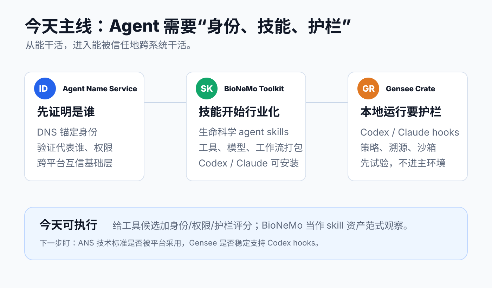

# 每日 AI 高价值信息

## 筛选原则

- 本次模式：泛 AI 情报，目标是选出 3 条对全球 AI 市场判断、个人知识库建设、Codex/Agent 工作流和未来产品实验最有价值的新信号。
- 搜索时间窗：优先 2026-06-23 至 2026-06-24；少数候选扩展到近 7 天，但今天最终入选项均有 2026-06-23 之后的一手发布或新仓证据。
- 来源范围：Linux Foundation / NVIDIA / JetBrains 官方公告，GitHub 新仓和 README，Hacker News 新讨论，GitHub security advisory，近期 Agent / MCP / coding agent 工具链。
- 排除/降权：疑似 aimbot、crack、蹭 Claude Mythos/GPT-5.5 名称的仓库直接淘汰；只有 HN 低热讨论但没有可检查对象的产品暂缓；昨天已入选的 CISA、Claude thinking、Selector Forge 不重复。
- 今天主线：Agent 正从“能执行任务”进入“能被识别、能调用垂直技能、能在本地受控运行”的阶段。

## 候选池与淘汰理由

| 候选 | 来源类型 | 状态 | 理由 |
| --- | --- | --- | --- |
| Linux Foundation Agent Name Service | 官方公告 + GitHub 参考实现 | 入选 | 2026-06-23 官方宣布 intent to launch；用 DNS 锚定 agent identity，解决跨系统 agent 的发现、验证和信任问题，是 agentic web 的底层信号。 |
| NVIDIA BioNeMo Agent Toolkit | 官方新闻稿 + GitHub 新仓 | 入选 | NVIDIA 把生命科学模型、工具、工作流包装为 Claude/Codex 可安装 skills，说明 agent skills 正从通用 prompt 走向行业工具链。 |
| Gensee Crate | GitHub 新仓 + README | 入选 | 2026-06-23 新仓，直接支持 Claude Code / Codex hooks、本地策略、溯源和 macOS sandbox，贴合个人本地 agent 安全。 |
| JetBrains Junie GA | 官方 blog | 暂缓 | Junie 出 beta，并强调 plan mode、IDE debugger、async task、PR review；信号强，但与近期 coding agent 生产化主线重合，今天优先保留基础设施层。 |
| HALO | HN + GitHub README | 暂缓 | 用 traces 诊断并优化 agent harness 很有价值，928 stars；但更适合单独做“agent trace / eval”专题。 |
| Proctor | HN + GitHub README | 暂缓 | signed isolation bundles 解决 coding-agent benchmark cheating，方法论价值高；但偏 benchmark 基建，今天不压过 ANS / BioNeMo / Gensee。 |
| MemGUI-Agent | GitHub + Hugging Face artifacts | 暂缓 | 长程移动 GUI agent + proactive context management 有研究价值，但对当前知识库/Codex 工作流不如 Gensee 直接。 |
| y-times-y/y | GitHub 新仓 | 暂缓 | Claude Code + Codex 并行、本地 self-modifying UI 很有启发，但仍处于 launch-readiness，成熟度不足。 |
| Arcade per-action authorization | 官方 blog + HN | 暂缓 | 方向重要，但 2026-06-16 已推荐 Arcade agent authorization；今天只作为同主题延伸观察。 |
| Hoppscotch critical advisory | GitHub security advisory + HN | 暂缓 | CVSS 10.0 很严重，但 advisory 发布于 2026-05-28、更新于 2026-06-11；不是今天的新事实。 |
| Valorant aimbot / Topaz download / Claude Mythos 蹭名仓 | GitHub 新仓噪声 | 淘汰 | 高风险、疑似作弊/下载诱导/蹭名，无可信技术价值，可能污染工具链判断。 |

## 1. Linux Foundation ANS：Agent 需要像服务一样有可验证身份

### 来源

- 官方公告：[Linux Foundation Announces Intent to Launch Agent Name Service](https://www.linuxfoundation.org/press/linux-foundation-announces-intent-to-launch-agent-name-service-to-establish-trusted-identity-infrastructure-for-ai-agents)
- GitHub 参考实现：[agentnameservice/ans](https://github.com/agentnameservice/ans)
- GitHub registry 说明：[agentnameservice/ans-registry](https://github.com/agentnameservice/ans-registry)
- 社区注意力线索：[Hacker News 讨论](https://news.ycombinator.com/item?id=48651697)

### 信号类型

- 成熟度：S2 官方意向发布 / S1 可检查参考实现
- 来源类型：Linux Foundation 官方公告、GitHub reference implementation
- 置信度：高；但采用速度仍需观察

### 一句话结论

Linux Foundation 准备推动 Agent Name Service，把 agent 身份锚定到 DNS，让系统能验证一个 agent 代表谁、权限是什么、状态是否可信。

### 事实 / 观点 / 推断

- 事实：Linux Foundation 于 2026-06-23 宣布 intent to launch Agent Name Service，定位为基于 DNS 的开放标准，用于 AI agents 的 trusted identity、verification 和 discovery。
- 事实：官方公告称 ANS 目标是避免依赖中心化或私有 registry，并支持 DIDs 与 Legal Entity Identifiers 等现有 identity system。
- 事实：`agentnameservice/ans` README 描述了 registry + transparency log、DNS-style name、SCITT COSE_Sign1 receipts、mTLS identity certificates、offline verifier 等技术对象。
- 观点：公告中多方生态伙伴的支持性引述属于立场和生态动员，不等于大规模生产采用已经发生。
- 推断：当 agent 开始发邮件、下单、付款、访问企业系统或跨平台协作时，“你是谁”和“你被授权代表谁”会变成比 prompt 更底层的问题。

### 为什么重要

昨天 CISA / Five Eyes 的信号是“AI cyber risk 时间窗缩短”；今天 ANS 给出了另一半答案：不是让每个平台单独发明 agent 身份，而是尝试复用互联网已有信任基础。若 ANS 或类似标准成形，agent 产品的竞争会从“能调用多少工具”升级到“能否被其他系统安全识别和接受”。

### 对我的启发

- 以后评估 MCP、agent 插件和自动化服务时，需要新增 `identity / delegation` 维度：它如何证明 agent 身份、代表哪个主体、权限如何撤销。
- 个人知识库如果未来接外部 API、支付、发布、邮件或交易动作，不能只靠 Codex 对话授权，必须有可记录、可撤销、可核验的 delegation 层。
- `AI news` 候选池可以把 “identity layer / trust layer / agent registry” 作为长期观察主题。

### 待验证点

- Linux Foundation 当前表述是 “intent to launch”，不是已完成标准化或行业强制采用。
- ANS 与 MCP auth、OAuth delegated auth、企业 IAM、Arcade/Okta/Pomerium 这类 action-layer authorization 的边界还没稳定。
- reference implementation 存在，但生产安全性、治理模型、DNSSEC/SCITT/LEI/DID 的实际组合方式仍需看后续规格和采用案例。

### 可行动作

- 建一个 `agent_identity_watchlist`：ANS、MCP auth、OAuth delegated auth、enterprise IAM、Arcade per-action authorization。
- 对本地工具清单增加字段：`是否代表用户行动`、`是否外部可见`、`是否需要可验证身份`。
- 暂不接入 ANS；先读 `agentnameservice/ans` 的 verifier 和 registry 设计，提炼为个人 agent 权限模型参考。

## 2. NVIDIA BioNeMo Agent Toolkit：skills 正在从通用提示词变成行业工具链

### 来源

- 官方新闻稿：[NVIDIA Announces BioNeMo Agent Toolkit](https://nvidianews.nvidia.com/news/nvidia-launches-bionemo-agent-toolkit-giving-ai-agents-the-tools-to-accelerate-scientific-discovery)
- GitHub：[NVIDIA-BioNeMo/bionemo-agent-toolkit](https://github.com/NVIDIA-BioNeMo/bionemo-agent-toolkit)
- 社区注意力线索：[Hacker News 讨论](https://news.ycombinator.com/item?id=48651224)

### 信号类型

- 成熟度：S2 官方发布 / S1 可检查仓库
- 来源类型：NVIDIA 官方新闻稿、GitHub README
- 置信度：中高；官方采用声明需要后续第三方案例验证

### 一句话结论

NVIDIA 把生命科学里的模型、库、NIM microservices 和工作流包装成 agent-callable skills，并明确支持 Claude Code / Codex 安装，这说明 skills 正在行业化。

### 事实 / 观点 / 推断

- 事实：NVIDIA 于 2026-06-23 发布 BioNeMo Agent Toolkit，定位为给 agentic life sciences 提供 domain-specific tools and skills。
- 事实：新闻稿列出蛋白结构预测、molecular docking、generative chemistry、genomic analysis、protein design、biomarker discovery 等任务，并称 toolkit available now through developer resources and GitHub。
- 事实：GitHub README 显示可用 `npx skills add NVIDIA-BioNeMo/bionemo-agent-toolkit --agent codex` 或 `--agent claude-code` 安装 skills，目录中包含 workflows、NIM skills、open-model skills、library skills 和 Codex marketplace manifest。
- 事实：NVIDIA 官方称 Anthropic、OpenAI 等正在 integrating，Lilly、Snowflake、UW Medicine IPD 等生态伙伴采用或合作；这些是官方声明，尚未在本地独立验证。
- 推断：高价值 skills 的下一阶段不会只是“写作风格包”或“提示词模板”，而会是行业模型、数据格式、工具调用、解释规则和工作流的组合资产。

### 为什么重要

这条对你最大的价值不是生命科学本身，而是范式：skill 作为可分发资产，正在从个人 prompt 升级成垂直行业执行包。它同时服务 Claude Code 和 Codex，说明 skills 可能成为跨 agent 的生态接口。未来最值钱的个人能力，不是会写单个 prompt，而是能把一个领域的判断、工具、验证和输出标准封装成可复用 skill。

### 对我的启发

- 你的知识库 skills 应该继续从“分析说明”升级为“可执行工作流资产”：输入、证据、工具、验证、输出、降级策略都写清楚。
- `AI news` 和视频分析 skill 可以学习 BioNeMo 的目录化方式：基础 skills + multi-step workflows + marketplace/manifest。
- 对 AI 市场而言，NVIDIA 不只在卖算力，也在把领域工具变成 agent 调用层；这会影响行业软件、数据平台和实验流程。

### 待验证点

- 未本机安装 BioNeMo Agent Toolkit，也没有验证具体 skill 的依赖、权限、token 成本和输出质量。
- 官方生态采用声明需要看后续实际集成文档、用户案例和第三方复现。
- 生命科学工具涉及数据许可、模型许可、临床/药物研发合规，不能把 demo 能力等同于生产结论。

### 可行动作

- 不直接安装到主环境；先把它作为 `vertical_skill_pack` 标杆，拆解目录结构、manifest、workflow 组织方式。
- 对现有 `AI情报员.skill` 和 `视频链接分析员.skill` 增加“可执行资产化”检查：是否有证据对象、脚本、模板、验证命令、降级路径。
- 后续可做一篇专题：`ai news skills ecosystem`，比较 BioNeMo、Vercel skills CLI、Claude/Codex skill marketplace 的边界。

## 3. Gensee Crate：本地 coding agent 需要低延迟安全 sidecar

### 来源

- GitHub：[GenseeAI/gensee-crate](https://github.com/GenseeAI/gensee-crate)
- README raw：[Gensee Crate README](https://raw.githubusercontent.com/GenseeAI/gensee-crate/main/README.md)

### 信号类型

- 成熟度：S1 可检查早期工程信号
- 来源类型：GitHub 新仓、README、可安装 CLI 说明
- 置信度：中；新仓且尚未本机实测

### 一句话结论

Gensee Crate 尝试给 Claude Code / Codex 加本地 safety sidecar：跟踪 prompt、tool call、文件读写、policy alerts、溯源和 macOS sandbox。

### 事实 / 观点 / 推断

- 事实：GitHub API 显示 `GenseeAI/gensee-crate` 创建于 2026-06-23，Apache-2.0，描述为 “Local-first runtime safety for AI coding agents”。
- 事实：README 称它 watches system events、user requests、agent tool calls、skills and memory behind unmodified coding agents such as Claude Code and Codex。
- 事实：README 明确提供 Claude Code 和 Codex hook 配置，支持 `gensee policy`、local dashboard、timeline、encrypted local store、`gensee run` managed macOS sandbox 和 staged workspace writes。
- 观点：README 中 benchmark 和低开销说法属于项目自述，未本机复现前只能作为线索。
- 推断：如果本地 agent 越来越常驻，未来“agent 安全”不会只在云端 API 层，而会进入开发者机器上的 hook、sidecar、dashboard、sandbox 和 policy。

### 为什么重要

这条很贴近你的系统。你已经让 Codex 读写知识库、开本地后台、访问浏览器、抓取视频/网页、commit/push。权限越多，收益越大，风险也越集中。Gensee Crate 代表一个早期但重要的方向：在不改造 Codex/Claude Code 本体的情况下，把行为审计和策略执行放到本地旁路层。

### 对我的启发

- 未来本地知识库应考虑 `agent_runtime_safety`：记录 agent 做了什么、为什么被允许、哪些行为需要拦截、如何回滚。
- 对新工具不要急着安装进主环境；优先看它能否在临时目录、最小权限、断网/低权限模式下跑通。
- 你的 “求真” 原则可以进一步工程化：不仅报告证据，还记录 agent 的工具调用、文件影响和策略决策。

### 待验证点

- Gensee Crate 是 2026-06-23 新仓，stars 和采用都很早，不能视为成熟产品。
- 它会接入 hooks、读取 prompts/commands/paths、保存本地 encrypted store；接入前必须审计隐私、密钥、日志和卸载路径。
- Codex hook 支持与当前 Codex Desktop / CLI 实际 hook contract 是否完全兼容，需要隔离项目实测。

### 可行动作

- 建 `agent_runtime_safety_watchlist`，先列 Gensee Crate、HALO、Proctor、Spanly、SonarQube MCP，不直接装主环境。
- 用临时仓库做 30 分钟 smoke test：只验证 Gensee policy dry-run、sample hook payload、dashboard 是否能看到事件。
- 若试用，必须使用独立 `GENSEE_HOME`、无真实 API key、临时 git repo，并记录它写了哪些本地文件。

## 今天的总判断

今天的 3 条不是单点新闻，而是同一条产业线的三个层次：

`身份层：ANS 让 agent 可被识别 → 技能层：BioNeMo 让 agent 可调用行业能力 → 运行层：Gensee 让本地 agent 可被约束和追踪`

这说明接下来 1-4 周最值得盯的不是“又哪个 agent 更会聊天”，而是 agent 生态能否补齐身份、行业技能包、运行时安全和可验证执行。对你的知识库来说，下一步最有复利的是把这些维度变成工具 intake checklist，而不是追着每个新工具安装。
