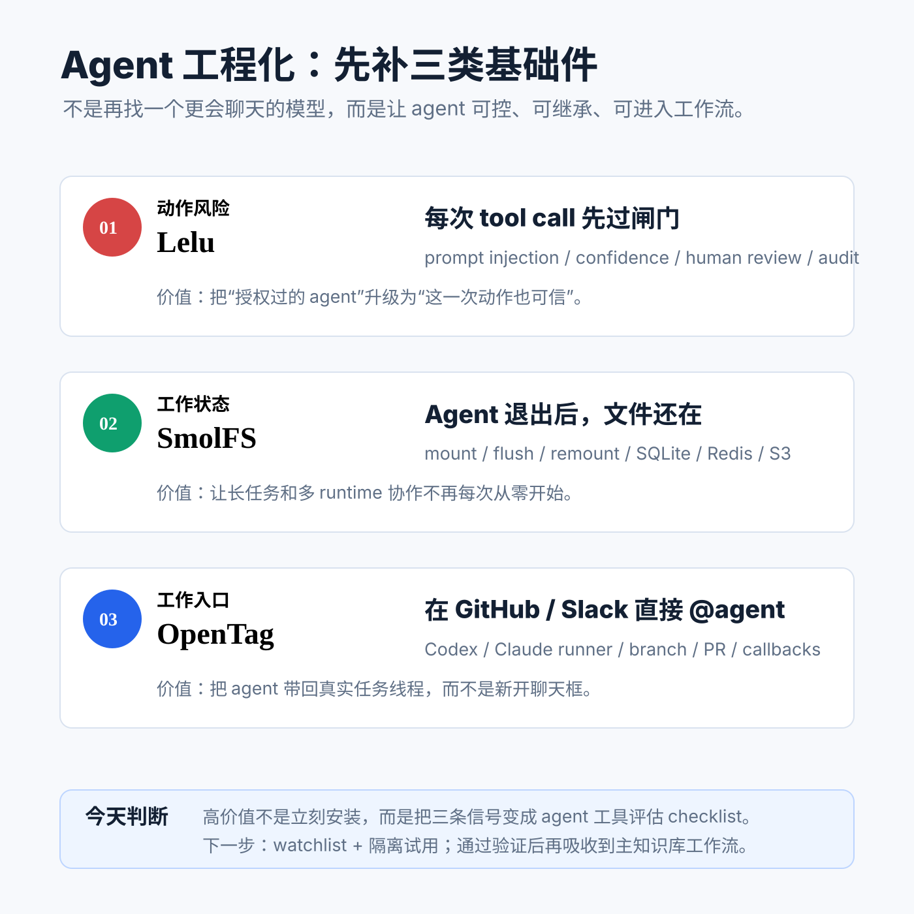

# 每日 AI 高价值信息

## 筛选原则

- 本次模式：泛 AI 情报，目标是选出 3 条对全球 AI 市场判断、个人知识库建设、Codex/Agent 工作流和未来产品实验最有价值的新信号。
- 搜索时间窗：优先 2026-06-24 至 2026-06-25；候选来自 GitHub 新仓/活跃仓、Hacker News 新讨论、官方/项目 README、API 元数据。
- 来源范围：GitHub、项目 README、HN 最新讨论；遇到官方页 JS 动态渲染或无法稳定抓取时，不把它包装成高置信事实。
- 排除/降权：只有二手讨论但没有可检查对象的暂缓；今天被讨论但原始材料较早的只作为背景；疑似下载诱导、作弊、蹭名仓直接淘汰。
- 今天主线：Agent 生产化不再只是“模型更强”，而是开始补动作授权、持久状态和工作入口这三类基础件。

## 候选池与淘汰理由

| 候选 | 来源类型 | 状态 | 理由 |
| --- | --- | --- | --- |
| Lelu | HN 今日讨论 + GitHub README/API | 入选 | 不是今天新建仓，但 2026-06-24 被 HN 重新推到视野，且 README 给出 action-level auth、prompt injection filter、confidence gate、HITL、MCP/OAuth 等可检查机制；对 agent 执行动作前的安全闸门价值高。 |
| SmolFS | GitHub 新仓 + HN | 入选 | 2026-06-24 新仓，定位为 durable workspace folders for AI agents；直接解决短生命周期 agent 退出后状态丢失、跨 runtime 共享工作目录的问题。 |
| OpenTag | GitHub 新仓 + README | 入选 | 2026-06-24 新仓，支持 GitHub/Slack @agent、Codex/Claude Code 本地 runner、分支/PR/审计回写；是 Claude Tag 产品信号的开放实现方向。 |
| Orchid | HN + GitHub README/API | 暂缓 | record / inspect / replay AI agents 很有价值，且带 MCP 查询；但今天更像 observability/debugging 专题，和 6 月中旬已跟踪的 Spanly/HALO 主题重合，先放入观察清单。 |
| Omnigent | GitHub 活跃仓 + README | 暂缓 | stars 高，覆盖 Claude Code/Codex/Cursor/Pi 多 agent 编排、策略和 sandbox；但范围太大，且不是今天新出现，适合单独做“multi-agent harness”专题。 |
| Qwen-AgentWorld Models | HN + 官方动态页 | 暂缓 | HN 显示 2026-06-24 新讨论，但官方页面抓到的是 JS-heavy Qwen Studio 壳，当前证据不足，不硬写为事实。 |
| Unit42 prompt injection report | HN + Palo Alto 官方文章 | 降级为背景 | HN 今天重新讨论，但官方文章发布日期为 2026-03-03；它能支持“prompt injection 已被真实利用”的背景判断，不是今天新事实。 |
| Nexusbox | GitHub 新仓/API | 暂缓 | GitHub 描述是 MCP 安全沙箱，但 raw README main 抓取为 404；没有足够项目机制证据，暂不入选。 |
| Haystack | HN 高热 + 官网 | 淘汰 | HN 热度高，但 Haystack 是成熟框架，不符合今天“新鲜高价值信号”的要求。 |
| chrome-use / Stupify / 各类下载诱导仓 | HN/GitHub 噪声 | 淘汰 | 有可探索点，但证据弱、早期过强或风险高；不进入今日 3 条。 |

## 1. Lelu：Agent 每次执行动作前，需要一个动态授权闸门

### 来源

- GitHub：[Lelu-ai/lelu](https://github.com/Lelu-ai/lelu)
- README raw：[lelu README](https://raw.githubusercontent.com/Lelu-ai/lelu/main/README.md)
- HN 线索：[Show HN: Lelu - gate OpenAI agent actions on confidence and prompt injection](https://news.ycombinator.com/item?id=48664025)

### 信号类型

- 成熟度：S1 可检查早期工程信号
- 来源类型：GitHub README/API、HN 今日线索
- 置信度：中；README 机制具体，但未本机实测

### 一句话结论

Lelu 的价值不是“又一个权限系统”，而是把 agent 的每次高风险 tool call 变成可授权、可降级、可人审、可审计的决策点。

### 事实 / 观点 / 推断

- 事实：GitHub API 显示 `Lelu-ai/lelu` 创建于 2026-03-06，2026-06-24 仍有更新，MIT，描述为 open source authorization engine for AI agents。
- 事实：README 给出 TypeScript / Python SDK，调用模式是 `authorize()` 返回 `allow / deny / human_review / compute` 等结果。
- 事实：README 描述的 pipeline 包括 shadow agent detection、prompt injection filter、confidence gate、YAML/OPA policy、risk model、human-review queue、behavioral analytics。
- 事实：README 明确说明支持 OpenAI、Anthropic、LangChain、LangGraph、CrewAI、Vercel AI SDK 和 MCP；同时承认 Anthropic Claude 不暴露 token log-probs，需要用 MissingSignalMode 处理缺失信号。
- 观点：Lelu README 对 Okta/OPA/Casbin/AWS AVP 的对比属于项目立场，不能等同于已证明替代这些系统。
- 推断：当 agent 开始删库、发邮件、退款、改权限、发 PR、操作云资源时，“用户授权过”不够，系统还需要判断 agent 这一次动作是否被 prompt injection 或低置信判断带偏。

### 为什么重要

你现在的知识库已经让 Codex 做采集、分析、写文件、起服务、提交、push。下一步如果继续接浏览器、邮件、支付、发布、交易和 API，风险会从“写错内容”升级为“代表你做错动作”。Lelu 代表的不是某个产品本身，而是一个趋势：agent auth 会从静态角色权限，走向 action-level runtime gating。

### 对我的启发

- 给本地 agent 工具清单新增字段：`动作是否外部可见`、`是否不可逆`、`是否需要 human_review`、`是否能降级到 compute/sandbox`。
- 对 Codex/知识库工作流，先把高风险动作分层：读网页 < 写本地文档 < commit/push < 发外部消息 < 支付/交易/云资源变更。
- 后续评估 agent 安全产品时，不只看“有没有 OAuth”，还要看它是否能处理 prompt injection、低置信度、异常行为和审计回放。

### 待验证点

- 没有在本机跑 Lelu quickstart，也未验证 prompt injection filter 的准确率和误杀率。
- confidence gate 对不同模型的支持并不等价；README 已说明 Anthropic Claude 不直接提供 token log-probs。
- 这类授权层如果接入主环境，会处理 agent identity、用户凭证、动作上下文和日志，必须先做隔离试用和隐私审计。

### 可行动作

- 先把 Lelu 放入 `agent_action_auth_watchlist`，不要直接接入主知识库。
- 做一个本地最小实验：模拟 `delete_file / git_push / send_email` 三类动作，看能否用 policy + HITL 表达你的真实偏好。
- 如果实验有效，再把理念吸收到本地 skills：高风险动作默认先输出意图、证据、影响范围和回滚路径。

## 2. SmolFS：短生命周期 Agent 需要可继承的工作区

### 来源

- GitHub：[CelestoAI/smolfs](https://github.com/CelestoAI/smolfs)
- README raw：[SmolFS README](https://raw.githubusercontent.com/CelestoAI/smolfs/main/README.md)
- HN 线索：[Show HN: A durable filesystem layer for AI agents](https://news.ycombinator.com/item?id=48667101)

### 信号类型

- 成熟度：S1 新仓 / 可检查 README
- 来源类型：GitHub API、README、HN 今日线索
- 置信度：中；方向明确，但 stars 和采用都很早

### 一句话结论

SmolFS 把 agent 的工作目录做成可 mount、可 flush、可再次挂载的持久层，让一次 agent 进程结束不等于上下文资产消失。

### 事实 / 观点 / 推断

- 事实：GitHub API 显示 `CelestoAI/smolfs` 创建于 2026-06-24，Rust，描述为 durable workspace folders for AI agents。
- 事实：README 称 SmolFS 让 agent workspace 在 agent process 停止后继续存在，可像普通目录一样 mount / write / unmount / remount。
- 事实：README 描述了 local dev mode 使用 SQLite metadata + local object files，cloud volumes 使用 Redis metadata + S3-compatible object storage。
- 事实：README 提供 CLI 生命周期：`doctor`、`init`、`mount`、`flush`、`status`、`unmount`，并提供 Python / TypeScript SDK。
- 观点：项目很早期，5 stars 级别的早期仓不能按成熟 infra 处理。
- 推断：如果未来 agent 更多运行在 cloud sandbox、短任务容器、移动设备或多 runtime 编排里，持久工作区会变成 memory / artifact / audit 之外的第四类基础状态。

### 为什么重要

你当前知识库已经天然在做“持久工作区”：raw、wiki、skills、outputs、memory、git 历史。SmolFS 的价值是把这种思想产品化：agent 不是每次开局都从零读文件，而是能继承上次留下的中间产物、临时文件、缓存和结构化工作目录。它和长期记忆不同，更接近 agent 的“可恢复工作台”。

### 对我的启发

- 对 Codex 长任务，除了写最终 markdown，还可以约定一个 `workdir state`：候选 JSON、抓取原文、截图、验证日志都被保留并可回放。
- 对多 agent 任务，持久 workspace 可以减少重复拉取、重复转录、重复解析，提高长周期任务效率。
- 如果未来知识库要跑自动化日报，不能只依赖聊天上下文；要有明确的 state 目录和生命周期规则。

### 待验证点

- 没有安装或 mount SmolFS；macOS 本地 mount 权限、性能、卸载行为和残留数据未验证。
- durable workspace 会保存更多中间数据，可能包含 prompt、token、网页原文、路径和隐私信息，必须有 retention / cleanup 策略。
- 对本地知识库来说，Git + 文件系统已经能解决很多问题；SmolFS 是否值得引入，取决于是否出现跨 sandbox / 多机器 / 临时 runtime 的刚需。

### 可行动作

- 不直接安装；先把理念吸收到知识库：每次复杂采集保留 `source snapshot / rejected candidates / validation logs`。
- 若后续做多 agent 自动化，可以在临时项目里测试 SmolFS 的 `--dev` 模式，验证 mount/unmount/flush 是否稳定。
- 给日报 skill 增加“可恢复工作目录”概念：即使中断，也能从候选池和源文件继续，而不是重跑全部搜索。

## 3. OpenTag：Agent 的入口会从聊天框迁回工作线程

### 来源

- GitHub：[amplifthq/opentag](https://github.com/amplifthq/opentag)
- README raw：[OpenTag README](https://raw.githubusercontent.com/amplifthq/opentag/main/README.md)

### 信号类型

- 成熟度：S1 新仓 / v0 工程信号
- 来源类型：GitHub API、README
- 置信度：中；核心 loop 有 smoke test 描述，但仍是 young v0

### 一句话结论

OpenTag 把 `@agent` 做成开放协议层：在 GitHub issue、PR 评论或 Slack 线程里召唤 Codex/Claude Code，本地 runner 执行后把结果回写到原线程。

### 事实 / 观点 / 推断

- 事实：GitHub API 显示 `amplifthq/opentag` 创建于 2026-06-24，2026-06-25 仍有更新，MIT，TypeScript。
- 事实：README 称 GitHub issue、PR review comment、Slack app mention 会被 normalize 成一个 `OpenTagEvent`。
- 事实：README 描述内置 executors 包括 `echo`、`claude-code` 和 `codex`，本地 daemon `opentagd` 只认显式绑定的 repository。
- 事实：README 写明 Codex / Claude Code executors 会拒绝 dirty workspace、创建隔离分支、运行本地 CLI、过滤内部 artifacts、报告 changed files，并可推 branch / 开 PR。
- 事实：项目状态为 young v0，当前证明的是 GitHub/Slack ingress、dispatcher persistence、local daemon、Claude Code/Codex executors、callbacks 等核心 loop。
- 推断：如果 Claude Tag 代表闭源产品方向，OpenTag 代表开放生态会快速复刻的方向：agent 不再要求人把上下文搬进 AI chat，而是 AI 被带回已有工作现场。

### 为什么重要

这条对你很实用。你现在已经把 Codex 接到知识库，但入口仍主要是“在 Codex 对话里说需求”。OpenTag 指向的是下一阶段：在 GitHub issue、Slack、Obsidian/知识库后台、甚至手机端线程里直接 `@agent`，系统自动把 bounded context、权限、runner、结果回写、审计串起来。

### 对我的启发

- 你的知识库后台可以逐步从“浏览文档”升级为“从文档里发起 agent run”：选中某篇 markdown，生成任务、执行、回写结果。
- 对团队协作，最高效入口不是另一个 AI workspace，而是把 agent 嵌回原来的任务线程。
- OpenTag 的 `refuse dirty workspace / isolated branch / structured result / quiet callback` 很值得吸收到本地自动化规范。

### 待验证点

- 未安装 OpenTag，也未实测 GitHub/Slack callback、Codex executor 和 PR 创建流程。
- 运行本地 Codex/Claude runner 涉及 repo 权限、分支、push token、日志和安全边界，必须用临时仓库先测。
- OpenTag 自称借鉴 Claude Tag，但不是 Anthropic 官方项目；应把它视为开放实现线索，不视为平台标准。

### 可行动作

- 先阅读 `examples/github-to-echo` 和 `examples/custom-runner`，确认协议对象是否适合接入知识库。
- 如果要试，先用空白 GitHub 测试仓和 echo executor，不接真实知识库。
- 把 “thread-native agent entry” 加入长期产品观察：Claude Tag、OpenTag、GitHub Copilot/Codex issue agent、Slack/Linear/Jira agent mention。

## 今天的总判断

今天的 3 条可以合成一个判断：

`Lelu 管动作风险 -> SmolFS 管工作状态 -> OpenTag 管工作入口`

这说明 Agent 工程化正在从“模型/提示词/工具调用”进入更朴素但更值钱的层面：权限、状态、入口、审计、回滚。对你最有价值的不是立刻安装这些项目，而是把它们变成评估新 agent 工具的 checklist。

### 立刻可用的 Checklist

- 这个 agent 会不会代表我执行外部动作？
- 这个动作是否可撤销？是否需要人审？
- 中间产物会不会丢？中断后能否恢复？
- 它的入口是在新聊天框，还是能嵌回原来的工作线程？
- 它是否拒绝 dirty workspace、是否隔离分支、是否记录 changed files？
- 它保存了哪些 prompt、文件、凭证和日志？能否清理？

今天不建议把 Lelu / SmolFS / OpenTag 直接接入主知识库。更好的路径是：先建 watchlist，再用临时仓库做最小实验，最后只吸收通过验证的设计原则。
